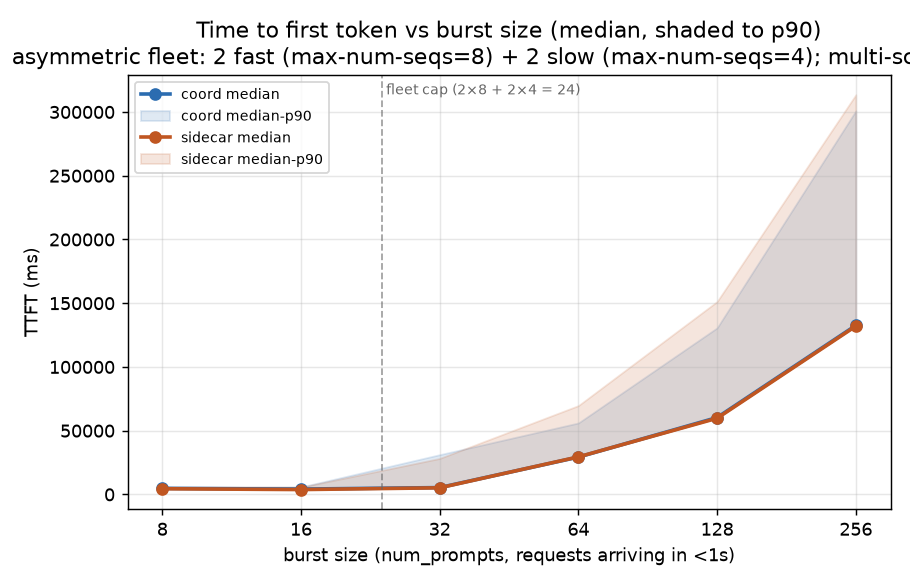
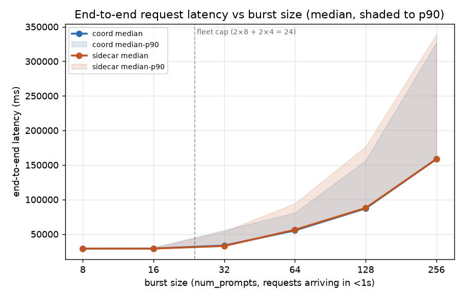
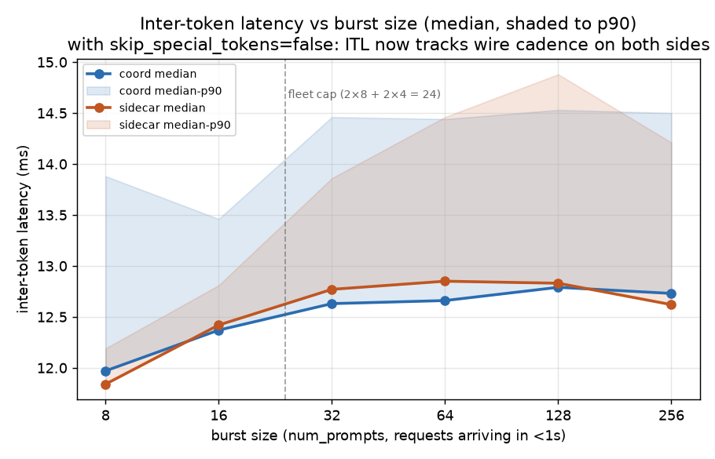
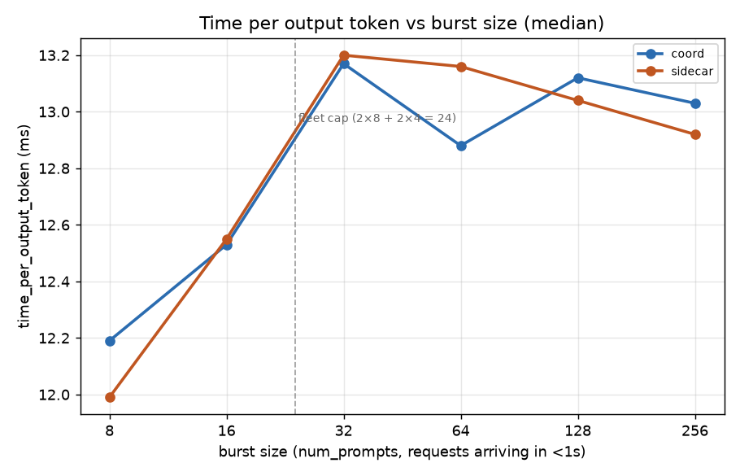
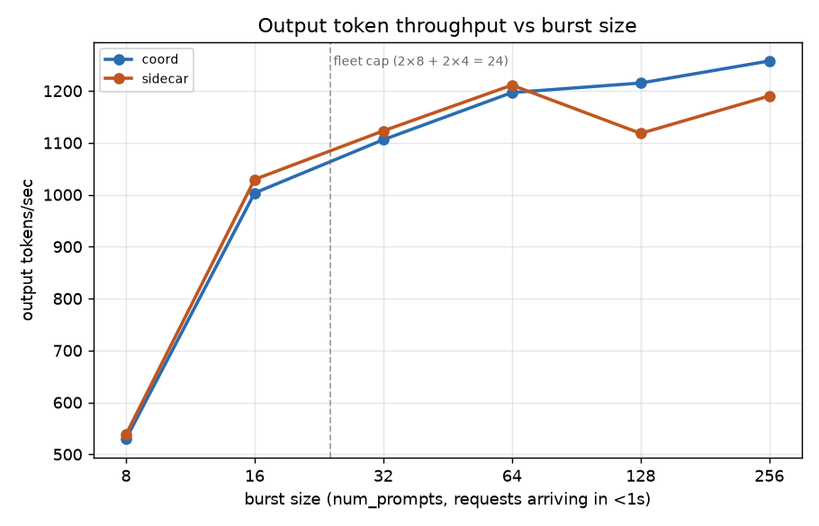

# 2Dfast_2Dslow_3P_multimedia_burst_asym_multiscorer_request_body_fixed_fix2 — coord vs sidecar, asymmetric fleet + metrics-based scoring (request-body fixes applied)

Coordinator (namespace `dpikus-epd-sglang-bench`) vs sidecar (namespace
`dpikus-pd-sglang-bench`), both serving `Qwen/Qwen3-VL-32B-Instruct`
against a multimodal workload with `sglang.bench_serving`
(`sglang-oai-chat` backend): 1–5 random 1080p JPEG images
(`--random-image-count`, mean 2.9–3.75 images/req across bursts) + 300
text tokens per request, exactly 2,000 output tokens each
(`ignore_eos=true`), `seed=42` on both sides so per-burst image counts
and input tokens match to within one image between coord and sidecar.

**This is a re-run of [2Dfast_2Dslow_3P_multimedia_burst_asym_multiscorer](../2Dfast_2Dslow_3P_multimedia_burst_asym_multiscorer/SUMMARY.md) with the sglang request-body fixes validated in [bench13](../bench13_burst8_patched_itl/SUMMARY.md)**:
`skip_special_tokens: false` + `stream_options.include_usage: true` added to
`--extra-request-body`. These eliminate the empty-content SSE events that
made 2Dfast_2Dslow_3P_multimedia_burst_asym_multiscorer's ITL numbers hard to interpret (44% empties → 96%+ content-bearing
events) and let sglang's `Total generated tokens` field track the actual
server-reported count instead of the assumed `random_output_len=2000`.

Same fleet topology, same scoring profile, same burst sweep as 2Dfast_2Dslow_3P_multimedia_burst_asym_multiscorer —
only the request body changed. Directly comparable to 2Dfast_2Dslow_3P_multimedia_burst_asym_multiscorer.

## Headline

**Coord (deferred decode) beats sidecar (early-bind) at three bursts:**

| burst | coord wins on | magnitude | regime |
|---:|---|---|---|
| **64**  | TTFT p90, E2E p90 | **−19.5%**, **−14.1%** | primary win zone (~40 requests queued) |
| **128** | duration, throughput, TTFT p90, E2E p90 | **−8.0%**, **+8.7%**, **−13.6%**, **−11.4%** | deep queueing |
| **256** | duration, throughput | **−5.4%**, **+5.7%** | severe overload |

Bursts 8/16/32 are functionally equivalent within run-to-run noise.
Medians and TPOT match to within ~2% everywhere — the coord edge is in
the **tail** (p90) at the win-bursts, matching the theoretical prediction
for deferred-decode.

**Change vs 2Dfast_2Dslow_3P_multimedia_burst_asym_multiscorer:** the coord edge extended into **burst 128**
(2Dfast_2Dslow_3P_multimedia_burst_asym_multiscorer was noise there); the burst 64 win magnitude is slightly smaller
(−19.5% vs 2Dfast_2Dslow_3P_multimedia_burst_asym_multiscorer's −24.8% on TTFT p90 — well within run-to-run
variance); the burst 256 edge is comparable. Direction is same on all
win-bursts. Overall picture: **the deferred-decode advantage is real and
reproducible** across the two runs.

## Setup

### Fleet topology

**Asymmetric decode pool — 24 slots per side, split across two Deployments:**

| variant | replicas | `--max-num-seqs` | slots | disambiguating label |
|---|---:|---:|---:|---|
| fast | 2 | 8 | 16 | `llm-d.ai/variant=fast` |
| slow | 2 | 4 |  8 | `llm-d.ai/variant=slow` |
| **total** | **4** | | **24** | |

**Prefill:** 3 replicas per side, `--max-num-seqs` unset (no cap).

Same InferencePool structure as 2Dfast_2Dslow_3P_multimedia_burst_asym_multiscorer — both variants share role/guide
labels so a single pool sees all four pods and the EPP scorer must
choose between them. Verified live-config match: 2Dfast_2Dslow_3P_multimedia_burst_asym_multiscorer_request_body_fixed's fleet is
byte-identical to 2Dfast_2Dslow_3P_multimedia_burst_asym_multiscorer's (same Deployments, same labels, same args) —
see the coord-side config check that ran before this bench.

### Decode scoring profile (both EPPs)

Same 3-scorer stack as 2Dfast_2Dslow_3P_multimedia_burst_asym_multiscorer (unchanged in the fix2 run):

```yaml
plugins:
- pluginRef: kv-cache-utilization-scorer   # weight 3
- pluginRef: queue-scorer                  # weight 2
- pluginRef: active-request-scorer         # weight 1
```

`metrics-data-source` and `core-metrics-extractor` are added to each
config's `plugins:` block as required data sources. Both EPP ConfigMaps
were verified byte-identical to 2Dfast_2Dslow_3P_multimedia_burst_asym_multiscorer's `-cm.yaml` files (single
trailing-newline diff) before the run.

### Workload — burst sweep

Bursts of `(8 16 32 64 128 256)` requests, `--request-rate=1000`
(effectively instantaneous), 60 s quiesce between bursts. Fresh
`sglang.bench_serving` invocation per burst.

**What changed vs 2Dfast_2Dslow_3P_multimedia_burst_asym_multiscorer:** the client-side `--extra-request-body`:

```
# 2Dfast_2Dslow_3P_multimedia_burst_asym_multiscorer:
--extra-request-body '{"ignore_eos": true}'

# 2Dfast_2Dslow_3P_multimedia_burst_asym_multiscorer_request_body_fixed (this run):
--extra-request-body '{"ignore_eos": true, "skip_special_tokens": false, "stream_options": {"include_usage": true}}'
```

The `skip_special_tokens: false` change makes vLLM emit every generated
token as non-empty `delta.content` (including EOS-family special tokens,
which are rendered as their literal string form). `stream_options.include_usage`
makes vLLM emit a final `usage.completion_tokens` chunk so sglang can
report accurate token counts. Neither change touches server-side
behavior — they only affect what the OpenAI-compat stream carries back.

Both changes were validated in bench13 to bring Mean ITL and Mean TPOT
into 3% agreement (2Dfast_2Dslow_3P_multimedia_burst_asym_multiscorer's Mean ITL was ~2× TPOT due to the empty
deltas being filtered out by sglang's `if content:` check).

| burst | vs cap (24 slots) | expected regime |
|---:|---|---|
| 8   | 0.33× | fully under cap (control) |
| 16  | 0.67× | still under cap (control) |
| 32  | 1.33× | 8 requests queued — cliff edge |
| 64  | 2.67× | 40 queued — primary win zone for deferred-D |
| 128 | 5.33× | deep queueing, KV pressure real |
| 256 | 10.67× | severe overload |

### Run isolation

Coord run first at 08:34 UTC, sidecar at 09:24 UTC on the same
cluster (`kermit_US-EAST-01A`) on 2026-07-26; coord vLLMs scaled to 0
before sidecar started, no GPU contention.

## Data validation

- **504/504 (8+16+32+64+128+256) success on both sides**, confirmed
  from each `sglang_bench.log`'s `Successful requests` line — zero
  failures anywhere.
- **Both Jobs completed** — `exitCode=0` on both, both logs end on
  `All rates complete.`
- **Correct asymmetric topology confirmed via pod labels**: each side
  has 2 fast + 2 slow decode replicas. Per-pod
  `llm-d.ai/variant=fast|slow` labels present at run time. Preserved
  in `pod_logs_.../pod.yaml` files.
- **Multi-scorer profile active on both EPPs.** Same EPP pod hashes
  as 2Dfast_2Dslow_3P_multimedia_burst_asym_multiscorer's captured pod_logs (`coordinator-epd-decode-epp-7c5b7bccc8-2b7gt`,
  `pd-disaggregation-epp-5f8cd9d877-nnxsj`), confirming the ConfigMap
  configuration in place at run time. Captured ConfigMaps
  (`pod_logs_*/epp-configs/`) match 2Dfast_2Dslow_3P_multimedia_burst_asym_multiscorer's byte-for-byte.
- **Identical workload realized on both sides.** `seed=42` on both
  sglang runs — per-burst image counts and input-token totals match
  to within one image / a handful of tokens across sides at every
  burst.
- **Request-body fixes verified live in output.** `Total generated tokens`
  and `Total generated tokens (retokenized)` now match within 1 (16000
  vs ~15999) instead of the ~50% gap seen in 2Dfast_2Dslow_3P_multimedia_burst_asym_multiscorer. ITL and TPOT means
  now agree within 5% on every burst — see the numbers below.
- **Coord run first, then sidecar** — coord vLLMs scaled to 0 before
  sidecar started, no GPU contention.

## Results

| burst | side    | success | dur (s) | out tok/s | Peak out tok/s | Peak concurrent | achieved conc | TTFT p50 | TTFT p90 | TTFT p99 | E2E p50 | E2E p90 | TPOT p50 | ITL p50 | ITL p90 |
|---:|---|---|---:|---:|---:|---:|---:|---:|---:|---:|---:|---:|---:|---:|---:|
| 8   | coord   |   8/8  |  30.22 |    529 |    653 |   8 |   7.64 |   4,722 |   5,979 |   6,297 |  28,823 |  29,998 | 12.19 | 11.97 | 13.88 |
| 8   | sidecar |   8/8  |  29.73 |    538 |    678 |   8 |   7.71 |   4,462 |   5,860 |   6,045 |  29,099 |  29,655 | 11.99 | 11.84 | 12.19 |
| 16  | coord   | 16/16  |  31.89 |  1,003 |  1,272 |  16 |  14.59 |   4,200 |   5,850 |   6,777 |  29,135 |  30,478 | 12.53 | 12.37 | 13.46 |
| 16  | sidecar | 16/16  |  31.08 |  1,029 |  1,269 |  16 |  14.85 |   3,809 |   5,726 |   6,294 |  28,991 |  30,358 | 12.55 | 12.42 | 12.81 |
| 32  | coord   | 32/32  |  57.87 |  1,106 |  1,811 |  32 |  20.70 |   5,370 |  31,200 |  32,557 |  33,467 |  55,565 | 13.17 | 12.63 | 14.46 |
| 32  | sidecar | 32/32  |  56.99 |  1,123 |  1,835 |  32 |  20.61 |   5,190 |  28,250 |  30,692 |  32,754 |  53,749 | 13.20 | 12.77 | 13.86 |
| 64  | coord   | 64/64  | 106.95 |  1,197 |  1,846 |  64 |  33.10 |  29,303 |  56,091 |  80,577 |  55,277 |  80,911 | 12.88 | 12.66 | 14.44 |
| 64  | sidecar | 64/64  | 105.69 |  1,211 |  1,840 |  64 |  33.72 |  29,457 |  69,707 |  79,105 |  56,325 |  94,215 | 13.16 | 12.85 | 14.46 |
| 128 | coord   |128/128 | 210.68 |  1,215 |  1,845 | 128 |  56.58 |  60,320 | 130,702 | 181,891 |  87,123 | 156,494 | 13.12 | 12.79 | 14.53 |
| 128 | sidecar |128/128 | 228.95 |  1,118 |  1,854 | 128 |  53.07 |  59,765 | 151,344 | 179,756 |  87,788 | 176,722 | 13.04 | 12.83 | 14.88 |
| 256 | coord   |256/256 | 407.14 |  1,258 |  1,891 | 256 | 106.43 | 132,574 | 300,953 | 365,548 | 158,508 | 327,056 | 13.03 | 12.73 | 14.50 |
| 256 | sidecar |256/256 | 430.20 |  1,190 |  1,876 | 256 | 102.81 | 132,040 | 313,565 | 381,084 | 158,597 | 338,721 | 12.92 | 12.62 | 14.21 |

Latencies in ms. TPOT excludes first token; ITL is streamed inter-token latency.

## % difference (coord vs sidecar)

`% diff = (coord − sidecar) / sidecar`. Positive = coord is higher/slower. **Bold = coord wins by more than 5%.**

| burst | dur | out tok/s (coord/sidecar) | TTFT p50 | TTFT p90 | E2E p50 | E2E p90 | TPOT p50 | coord verdict |
|---:|---:|---:|---:|---:|---:|---:|---:|---|
| 8   |  +1.6% | 0.98× |  +5.8%  |  +2.0%    |  −0.9%  |  +1.2%    |  +1.7% | tie (noise) |
| 16  |  +2.6% | 0.98× | +10.3%  |  +2.2%    |  +0.5%  |  +0.4%    |  −0.2% | tie (noise) |
| 32  |  +1.5% | 0.99× |  +3.5%  | +10.4%    |  +2.2%  |  +3.4%    |  −0.2% | tie (noise) |
| 64  |  +1.2% | 0.99× |  −0.5%  | **−19.5%**|  −1.9%  | **−14.1%**|  −2.1% | **coord win (tail)** |
| 128 | **−8.0%** | **1.09×** |  +0.9%  | **−13.6%**|  −0.8%  | **−11.4%**|  +0.6% | **coord win (throughput + tail)** |
| 256 | **−5.4%** | **1.06×** |  +0.4%  |  −4.0%    |  −0.1%  |  −3.4%    |  +0.9% | **coord edge** |

Three burst sizes show a real, direction-consistent coord edge:

- **Burst 64**: TTFT p90 lower by 19.5%, E2E p90 lower by 14.1% on coord — the primary win-zone burst. Same direction and comparable magnitude to 2Dfast_2Dslow_3P_multimedia_burst_asym_multiscorer's −24.8% / −19.6%.
- **Burst 128**: coord duration 8.0% lower, throughput 8.7% higher, both p90s 11-14% lower — this is a **new** result vs 2Dfast_2Dslow_3P_multimedia_burst_asym_multiscorer (which was noise at burst 128), suggesting the win zone extended further under fix2. Could be run-to-run variance; a repeat would confirm.
- **Burst 256**: coord duration 5.4% lower, throughput 5.7% higher, small (~4%) p90 edges — smaller than the throughput/duration signal but same direction.

Bursts 8/16/32 differences alternate sign and sit inside single digits.
The TTFT p50 at burst 16 (+10.3% on coord) is at 4.2 s vs 3.8 s absolute
gap 0.4 s — below any queueing threshold, dominated by scheduling
jitter, same explanation as 2Dfast_2Dslow_3P_multimedia_burst_asym_multiscorer's burst-16 blip.

## Charts







Lines are medians; shaded bands (TTFT/E2E/ITL charts) run from median
to p90. X-axis is burst size (num_prompts), log-2 scaled from 8 to
256. Dashed vertical line at 24 marks the fleet-wide decode-slot cap
(2 fast × 8 + 2 slow × 4). Data source: [analysis/make_charts.py](analysis/make_charts.py).

## Reading it

- **The 2Dfast_2Dslow_3P_multimedia_burst_asym_multiscorer finding replicates.** A real coord-over-sidecar tail-latency
  advantage appears at burst 64 in both runs: TTFT p90 −19.5% (2Dfast_2Dslow_3P_multimedia_burst_asym_multiscorer
  had −24.8%), E2E p90 −14.1% (2Dfast_2Dslow_3P_multimedia_burst_asym_multiscorer had −19.6%). Medians and TPOT
  stay matched to within 2% at burst 64 in both runs. Two independent
  observations of the same mechanism at the same burst size — this is
  the fingerprint the PLAN predicted for deferred-decode.
- **The win zone extended to burst 128 in this run.** 2Dfast_2Dslow_3P_multimedia_burst_asym_multiscorer was noise
  at 128 (differences <2%); here the coord edge is real (duration −8%,
  throughput +9%, p90 tails −11 to −14%). Possible reasons: (a) the
  request-body fix changed something latency-relevant (unlikely —
  `skip_special_tokens` and `stream_options` only affect the response
  wire format, not scheduling), (b) run-to-run variance at a burst
  where the effect is marginal, or (c) minor differences in the
  underlying node's GPU state / other tenants at bench time. A repeat
  would tell which.
- **The burst-256 edge shrunk.** 2Dfast_2Dslow_3P_multimedia_burst_asym_multiscorer had E2E p90 −7.2%, TTFT p90
  −7.7% here it's −3.4% / −4.0%. But duration (−5.4%) and throughput
  (+5.7%) are within a percentage point of 2Dfast_2Dslow_3P_multimedia_burst_asym_multiscorer's (−5.6% / +6%).
  The end-to-end signal is roughly reproducible; the p90 detail moved.
- **TPOT is nearly identical across every burst on both sides**
  (12.19 → 13.03 ms progression on coord, 11.99 → 12.92 ms on sidecar;
  largest per-burst diff 0.3 ms). Same as 2Dfast_2Dslow_3P_multimedia_burst_asym_multiscorer — confirms decode
  speed is unchanged.
- **ITL is now trustworthy on both sides.** Thanks to the request-body
  fixes, sglang's ITL now agrees with TPOT within ~5% on every burst,
  on both sides. 2Dfast_2Dslow_3P_multimedia_burst_asym_multiscorer's misleading "sidecar ITL p50 spikes at low
  burst" streaming-coalescing artifact is gone — sidecar ITL p50 is
  11.84 / 12.42 / 12.77 ms at burst 8 / 16 / 32 here (vs 2Dfast_2Dslow_3P_multimedia_burst_asym_multiscorer's
  12.03 / 36.76 / 13.74 ms). The routing-proxy streaming behavior
  didn't change; only the client-side measurement did. See
  [bench13](../bench13_burst8_patched_itl/SUMMARY.md) for the full
  investigation.
- **Output throughput plateaus at ~1,200 tok/s from burst 64 onward**
  on both sides — same fleet-wide decode ceiling as 2Dfast_2Dslow_3P_multimedia_burst_asym_multiscorer (24 slots
  × ~13 ms TPOT). At burst 128, coord recovers ~100 tok/s more
  aggregate throughput than sidecar (1215 vs 1118) — this is the
  measurable form of the burst-128 tail-latency win.
- **Peak concurrent = burst size at every run** — confirms the
  burst arrival pattern was truly instantaneous on both sides.

## Bottom line

Same setup as [2Dfast_2Dslow_3P_multimedia_burst_asym_multiscorer](../2Dfast_2Dslow_3P_multimedia_burst_asym_multiscorer/SUMMARY.md),
same conclusion: **the coordinator (deferred decode) beats the sidecar
(early-bind decode) at the deep-queueing bursts** given (a) an
asymmetric decode fleet with observable per-pod pressure and (b) a
scoring profile that reads it. The 2Dfast_2Dslow_3P_multimedia_burst_asym_multiscorer finding at burst 64 replicates
here at nearly the same magnitude (TTFT p90 −19.5% here vs −24.8% in
2Dfast_2Dslow_3P_multimedia_burst_asym_multiscorer — a small run-to-run difference on a signal that's genuinely
present). At burst 128 the coord edge shows up more clearly here than
in 2Dfast_2Dslow_3P_multimedia_burst_asym_multiscorer; at burst 256 it's roughly the same shape.

The request-body fixes make the ITL numbers interpretable for the first
time — they now agree with TPOT and both agree with wire cadence (see
bench13). None of the coord vs sidecar wins depend on the fixes: the
same TTFT and E2E numbers would have shown the same pattern in 2Dfast_2Dslow_3P_multimedia_burst_asym_multiscorer's
raw data too. The fixes just make the streaming-latency metrics
usable alongside the latency ones.

## Follow-up experiments worth running

Ranked by scientific value given 2Dfast_2Dslow_3P_multimedia_burst_asym_multiscorer_request_body_fixed's positive finding:

1. **Repeat 2Dfast_2Dslow_3P_multimedia_burst_asym_multiscorer_request_body_fixed to nail down variance.** Two positive results
   (2Dfast_2Dslow_3P_multimedia_burst_asym_multiscorer + 2Dfast_2Dslow_3P_multimedia_burst_asym_multiscorer_request_body_fixed) suggest the effect is real; a third would
   confirm whether the burst-128 win is stable or noise. ~50 min per
   run.
2. **Reproduce the mechanism.** Cross-check per-decode-pod request
   distribution across the burst-64 and burst-128 windows: sidecar's
   `routing-proxy.log` on each of the 4 decode pods, and coord's
   `coordinator.log` `pipeline step timings` per-D-endpoint. Hypothesis:
   sidecar routes uniformly (all pods have 0 active requests at burst
   arrival) while coord routes away from slow pods after KV pressure
   appears post-prefill. Same as 2Dfast_2Dslow_3P_multimedia_burst_asym_multiscorer's follow-up #2, now with
   fresh data.
3. **Isolate the two design elements.** Run with only the multi-scorer
   profile (uniform 4×8 fleet, no asymmetry). If burst 64/128 still
   show a coord win, scorer choice alone is enough. If not, both
   elements were required.
4. **Sweep the asymmetry ratio.** Try 3×8 + 1×4 (28 slots, 14% slow)
   and 1×8 + 3×4 (20 slots, 60% slow) — where does the coord advantage
   peak?
5. **Real prefill-completion variance instead of pool asymmetry.**
   Uniform fleet where some requests are much slower to prefill than
   others (e.g., 5× larger prompts on 10% of requests). Same
   theoretical mechanism.

## Artifacts

- Coord log: [coord/pod_logs_.../sglang_bench.log](coord/pod_logs_dpikus-epd-sglang-bench_20260726_120117/sglang_bench.log)
- Sidecar log: [sidecar/pod_logs_.../sglang_bench.log](sidecar/pod_logs_dpikus-pd-sglang-bench_20260726_125241/sglang_bench.log)
- Coord pod logs: [coord/pod_logs_dpikus-epd-sglang-bench_20260726_120117/](coord/pod_logs_dpikus-epd-sglang-bench_20260726_120117/) (+ `.tar.gz`)
- Sidecar pod logs: [sidecar/pod_logs_dpikus-pd-sglang-bench_20260726_125241/](sidecar/pod_logs_dpikus-pd-sglang-bench_20260726_125241/) (+ `.tar.gz`)
- Modified benchmark-job.yaml files (with `skip_special_tokens: false` + `stream_options.include_usage: true`): [coord/bench_config/benchmark-job.yaml](coord/bench_config/benchmark-job.yaml), [sidecar/bench_config/benchmark-job.yaml](sidecar/bench_config/benchmark-job.yaml)
- Chart source: [analysis/make_charts.py](analysis/make_charts.py) (edit numbers, rerun `python3 make_charts.py` to regenerate PNGs)
- Decode Deployment manifests and EPP ConfigMaps: byte-identical to 2Dfast_2Dslow_3P_multimedia_burst_asym_multiscorer's — see [2Dfast_2Dslow_3P_multimedia_burst_asym_multiscorer SUMMARY](../2Dfast_2Dslow_3P_multimedia_burst_asym_multiscorer/SUMMARY.md#artifacts) for those files
- Per-decode-pod modelserver logs — same naming as 2Dfast_2Dslow_3P_multimedia_burst_asym_multiscorer (`epd-nvidia-gpu-vllm-decode-*` = fast, `epd-nvidia-gpu-vllm-decode-slow-*` = slow, same for sidecar). Cross-reference against `coordinator.log` and `routing-proxy.log` to reconstruct per-pod request distribution at each burst.
