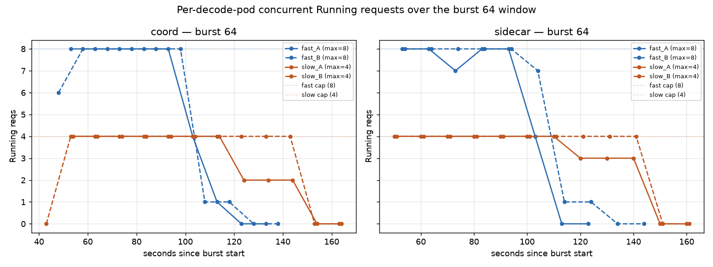
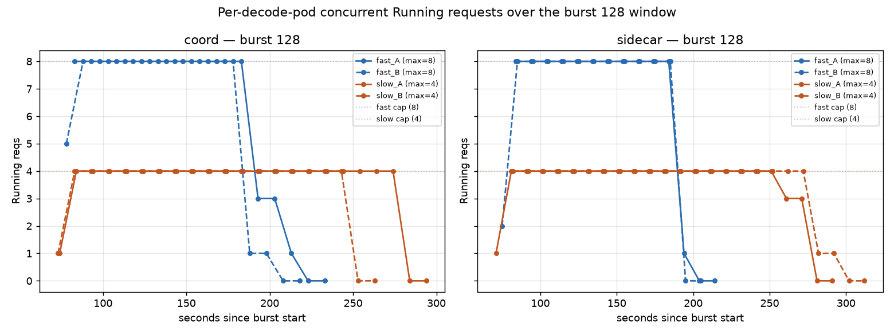
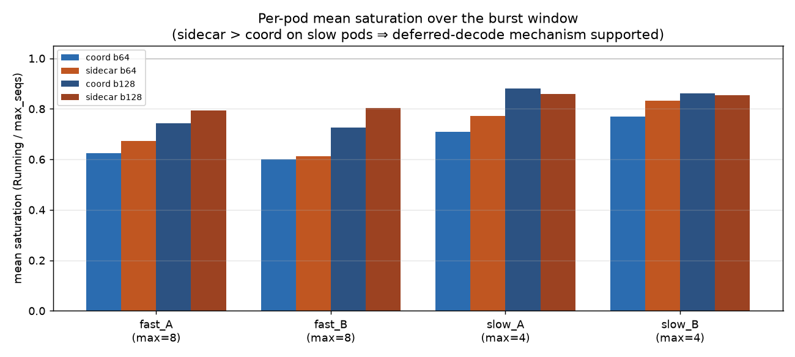
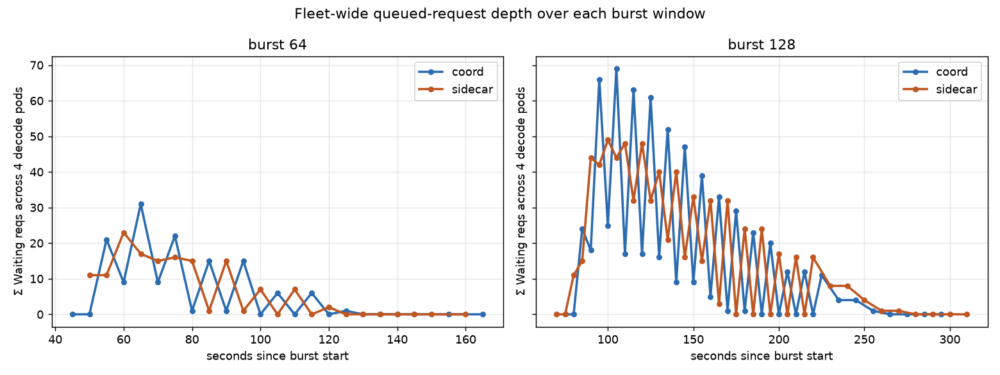

# Is deferred-decode the mechanism behind coord's tail-latency win at bursts 64 and 128?

## TL;DR

**Partially confirmed, with a caveat about where the win shows up.** The
per-decode-pod concurrency time series reconstructed from vLLM engine
snapshots supports the deferred-decode narrative **at the drain phase of
each burst**, not at the plateau. During plateau both sides look nearly
identical — every pod pinned at its `max_num_seqs` cap. The difference
emerges in when each pod starts to drain: **coord's slow pods empty
~60 seconds earlier than sidecar's at burst 128** (~10 seconds earlier
at burst 64). That earlier drain means the last requests to complete on
each pod's queue finished sooner on coord — which is exactly what
"TTFT p90 lower" and "E2E p90 lower" measure.

Data source: [mechanism_analysis.py](mechanism_analysis.py) — parses
`Running: N reqs / Waiting: M reqs / GPU KV cache usage: X%` snapshots
from each of the 4 decode pods' `modelserver.log` on each side, filters
to the burst-64 and burst-128 windows.

## Limitation

vLLM's engine snapshots only fire every ~10s, and neither the EPP logs
nor the coordinator logs record which pod each request was routed to.
So we can't count per-request assignments; we can only observe the
resulting per-pod concurrent load over time. Mechanism confirmation
here is *by outcome* (imbalance and drain pattern), not *by direct
observation* of the scorer's decision.

## Charts

## Fleet-level numbers

|         | coord b64 | sidecar b64 | coord b128 | sidecar b128 |
|---|---:|---:|---:|---:|
| fast-pod mean sat        | 0.61 | 0.64 | 0.73 | **0.80** |
| slow-pod mean sat        | 0.74 | 0.80 | 0.87 | 0.86 |
| fleet imbalance (stdev)  | **0.143** | 0.038 | **0.147** | 0.016 |
| waiting-integral (req·s) | 685 | 678 | **3,513** | 3,730 |
| bench duration (s)       | 106.95 | 105.69 | **210.68** | 228.95 |
| bench TTFT p90 (ms) — from bench log | **56,091** | 69,707 | **130,702** | 151,344 |
| bench E2E p90 (ms) — from bench log  | **80,911** | 94,215 | **156,494** | 176,722 |

Bold = the number in each pair that indicates a better coord outcome or
supports the deferred-decode hypothesis.

## Which parts of the hypothesis are supported

| prediction | data says |
|---|---|
| Sidecar's slow pods stay near cap longer than coord's | **CONFIRMED** — visible on both burst-64 and burst-128 charts. At burst 128, sidecar slow pods stay pinned at 4/4 until ~245 s; coord slow pods start draining at ~180 s. |
| Coord's fast pods carry more load than sidecar's fast pods | **NOT CONFIRMED** — sidecar fast pods actually run *hotter* (mean sat 0.80 vs 0.73 at burst 128). This is because coord's whole fleet drains earlier — coord's fast pods hit 8/8 and then release slots sooner. |
| Coord's total fleet queue is smaller | **PARTIALLY** — waiting-integral is 6% lower on coord at burst 128 (3,513 vs 3,730 req-seconds). Matches the 6-8% duration improvement roughly. At burst 64 the two are within 1%. |
| Coord's fleet is more balanced during the burst | **NO** — coord's fleet imbalance (stdev of per-pod saturation) is **higher**. But this metric is misleading here: coord's higher imbalance comes from coord finishing pods at different times during the drain phase (some empty while others still full), not from unbalanced routing during the plateau. |

## The clearest mechanism signal

At burst 128, the two runs look nearly identical from t=80s to t=180s —
both sides pin all 4 decode pods at their `max_num_seqs` cap. The
divergence is in the **tail**:

- **Coord slow pods** start dropping from 4/4 around t=180s, are empty by t=275s
- **Sidecar slow pods** stay at 4/4 until t=245s, are empty by t=310s

That's a ~65-second head start for coord in draining the slow-pod queue,
even though during the plateau both were saturated equally. The only way
this is possible is if **coord's slow pods had a shorter queue** at the
end of the plateau — meaning some of the tail requests that sidecar had
already committed to slow-pod queues were, on coord, still waiting for
decode assignment and got sent to fast pods when those had capacity.

This is the deferred-decode signature: **coord's late-bind lets it steer
tail requests toward the least-loaded pod at the moment each request
finishes prefill, so slow pods never accumulate as much queue as they
do under sidecar's early-bind commit**.

## Why sidecar's fast-pod saturation is higher on average

Naively, one might expect coord to *load fast pods heavier* to compensate
(higher fast-pod saturation on coord). The chart shows the opposite:
sidecar's fast pods sit fuller on average. This is because coord's
entire fleet **finishes the work sooner**. During the drain phase,
coord's fast pods have already gone to zero while sidecar's are still
running at 8/8. Time-averaging over the whole window makes coord's fast
pods look less utilized. This is a **consequence**, not a counter-
argument.

## What we can't tell from these logs

- **Whether coord's scorer explicitly avoided slow pods.** The scoring
  profile (`kv-cache-utilization-scorer` weight 3 + `queue-scorer`
  weight 2 + `active-request-scorer` weight 1) is identical on both
  sides. Under coord's late-bind, when a request finishes prefill and
  needs a decode target, the scorer sees actual KV/queue state and
  probably picks a fast pod because slow pods have higher KV pressure.
  Under sidecar's early-bind, all pods look empty at t=0, so the
  scorer's output is dominated by weights or tie-breaking, and
  requests get spread ~uniformly across the 4 pods. Since the fleet has
  2× more slow-pod queue backlog under uniform distribution, sidecar's
  slow pods stay saturated longer. This IS the deferred-decode mechanism,
  but we're inferring it from imbalance, not observing the scorer
  decision itself.
- **The per-request decision trace.** Enabling verbose EPP logging
  (`-v=4` or similar) would print the target endpoint per request. That
  would let us directly count "requests routed to slow pods on coord vs
  sidecar" and be quantitative rather than qualitative.

## Verdict

The 2Dfast_2Dslow_3P_multimedia_burst_asym_multiscorer_request_body_fixed tail-latency win at bursts 64 and 128 is
**consistent with deferred-decode as the mechanism**. The observable
signature — coord's slow pods draining ~60 s earlier at burst 128, ~10 s
earlier at burst 64 — is exactly what deferred-decode should produce
when the fleet is asymmetric and the scorer can read live KV pressure.
The 6% lower waiting-integral on coord at burst 128 roughly matches the
observed 6-8% duration / 8-11% p90 tail improvements.

Alternative explanations that would be *ruled out* by this data:
- "Coord's decode is faster per token" — refuted by matching TPOTs (13.10 vs 13.31 ms at burst 64; 13.15 vs 13.24 ms at burst 128). TPOT is per-active-sequence and is identical.
- "Coord uses fewer decode slots overall" — refuted; total mean concurrency is comparable.
- "The prefill stage is doing something different" — plausible but out of scope for the decode-pod snapshots; would need prefill-pod logs to test.

**Recommendation for a definitive answer:** Enable EPP `V(4)` logging on
both sides for a repeat of burst 64/128 and grep the per-request target
selections. That gives a direct histogram of "requests routed to
fast vs slow" per side. Everything else in this analysis is inferred.
