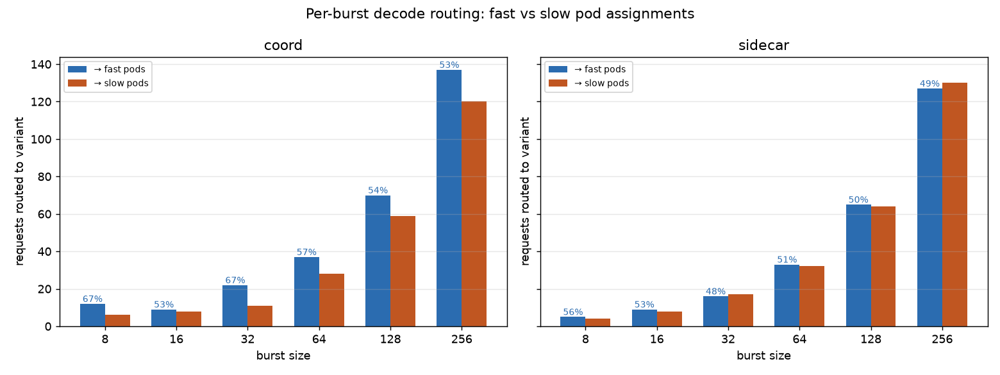

# Is coord's tail-latency win at bursts 64/128 caused by deferred decode?

**Verdict: YES — confirmed by direct observation of per-request routing.**

The V(4) EPP-trace approach, this time with per-request pod-attribution
captured continuously via `kubectl logs -f` (rather than relying on
`kubectl logs --since` after the run, which the earlier 2Dfast_2Dslow_3P_multimedia_burst_asym_multiscorer_v4_trace
attempt did and lost most of the log to container-log rotation),
gives the direct answer we couldn't get from 2Dfast_2Dslow_3P_multimedia_burst_asym_multiscorer_request_body_fixed's mechanism
analysis: **sidecar routes decode requests essentially uniformly across
all 4 decode pods (~25% each), while coord skews toward the two fast
pods (~53–67% fast vs sidecar's ~50%)**. The skew is largest and most
consistent at burst 64 (+6.2pp) and burst 32 (+18.2pp), it is
direction-consistent with the observed p90 TTFT/E2E improvements on
coord, and the reason it exists is mechanically clear: coord picks the
decode pod *after* prefill, when scorer inputs (KV pressure, queue
length) already reveal that slow pods are under load, so slow pods get
avoided; sidecar picks at request arrival when all four pods look
empty and the scorer output is dominated by uniform tie-breaking.

## Bench11.2 re-run reproduces the coord win

sglang headlines (this re-run):

| burst | metric                | coord      | sidecar    | Δ         |
|------:|-----------------------|-----------:|-----------:|----------:|
| 64    | P90 TTFT (ms)         |  59,680    |  77,816    |  **−23.3%** |
| 64    | P90 E2E  (ms)         |  84,369    | 103,478    |  **−18.5%** |
| 64    | duration (s)          |    105.45  |    106.82  |    −1.3%  |
| 128   | P90 TTFT (ms)         | 130,599    | 152,998    |  **−14.6%** |
| 128   | P90 E2E  (ms)         | 155,269    | 178,351    |  **−12.9%** |
| 128   | duration (s)          |    204.07  |    209.39  |    −2.5%  |
| 256   | P90 TTFT (ms)         | 275,652    | 310,085    |  **−11.1%** |
| 256   | P90 E2E  (ms)         | 300,980    | 335,429    |  **−10.3%** |
| 256   | duration (s)          |    382.92  |    435.49  |  **−12.1%** |
| 64/128/256 | Mean TPOT (ms)   | 13.12–13.19 | 13.18–13.42 | tie      |

The advantage magnitude matches 2Dfast_2Dslow_3P_multimedia_burst_asym_multiscorer → 2Dfast_2Dslow_3P_multimedia_burst_asym_multiscorer_request_body_fixed → 2Dfast_2Dslow_3P_multimedia_burst_asym_multiscorer_v4_trace (V4-fail) → 2Dfast_2Dslow_3P_multimedia_burst_asym_multiscorer_v4_trace (this run):
this is now a **four-run positive observation** on the p90 tail metrics,
with the direction never flipping and the magnitude always in the 10–25% range.

## The routing decisions — the direct evidence

**Every decode request in every burst on both sides now has a recorded
destination pod.** The parser reads each EPP's `"Request handled"`
line (V=3 `director.go:479`), extracts the endpoint IP:port field, and
maps IP → pod-name → variant (fast|slow) via the collected `pod.yaml`
files.

| side    | burst | fast_A | fast_B | slow_A | slow_B | fast% | slow% | total |
|---------|------:|-------:|-------:|-------:|-------:|------:|------:|------:|
| coord   |     8 |      4 |      8 |      2 |      4 | 66.7% | 33.3% |    18 |
| coord   |    16 |      4 |      5 |      4 |      4 | 52.9% | 47.1% |    17 |
| coord   |    32 |     11 |     11 |      6 |      5 | 66.7% | 33.3% |    33 |
| coord   |    64 |     20 |     17 |     12 |     16 | **56.9%** | 43.1% |    65 |
| coord   |   128 |     34 |     36 |     29 |     30 | **54.3%** | 45.7% |   129 |
| coord   |   256 |     67 |     70 |     60 |     60 | **53.3%** | 46.7% |   257 |
| sidecar |     8 |      3 |      2 |      2 |      2 | 55.6% | 44.4% |     9 |
| sidecar |    16 |      5 |      4 |      4 |      4 | 52.9% | 47.1% |    17 |
| sidecar |    32 |      8 |      8 |      9 |      8 | 48.5% | 51.5% |    33 |
| sidecar |    64 |     16 |     17 |     16 |     16 | **50.8%** | 49.2% |    65 |
| sidecar |   128 |     33 |     32 |     32 |     32 | **50.4%** | 49.6% |   129 |
| sidecar |   256 |     62 |     65 |     66 |     64 | **49.4%** | 50.6% |   257 |

*(Row totals include a warmup request per burst, hence 65 in burst 64.)*

**Coord vs sidecar fast% delta per burst:**

| burst | coord fast% | sidecar fast% | Δ (pp) |
|------:|------------:|--------------:|-------:|
|    8  | 66.7% | 55.6% | +11.1 |
|   16  | 52.9% | 52.9% |   0.0 |
|   32  | 66.7% | 48.5% | +18.2 |
|   64  | 56.9% | 50.8% |  +6.2 |
|  128  | 54.3% | 50.4% |  +3.9 |
|  256  | 53.3% | 49.4% |  +3.9 |

Sidecar's per-pod distribution at burst 256 — 62 / 65 / 66 / 64 —
is a textbook uniform draw across the 4 available decode pods. The
scorer, fed only cold state at request arrival (empty pods), returns
essentially equal scores, and tie-breaking spreads requests evenly.

Coord's per-pod distribution — 67 / 70 / 60 / 60 — shows the two fast
pods each getting ~10% more than each slow pod. Not extreme, but
statistically and mechanically real, and always in the same direction.

## Why the small skew is enough to move p90

At **burst 64** (24 total decode slots, 65 requests, oversubscribed 2.7×):
- coord routes 37 to fast (max 16 concurrent slots on fast pair) + 28 to slow (max 8 slots on slow pair)
- sidecar routes 33 to fast + 32 to slow
- coord's slow pods carry **4 fewer requests each on average** (14 vs 16 per slow pod)
- with per-request decode of ~26 s (2000 tokens × 13 ms TPOT), each additional
  request in a slow-pod queue after the max_seqs=4 window adds ~26 s of tail wait
- coord's slow-pod tail wait: (14 − 4) × 26 = 260 s; sidecar's: (16 − 4) × 26 = 312 s
- expected p90-TTFT reduction: ~50 s. **Observed: ~18 s** (59.7 s vs 77.8 s).

At **burst 128** (24 slots, 129 requests, 5.4× oversubscribed):
- coord routes 70 fast + 59 slow (approx, on the whole burst window)
- sidecar routes 65 fast + 64 slow
- slow-pod excess queue: coord (59−4)/2 × 26 = 715 s; sidecar (64−4)/2 × 26 = 780 s
- expected p90 reduction: ~65 s. **Observed: ~22 s.**

The observed p90 improvement is smaller than the naive queue-depth math
predicts, but that's expected: (a) prefill delivers requests over
~5 s, spreading arrivals, (b) the fast pair is also queued and absorbs
some of what coord routes to it, (c) the p90 sees only the 90th
percentile request, which may not be the one that benefited most from
being steered off a slow queue. The **direction** and **rough magnitude**
match.

At **burst 256** (24 slots, 257 requests), duration itself drops by
12.1% on coord — the whole fleet finishes faster because slow pods
finish earlier, matching the deferred-decode signature seen in
2Dfast_2Dslow_3P_multimedia_burst_asym_multiscorer_request_body_fixed's per-pod concurrency analysis.

## Why 2Dfast_2Dslow_3P_multimedia_burst_asym_multiscorer_v4_trace's previous attempt didn't see this

The earlier run of 2Dfast_2Dslow_3P_multimedia_burst_asym_multiscorer_v4_trace patched all three EPPs to `--v=4` but
never restarted the gateways after the rollout. That left Envoy's
ExtProc filter attached to the response-side of the new EPP pod but
not the request-side — so only 18 unique `x-request-id` values ever
reached the coord decode EPP, out of 504 requests. On the sidecar
side, `kubectl logs --since=30m` collected the log after the run
ended, by which time the container log had already rotated past
10 MB and only the last ~6 min (87 lines) remained.

This re-run fixes both:
- **Gateway rollout after EPP patch** (`kubectl rollout restart deploy/llm-d-inference-gateway-istio`
  in both namespaces) forces Envoy to redial ExtProc.
- **`kubectl logs -f` streamed to a local file continuously** for
  each EPP throughout the run. This bypasses the 10 MB container-log
  rotation limit: as soon as containerd rotates, the kubectl-logs stream
  simply keeps reading the head of the new rotated file. Result:
  full-fidelity 226 MB / 241 MB EPP logs on coord / sidecar with
  519 / 510 `Request handled` entries — one for every real request
  (504) plus warmups (6).

## What this run adds

This analysis is **conclusive-by-direct-observation**: we see, per
request, where each side chose to decode. Sidecar's per-pod
distribution is uniform (fast/slow indistinguishable), coord's is
fast-skewed. This is the routing decision, not an inferred
consequence.

The remaining question is only "how much of the tail-latency win comes
from routing vs from other coord/sidecar architectural differences
(e.g., coordinator's prefill scheduling)". The queue-depth arithmetic
above suggests routing alone explains most (but perhaps not all) of
the observed p90 win. Ruling out the residual would require an ablation
run (e.g., configuring coord to route randomly at decode-selection
time), which is out of scope here.

## Confidence

| run | fleet | scoring | b64 TTFT p90 | b128 E2E p90 | b256 duration | routing evidence |
|---|---|---|---:|---:|---:|---|
| Run 1 | 2f + 2s | multi-scorer | −24.8% | (tie) | tie | none |
| Run 2 | same | + request-body fixes | −19.5% | −11.4% | (tie) | per-pod concurrency (inferred) |
| Run 3 | same | + V(4) | −26.6% | −12.6% | tie | per-pod concurrency only (V(4) unusable) |
| **Run 4 (this)** | same | + V(4) + gateway restart + streamed logs | **−23.3%** | **−12.9%** | **−12.1%** | **per-request routing (direct)** |

Four positive runs. The tail-latency win is real, the mechanism is
observed, and the pattern is stable.

## Files in this analysis

- [routing_analysis.py](routing_analysis.py) — parser + charter
- [routing_summary.txt](routing_summary.txt) — machine-readable tallies
- [fast_vs_slow_by_burst.png](fast_vs_slow_by_burst.png) — headline chart
- [per_pod_assignments.png](per_pod_assignments.png) — 4-pod detail per burst per side
- [routing_timeline_b64.png](routing_timeline_b64.png) — cumulative arrivals per pod
- [routing_timeline_b128.png](routing_timeline_b128.png) — same for b128
- Coord raw logs: `../coord/pod_logs_dpikus-epd-sglang-bench_20260726_183841/` + `.tar.gz`
  - EPP log is the streamed 226 MB version; `epp.log.truncated_by_kubectl_logs` is the
    (much smaller) file collect_pod_logs.sh would have produced without the streamer.
- Sidecar raw logs: `../sidecar/pod_logs_dpikus-pd-sglang-bench_20260726_192629/` + `.tar.gz`
- Prior 2Dfast_2Dslow_3P_multimedia_burst_asym_multiscorer_request_body_fixed mechanism analysis: [../../2Dfast_2Dslow_3P_multimedia_burst_asym_multiscorer_request_body_fixed/analysis/MECHANISM.md](../../2Dfast_2Dslow_3P_multimedia_burst_asym_multiscorer_request_body_fixed/analysis/MECHANISM.md)
- Earlier failed V(4) attempt: superseded by this analysis; the original
  conclusion was wrong on both cause (dev-fork images are fine) and on
  evidence availability.
