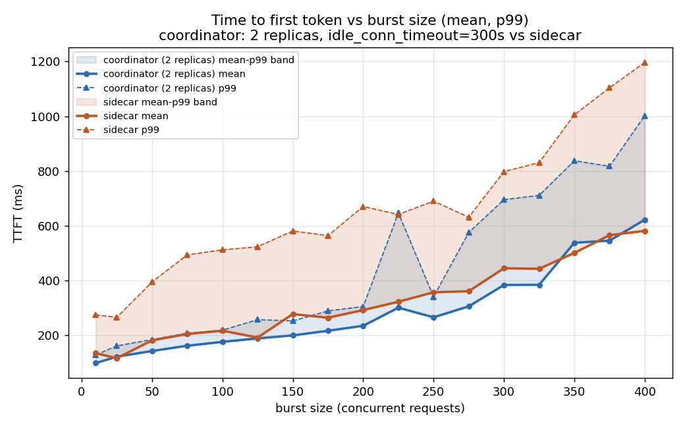
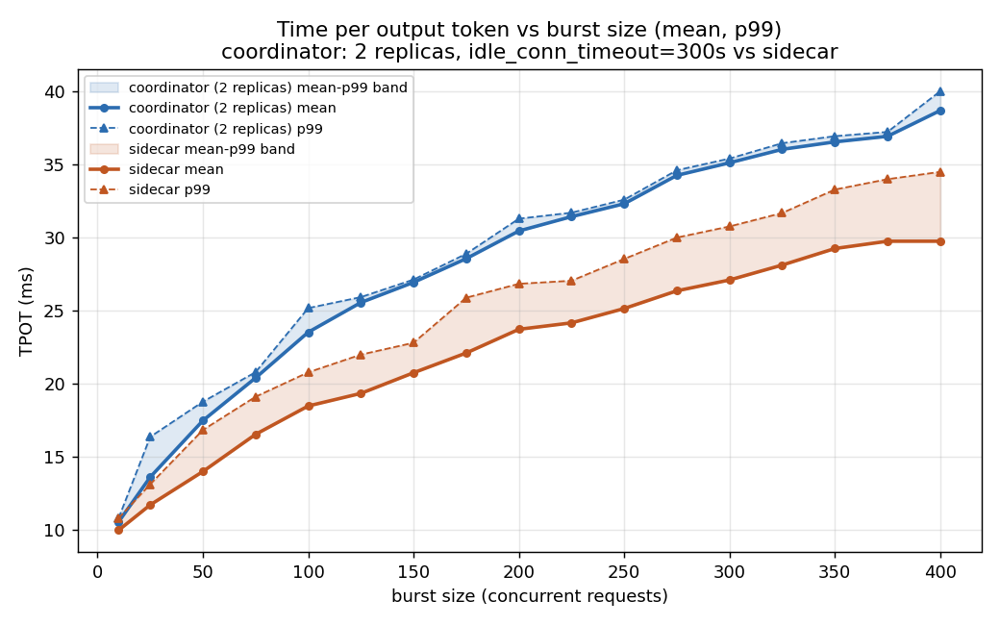

# coordinator vs sidecar — final comparison, DeepSeek-V2

## Which coordinator run this uses, and why

This session ran the same 25-step burst sweep against coordinator
**five times** while investigating an intermittent TTFT anomaly (full
elimination chain: not the test's workload, not GPU sharing, not node
health, not RDMA/KV-transfer, not vLLM engine queueing, not
coordinator/EPP CPU or GC, not TCP-level connection issues, not the
gateway — see prior session notes). The anomaly reproduced in every
run but at a **different burst level each time**, with no config
change (replica count, `idle_conn_timeout`) shown to reliably fix or
predict it.

Given that, picking "the best run" by lowest numbers would be
cherry-picking — every run has an anomaly somewhere, just in a
different place. This report instead uses **the most recent run,
`20260816_200211`**, on the grounds that it reflects the final,
settled configuration (2 coordinator replicas,
`idle_conn_timeout: 300s`) and is the only run with complete
monitoring validation across every component in the request path
(vLLM, coordinator, EPP, network, and gateway CPU — the last of these
only got instrumented in time for this run). It is presented as
**representative, not optimal** — the other four runs are documented
in `coord_vs_sidecar_summary_20260816.md` and
`coord_vs_sidecar_summary_20260816_2coord.md` for anyone who wants
the full spread instead of one snapshot.

| | |
|---|---|
| Model | `deepseek-ai/DeepSeek-V2` |
| Decode | 6 &times; TP4 (both sides) |
| Prefill | 4 &times; TP8 (both sides) |
| Coordinator replicas | 2 |
| Coordinator `idle_conn_timeout` | 300s (raised from 90s default) |
| Input / output length | ~1500 / ~1000 tokens (range-ratio 1.0) |
| Coordinator run | `alexey-epd-sglang-bench`, `20260816_200211` |
| Sidecar run | `alexey-sidecar-sglang`, `20260816_010355` |

## Results (P99, ms)

| Burst | Coord TTFT | Sidecar TTFT | TTFT % diff | Coord TPOT | Sidecar TPOT | TPOT % diff |
|---:|---:|---:|---:|---:|---:|---:|
| 10 | 127.4 | 274.2 | -53.5% | 10.81 | 10.81 | 0.0% |
| 25 | 160.4 | 265.1 | -39.5% | 16.37 | 13.13 | +24.7% |
| 50 | 183.7 | 394.1 | -53.4% | 18.77 | 16.84 | +11.5% |
| 75 | 207.2 | 493.3 | -58.0% | 20.79 | 19.11 | +8.8% |
| 100 | 217.9 | 511.6 | -57.4% | 25.17 | 20.78 | +21.1% |
| 125 | 256.5 | 523.0 | -51.0% | 25.92 | 21.99 | +17.9% |
| 150 | 251.9 | 580.6 | -56.6% | 27.12 | 22.80 | +18.9% |
| 175 | 288.5 | 563.6 | -48.8% | 28.88 | 25.88 | +11.6% |
| 200 | 304.4 | 670.1 | -54.6% | 31.28 | 26.83 | +16.6% |
| **225** | **647.0** | 641.1 | **+0.9%** | 31.69 | 27.04 | +17.2% |
| 250 | 340.3 | 689.9 | -50.7% | 32.58 | 28.53 | +14.2% |
| 275 | 575.3 | 631.0 | -8.8% | 34.59 | 29.99 | +15.3% |
| 300 | 695.2 | 797.6 | -12.8% | 35.39 | 30.75 | +15.1% |
| 325 | 710.8 | 830.6 | -14.4% | 36.44 | 31.67 | +15.1% |
| 350 | 837.4 | 1005.5 | -16.7% | 36.92 | 33.27 | +11.0% |
| 375 | 817.3 | 1104.2 | -26.0% | 37.21 | 33.98 | +9.5% |
| 400 | 1002.4 | 1196.7 | -16.2% | 39.99 | 34.48 | +16.0% |

% diff is `(coord − sidecar) / sidecar`. Negative TTFT = coordinator
faster. Positive TPOT = coordinator slower.

End-to-end latency (which metric actually wins once TTFT and TPOT are
combined) is covered separately in
`coord_vs_sidecar_e2e_latency.md`, including a cross-check against all
four coordinator runs collected this session.

## Charts

Line is mean, dashed is P99, band spans mean-to-P99 per architecture.
The isolated spike at burst=225 is visible as a single dashed-line
excursion, not a sustained shift — everything on either side of it
tracks the smooth trend cleanly.

## Reading it

- **Coordinator wins P99 TTFT at 16 of 17 burst levels**, typically by
  40-58% at low-to-mid burst and 9-26% at high burst. The sole
  exception is burst=225, where the unresolved intermittent anomaly
  landed this run — and even there it's a rounding-error loss (+0.9%),
  not a real regression.
- **Sidecar wins P99 TPOT at every burst level**, by a fairly steady
  9-25%. This has held in every run across the whole investigation,
  unrelated to replica count or timeout settings, and remains
  unexplained.
- **The burst=225 spike is not a property of this configuration** —
  it's the same class of anomaly documented across all five runs, just
  landing here instead of at 75, or 275/325, or nowhere-in-particular.
  Treat its exact location as noise; treat its *existence* as a real,
  unresolved, low-frequency tail-latency risk that any of these
  numbers could hit at some burst level on a given day.

## Bottom line

At matched capacity (6&times;TP4 decode, 4&times;TP8 prefill, coordinator
at 2 replicas with a raised idle-connection timeout), **coordinator has
a clear, wide TTFT advantage across nearly the entire tested range**,
and **sidecar has a smaller but completely consistent TPOT advantage**
throughout. Both findings have now reproduced across five separate
coordinator runs. The one caveat that applies to any single run
(including this one): coordinator carries a real risk of an isolated,
unexplained P99 TTFT spike landing at an unpredictable burst level,
large enough to erase its advantage at that specific level while
leaving everything else in the sweep untouched. Root cause remains
open after eliminating every infrastructure-level explanation checked
in this investigation (workload content, GPU sharing, node health,
RDMA/KV-transfer, vLLM engine queueing, coordinator/EPP CPU and GC,
TCP-level connection behavior, and gateway CPU).
