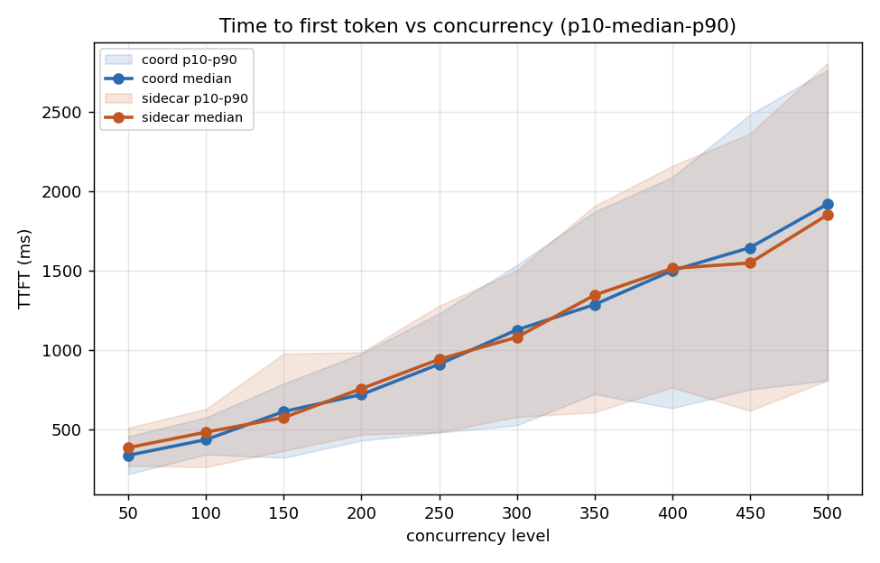
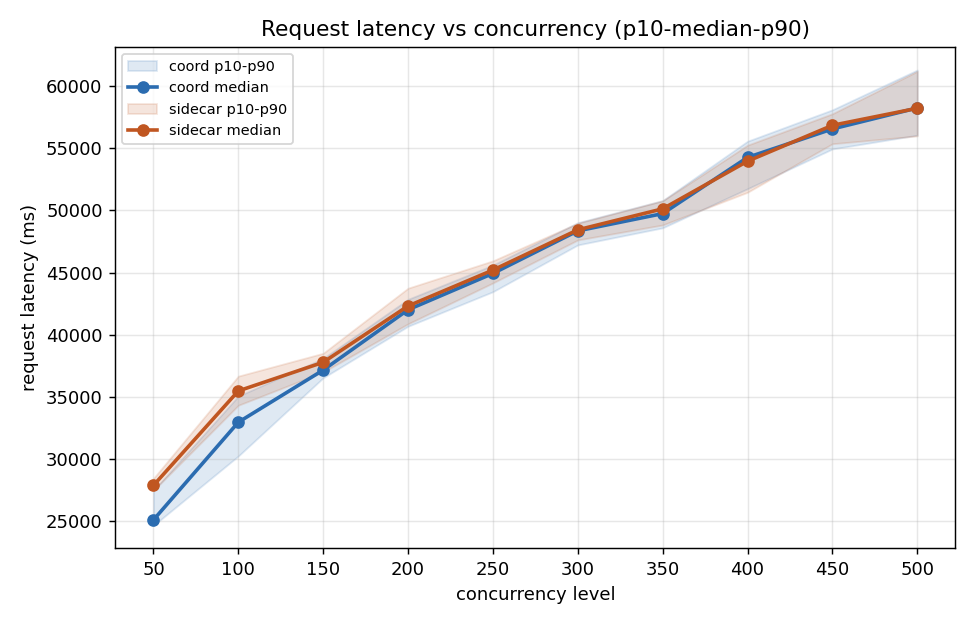
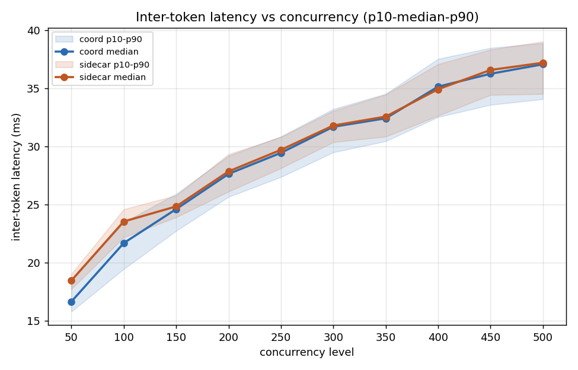
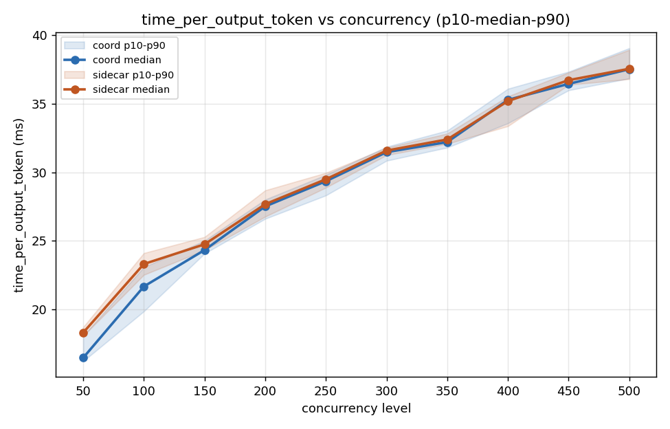

# coordinator vs sidecar — random_spikes, DeepSeek-V2

## Deployment

Identical topology on both sides (confirmed from
`decode_deployment.yaml` / `prefill_deployment.yaml` for each
architecture):

| | |
|---|---|
| Model | `deepseek-ai/DeepSeek-V2` |
| GPU type | H200 |
| Decode | 6 replicas &times; TP4 (4 GPUs/replica) = 24 GPUs |
| Prefill | 4 replicas &times; TP8 (8 GPUs/replica) = 32 GPUs |
| Total GPUs | 56 (both sides) |

## Benchmark

| | |
|---|---|
| Tool | `inference-perf` (`random_spikes` scenario) |
| Input / output length | exactly 1000 / 1500 tokens (fixed, `std_dev: 0`) |
| Stages used | concurrency 50, 100, 150, 200, 250, 300, 350, 400, 450, 500 |
| Coordinator run | `inference-perf_1787120620_random_spikes_epd-gpt-deepSeek-v2` |
| Sidecar run | `inference-perf_1787123995_random_spikes_epd-gpt-deepSeek-v2` |

The first concurrency=50 stage (stage 0 of 11) is excluded as a
warmup run — the scenario repeats concurrency=50 twice back to back
specifically for this purpose. All numbers below are the *second*
concurrency=50 stage and onward.

## Data validation

- **100% success on every stage used, both sides** (50/50 through
  500/500) — no failures anywhere, including at the highest,
  500-concurrency stage.
- **Configs matched** — `config.yaml` diffs clean between the two runs
  except `base_url` (expected, different service endpoints) and the
  storage path (expected, run ID).

## Results

| Concurrency | Arch | Latency median (ms) | TTFT median (ms) | TTFT P90 (ms) | ITL median (ms) | ITL P90 (ms) |
|---:|---|---:|---:|---:|---:|---:|
| 50 | coord | 25072.9 | 339.0 | 457.9 | 16.64 | 18.46 |
| 50 | sidecar | 27853.3 | 387.3 | 512.1 | 18.45 | 19.03 |
| 100 | coord | 32940.5 | 437.5 | 577.4 | 21.68 | 23.46 |
| 100 | sidecar | 35461.6 | 484.4 | 630.7 | 23.54 | 24.59 |
| 150 | coord | 37141.0 | 614.5 | 789.7 | 24.60 | 25.91 |
| 150 | sidecar | 37768.9 | 576.1 | 978.0 | 24.83 | 25.78 |
| 200 | coord | 41999.8 | 721.0 | 978.3 | 27.63 | 29.19 |
| 200 | sidecar | 42304.3 | 758.1 | 986.3 | 27.85 | 29.33 |
| 250 | coord | 44924.8 | 911.9 | 1230.2 | 29.45 | 30.86 |
| 250 | sidecar | 45197.2 | 942.7 | 1278.4 | 29.71 | 30.81 |
| 300 | coord | 48354.3 | 1127.6 | 1535.2 | 31.69 | 33.22 |
| 300 | sidecar | 48437.9 | 1081.3 | 1502.0 | 31.80 | 33.07 |
| 350 | coord | 49744.4 | 1286.8 | 1870.1 | 32.42 | 34.52 |
| 350 | sidecar | 50128.8 | 1346.1 | 1906.3 | 32.57 | 34.47 |
| 400 | coord | 54272.2 | 1500.1 | 2087.7 | 35.15 | 37.54 |
| 400 | sidecar | 53966.5 | 1514.4 | 2158.2 | 34.93 | 37.09 |
| 450 | coord | 56562.3 | 1644.5 | 2481.2 | 36.26 | 38.48 |
| 450 | sidecar | 56855.6 | 1548.4 | 2361.5 | 36.59 | 38.34 |
| 500 | coord | 58256.4 | 1919.2 | 2761.9 | 37.07 | 38.90 |
| 500 | sidecar | 58228.8 | 1850.8 | 2805.3 | 37.21 | 39.04 |

## Charts

Bands are p10-p90, line is the median.

## Reading it

- **TTFT tracks closely between the two architectures at every
  concurrency level**, from 50 through 500. Neither side shows a
  consistent, one-sided advantage — coordinator has the lower median
  at 50, 100, 200, 250, 350, and 400; sidecar has the lower median at
  150, 300, 450, and 500. The gaps are mostly in the 3-13% range either
  way, with p10-p90 bands overlapping heavily at every point.
- **ITL (time per output token) is likewise essentially matched
  throughout** — differences of roughly 0.1-1.9ms at any given
  concurrency level, both directions, no systematic winner. The medians
  sit almost on top of each other on the chart from 50 all the way to
  500 concurrency.
- **Both metrics scale with concurrency identically for both
  architectures** — TTFT grows from ~350-390ms at concurrency 50 to
  ~1850-1920ms at concurrency 500, and ITL grows from ~16.6-18.5ms to
  ~37-37.2ms, on nearly identical curves for coordinator and sidecar.

## Bottom line

Across the full 50-500 concurrency range tested, coordinator and
sidecar perform essentially equivalently on both time-to-first-token
and inter-token latency. Neither architecture shows a meaningful,
consistent advantage over the other at any concurrency level in this
comparison.
