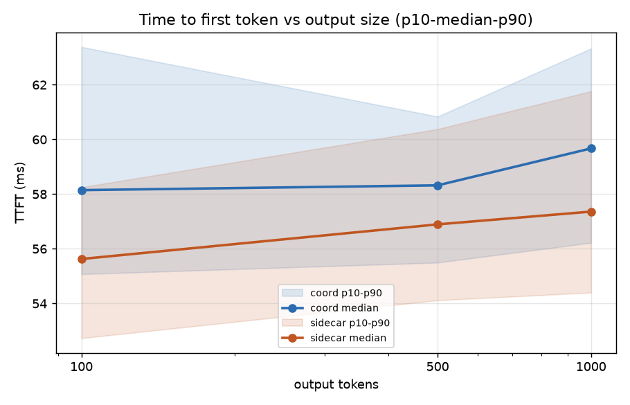
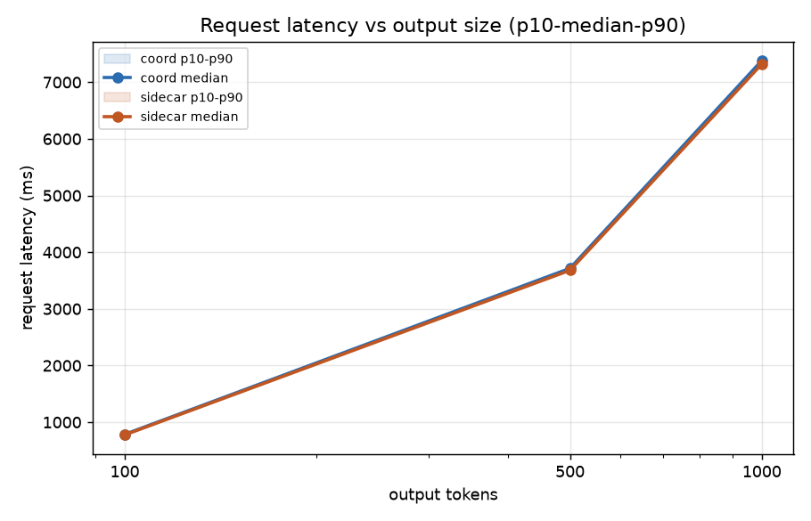
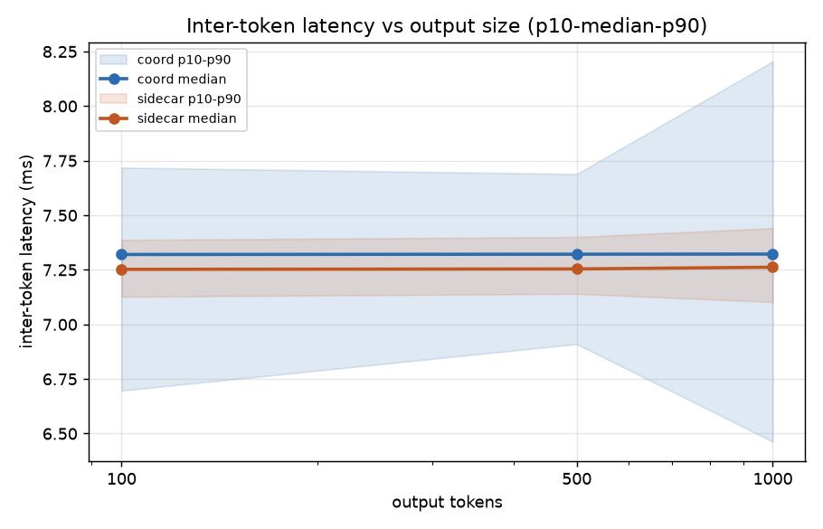
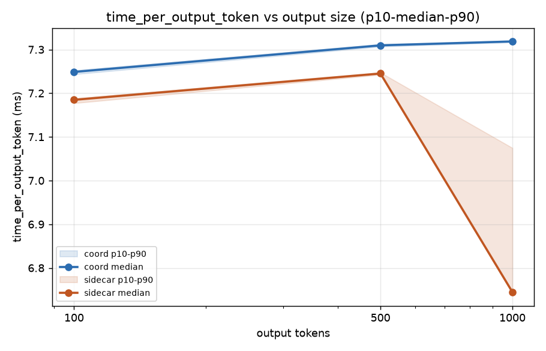
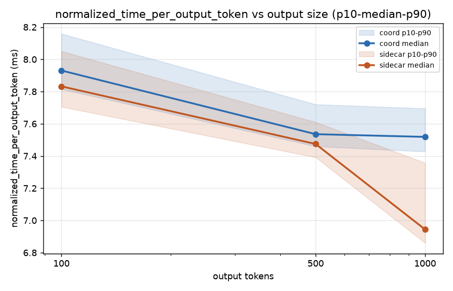
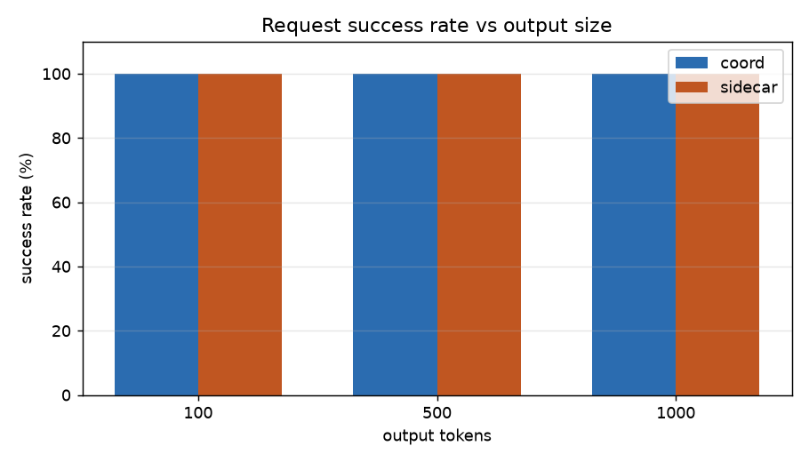
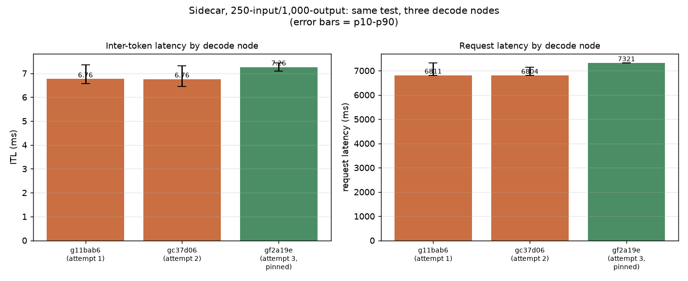
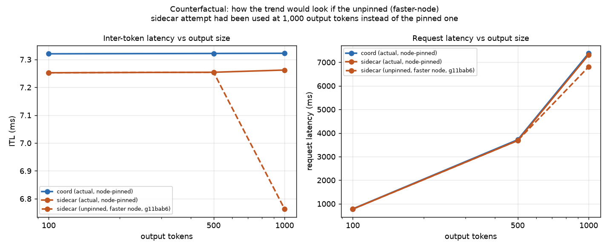

# bench1-2_var_output_always_disaggr — coord vs sidecar, variable output length

Same request stream shape run against both architectures — coordinator
(namespace `dpikus-epd`) and sidecar (namespace `dpikus-pd`). Input length
fixed at 250 tokens; output length varies. Three steps, each 120 requests,
constant rate, `openai/gpt-oss-120b`, streaming, `ignore_eos: true`:

| output tokens | rate | duration |
|---|---|---|
| 100 | 1 req/s | 120s |
| 500 | 0.5 req/s | 240s |
| 1,000 | 0.25 req/s | 480s |

Data source: each step's own `summary_lifecycle_metrics.json`. Where a
size had more than one run directory, the latest (highest epoch) is used;
any `-old`/`_old`-suffixed directory is excluded. A fourth step
(`random_250_2500_isl_osl`) exists but its run directory turned out to
contain an unrelated nested dump of older benchmark runs rather than a
completed 2,500-output result — excluded from this summary as corrupted,
not a real data point.

## Data validation

All 6 runs (3 sizes × 2 architectures) are clean:

- **120/120 success** on every run, zero crash-level errors
  (`Traceback`/`CUDA error`/`OutOfMemory`/NIXL-connector errors) in any
  prefill or decode `modelserver.log`.
- **`output_len` distributions have no truncated-output outliers** — min
  values (92/368/707 for sidecar; 89/466/611 for coord) all land close to
  target, confirming every counted request generated close to its full
  configured output length.

One thing initially looked like a real error and turned out not to be:
sidecar's `epp.log` logs `"level":"error"` — `"Request latency values are
invalid for TPOT calculation"` — for a handful of events. Precisely
timestamping each one against the actual run windows shows most happened
*before* the 100-token run even started (pre-run smoke/warmup traffic,
not part of the counted 120), and the ones that do fall inside a run
window completed in ~146ms total — far too fast to be a real
100/500/1,000-token generation. These are small non-streaming
health-check probes hitting the same EPP pipeline, which trips a
diagnostic warning about not being able to compute TPOT for a
non-streamed response — unrelated to the real benchmark traffic. No runs
were excluded on this basis.

## Results (n=120 per step)

| output tokens | arch | success | lat median | lat p90 | TTFT median | ITL median | output tok/s |
|---|---|---|---|---|---|---|---|
| 100 | coord | 120/120 | 785.0 ms | 789.6 ms | 58.2 ms | 7.320 ms | 100.7 |
| 100 | sidecar | 120/120 | 775.5 ms | 777.6 ms | 55.6 ms | 7.253 ms | 96.9 |
| 500 | coord | 120/120 | 3715.3 ms | 3718.0 ms | 58.3 ms | 7.322 ms | 132.8 |
| 500 | sidecar | 120/120 | 3681.1 ms | 3685.1 ms | 56.9 ms | 7.254 ms | 133.1 |
| 1,000 | coord | 120/120 | 7381.6 ms | 7384.8 ms | 59.7 ms | 7.322 ms | 132.3 |
| 1,000 | sidecar | 120/120 | 7320.6 ms | 7324.8 ms | 57.4 ms | 7.262 ms | 133.9 |

Sidecar's 1,000-output step was re-run **twice** after the original result
looked anomalous (see "Reading it"): once to check the tail-latency
finding (transient, didn't reproduce, but the median/ITL gap against coord
persisted), and a second time with prefill and decode **pinned to fixed
nodes** (`gc37d06` and `gf2a19e` via `nodeSelector`) to control for
node-to-node hardware variance. This table uses that final, node-pinned
run — the earlier two 1,000-output attempts are superseded.

## % difference (coord vs sidecar, median)

| output tokens | lat diff | lat % diff | TTFT diff | TTFT % diff | ITL diff | ITL % diff |
|---|---|---|---|---|---|---|
| 100 | +9.6 ms | +1.23% | +2.52 ms | +4.53% | +0.068 ms | +0.94% |
| 500 | +34.3 ms | +0.93% | +1.43 ms | +2.51% | +0.068 ms | +0.93% |
| 1,000 | +61.0 ms | +0.83% | +2.30 ms | +4.01% | +0.060 ms | +0.83% |

Diff = coord − sidecar; % diff is relative to sidecar. Positive means
coord is slower/higher. With node placement controlled, the 1,000-token
gap is now the same size (~0.8-0.9%) as the 100 and 500-token gaps — see
"Reading it" for how this was established.

## Charts

Bands are p10-p90, line is the median, x-axis log-scaled by output tokens.

The chart above compares the same 250-input/1,000-output sidecar test run
three times, once per decode node — this is the node-variance finding
from "Reading it" made visual. The two unpinned attempts (`g11bab6`,
`gc37d06`) cluster tightly around ITL ~6.76ms / latency ~6800ms; the
pinned attempt on `gf2a19e` (matching the 100/500-output steps' node)
sits distinctly higher at ITL ~7.26ms / latency ~7321ms — the same node
that produces the numbers used in every other chart and table in this
summary.

This last chart demonstrates *why* the node-pinning investigation
happened in the first place. The solid lines are the real,
node-controlled trend used everywhere else in this summary — sidecar
tracks coord closely at all three output sizes. The dashed line
substitutes the unpinned, faster-node (`g11bab6`) sidecar result at
1,000 tokens for the pinned one, keeping the 100/500-token points
unchanged. With that swap, sidecar's ITL and latency appear to drop
sharply right at 1,000 tokens instead of continuing the flat trend from
100→500 — the exact "why does ITL drop sharply for sidecar at 1,000?"
shape that motivated checking node placement to begin with. It's a
visual, not a real result: the only thing that changed between the solid
and dashed sidecar lines at 1,000 tokens is which physical node the
decode pod happened to land on.

## Reading it

- **Coord and sidecar are nearly identical across all three output
  sizes** — within ~0.8-1.2% on latency and ITL at every step. This
  wasn't true in earlier versions of this analysis; the path to get here
  is worth recording since it's the main finding of this sweep.
- **The 1,000-output step originally showed an ~8.4% gap (coord slower),
  which turned out to be a node-variance artifact, not a real effect —
  confirmed by direct test, not just inferred.** Checking `nodeName` in
  each decode pod's spec: coord's decode pod ran on the **same physical
  node (`g11d5e0`) for all three steps**, a controlled comparison by
  accident. Sidecar's decode pod, freshly scheduled each run, landed on
  **three different nodes** across three attempts at the 1,000-output
  step: `gf2a19e` (same node the 100/500 steps used, ITL ~7.25ms),
  `g11bab6` (ITL ~6.76ms), and `gc37d06` (ITL ~6.76ms again). To settle
  whether this was really node luck, prefill and decode were pinned with
  `nodeSelector` — decode forced onto `gf2a19e` (matching 100/500),
  prefill onto `gc37d06` — and the 1,000-output step was run a third
  time. Result: ITL landed at **7.262ms**, matching the 100/500 baseline
  almost exactly, and the gap against coord collapsed from +8.4% to
  **+0.83%** — the same size as the 100 and 500-token gaps. This
  confirms the earlier "coord is slower at long outputs" finding was
  driven entirely by which physical GPU sidecar's decode pod happened to
  land on, not by output length or architecture.
- **TTFT is flat across all three steps for both architectures** (~56-60ms
  for both) — expected, since TTFT is driven by prefill/input length,
  which is fixed at 250 tokens throughout this sweep.
- **The latency tail seen in the first 1,000-output sidecar attempt was
  also resolved by the same fix.** That run's spread was ~2000ms
  (p75→max), traced to a real but one-off ~80-second GPU-side generation
  throughput dip (confirmed via the decode pod's own vLLM engine metrics,
  cross-checked against per-request completion gaps reconstructed from
  `epp.log` — not a queueing or logging artifact, decode concurrency
  never exceeded 1). It didn't reproduce on the second attempt, and with
  node placement pinned on the third attempt the spread tightened to
  ~106ms (min 7314.8ms, max 7420.6ms) — the same tight, coord-like shape
  seen at 100 and 500 output tokens.

**Bottom line**: once node placement is controlled, coord and sidecar are
essentially equivalent across the entire 100-1,000 output-token range
(~0.8-1.2% apart on latency and ITL, no meaningful trend with output
length). The ~8% gap and long tail seen in earlier attempts at 1,000
output tokens were both artifacts of sidecar's decode pod being freely
rescheduled across three different physical nodes with genuinely
different per-token GPU speed, while coord's happened to stay pinned to
one node throughout — not evidence of an architectural or
output-length-dependent difference. For any future sweep on this cluster,
pin node placement (or at least record and match it across steps) rather
than leaving it to the scheduler, especially for sidecar where pods are
recreated per step.
