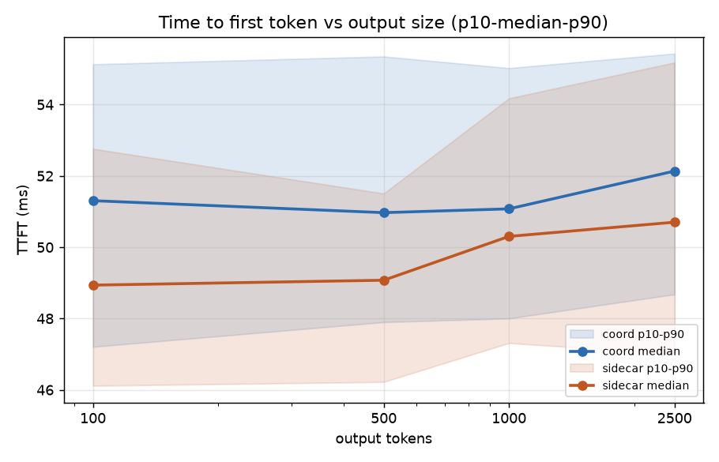
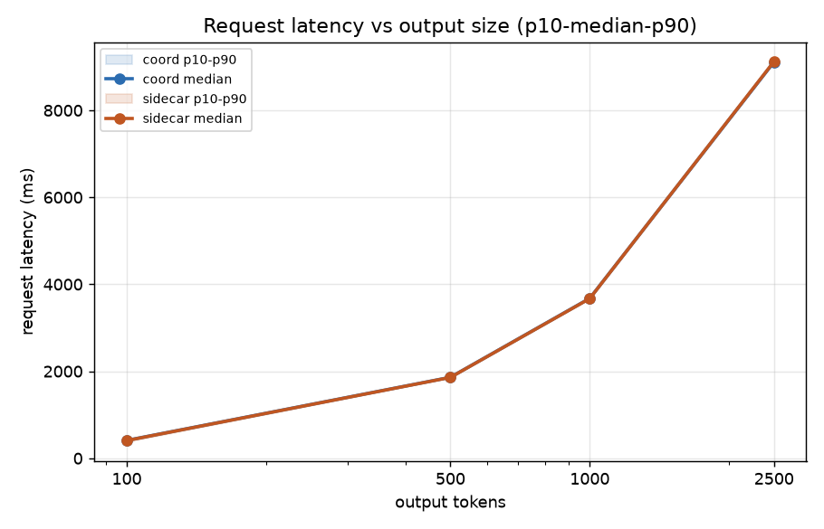
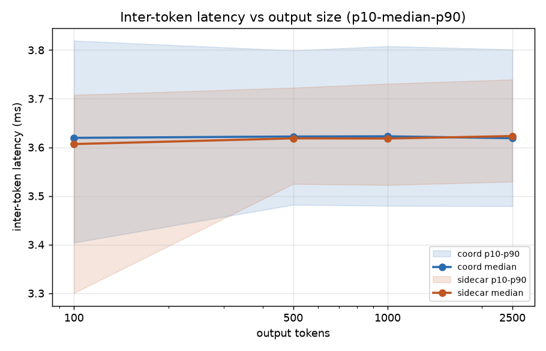
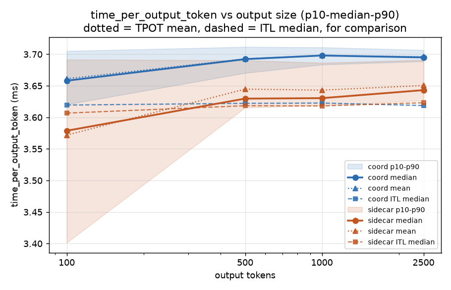
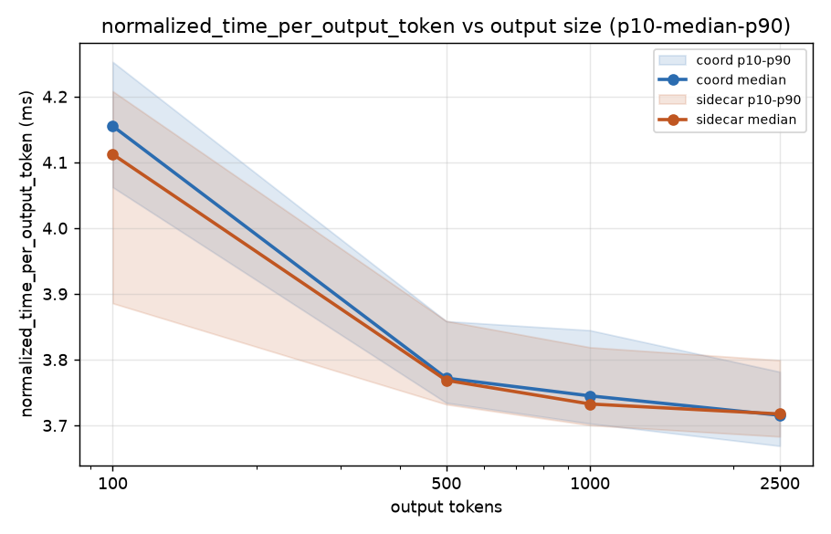
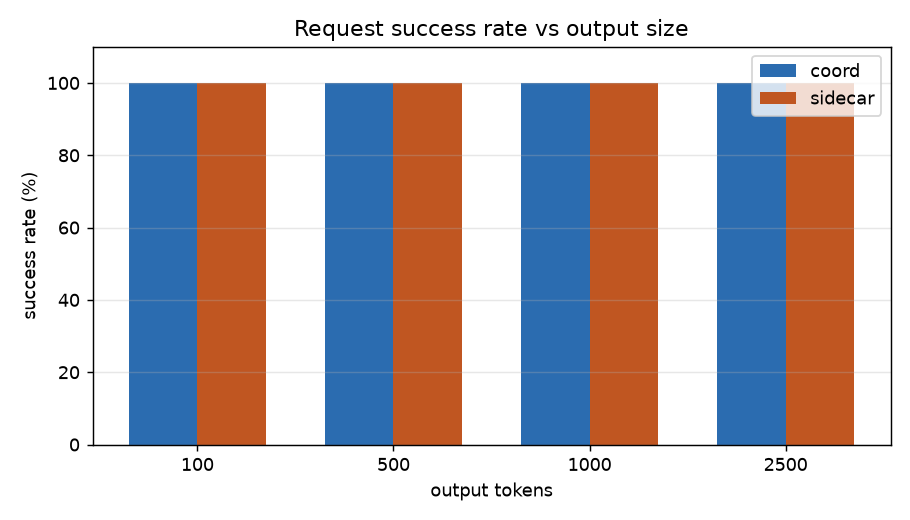

# bench1-2_var_output_always_disaggr_pinned — coord vs sidecar, node-pinned

Coordinator (namespace `dpikus-epd`) vs sidecar (namespace `dpikus-pd`),
same request stream shape against both architectures: input fixed at 250
tokens, output length varies. Prefill and decode are **pinned to the same
physical nodes on both architectures**. Four steps, each 120 requests,
constant rate, `openai/gpt-oss-120b`, streaming, `ignore_eos: true`:

| output tokens | rate | duration |
|---|---|---|
| 100 | 1 req/s | 120s |
| 500 | 0.5 req/s | 240s |
| 1,000 | 0.25 req/s | 480s |
| 2,500 | 0.1 req/s | 1200s |

Data source: each step's own `summary_lifecycle_metrics.json`.

## Data validation

All 8 runs (4 sizes x 2 architectures) are clean:

- **120/120 success** on every run, zero crash-level errors
  (`Traceback`/`CUDA error`/`OutOfMemory`/NIXL-connector errors) in any
  prefill or decode `modelserver.log`.
- **`output_len` has no truncated-output outliers** — min values land
  close to target at every step, confirming every counted request
  generated close to its full configured output length.
- **Node placement confirmed directly from the per-run `pod.yaml`
  snapshots (real `nodeName`, not just `nodeSelector` intent) — every
  component sat on the same physical node for all 4 steps, on both
  architectures**: gateway `g49fc0a`, EPP `g49fc0a`, coordinator (coord
  only) `g801c7a`, decode `gf2a19e`, prefill `gc37d06`. Coord and
  sidecar share the same physical nodes as each other, so there's no
  node-to-node GPU variance in this sweep.

## Results (n=120 per step)

| output tokens | arch | success | lat median | TTFT median | ITL median | output tok/s |
|---|---|---|---|---|---|---|
| 100 | coord | 120/120 | 411.3 ms | 51.3 ms | 3.619 ms | 101.2 |
| 100 | sidecar | 120/120 | 407.6 ms | 48.9 ms | 3.607 ms | 100.5 |
| 500 | coord | 120/120 | 1862.2 ms | 51.0 ms | 3.622 ms | 239.5 |
| 500 | sidecar | 120/120 | 1859.0 ms | 49.1 ms | 3.618 ms | 237.9 |
| 1,000 | coord | 120/120 | 3676.9 ms | 51.1 ms | 3.623 ms | 243.3 |
| 1,000 | sidecar | 120/120 | 3672.1 ms | 50.3 ms | 3.618 ms | 240.2 |
| 2,500 | coord | 120/120 | 9111.7 ms | 52.1 ms | 3.619 ms | 244.6 |
| 2,500 | sidecar | 120/120 | 9121.9 ms | 50.7 ms | 3.623 ms | 240.2 |

## % difference (coord vs sidecar, median)

| output tokens | lat % diff | TTFT % diff | ITL % diff |
|---|---|---|---|
| 100 | +0.91% | +4.91% | +0.33% |
| 500 | +0.17% | +3.87% | +0.11% |
| 1,000 | +0.13% | +1.59% | +0.14% |
| 2,500 | -0.11% | +2.76% | -0.11% |

Diff = coord − sidecar; % diff is relative to sidecar. Positive means
coord is slower/higher.

## Reading it

- **Coord and sidecar are essentially identical across all four output
  sizes** — within ~0.1-0.9% on latency and ITL at every step. TTFT is
  flat and close (~1.5-5%) for both architectures at every step, as
  expected since it's driven by the fixed 250-token input; that gap is
  within the metric's own noise band (p10-p90 spread of ~7-8ms against
  a ~50ms median with n=120), not a systematic effect.
- **No node-placement confound**: gateway, coordinator, EPP, decode, and
  prefill all sat on the same physical nodes for every step, on both
  architectures (checked against the actual `nodeName` in each run's
  pod snapshot, not just the deployment's `nodeSelector`).

## Why TPOT runs higher than ITL (and coord more than sidecar)

The results table above reports ITL's *median*. `time_per_output_token`
(TPOT) is a different statistic on the same underlying per-token gaps,
and the two are not expected to match:

- **TPOT is, by construction, each request's own *average* gap**:
  `(request_latency - TTFT) / (output_tokens - 1)`. With hundreds to
  thousands of tokens per request at the 500/1,000/2,500 steps, this
  average is a very stable estimate of that request's *mean* per-token
  time — confirmed directly: `mean(TPOT)` and `mean(ITL)` agree to 4
  significant figures at every step, both architectures (e.g. at 1,000
  tokens, coord: 3.6982 vs 3.6981ms; sidecar: 3.6431 vs 3.6429ms).
- **ITL's reported value is the *median* of all individual token gaps
  pooled together**, not an average. That distribution is heavily
  right-skewed — most gaps are fast (~3.6ms) but a minority are much
  slower (batch/preemption/scheduling stalls): coord's ITL at 1,000
  tokens has median 3.62ms but p95=5.73ms, p99=8.00ms, max=12.1ms.
  Skew like that pulls the *mean* well above the *median* without
  moving the median much — which is exactly why TPOT (mean-like) reads
  higher than the ITL median for both architectures.
- **Coord's tail is consistently heavier than sidecar's** at the
  500/1,000/2,500 steps specifically — e.g. at 1,000 tokens, coord's
  ITL p99 is 8.00ms vs sidecar's 6.85ms, despite both having the same
  ~3.62ms median. A heavier tail pulls the mean up further without
  moving the median, so it shows up as an elevated TPOT for coord
  (~1.4-2.2% higher than sidecar's) while the ITL median — and the
  request latency it's actually driving — stays essentially matched.
  This reads as coord having somewhat more frequent or severe brief
  decode stalls than sidecar, not a difference in typical per-token
  speed. Not root-caused further here; that would need the decode
  engine's own batching/preemption metrics for these two steps.

## Charts

Bands are p10-p90, solid line is the median, x-axis log-scaled by output
tokens. The TPOT chart additionally overlays each architecture's own TPOT
*mean* (dotted) and ITL *median* (dashed): the dotted and solid lines sit
almost on top of each other (TPOT's median ≈ its own mean — the metric
itself isn't skewed), while both sit above the dashed ITL-median lines —
visibly more so for coord than sidecar at 500/1,000/2,500 tokens, per
the explanation above.

**Bottom line**: with node placement controlled on both architectures,
coord and sidecar are equivalent across the entire 100-2,500 output-token
range — within ~0.1-0.9% on latency and ITL at every step. The only
metric showing a consistent, non-trivial gap is TPOT (~1.4-2.2%, coord
higher), and that traces to coord having a somewhat heavier tail of
occasional slow decode tokens, not a difference in typical per-token
speed or in overall request latency.
