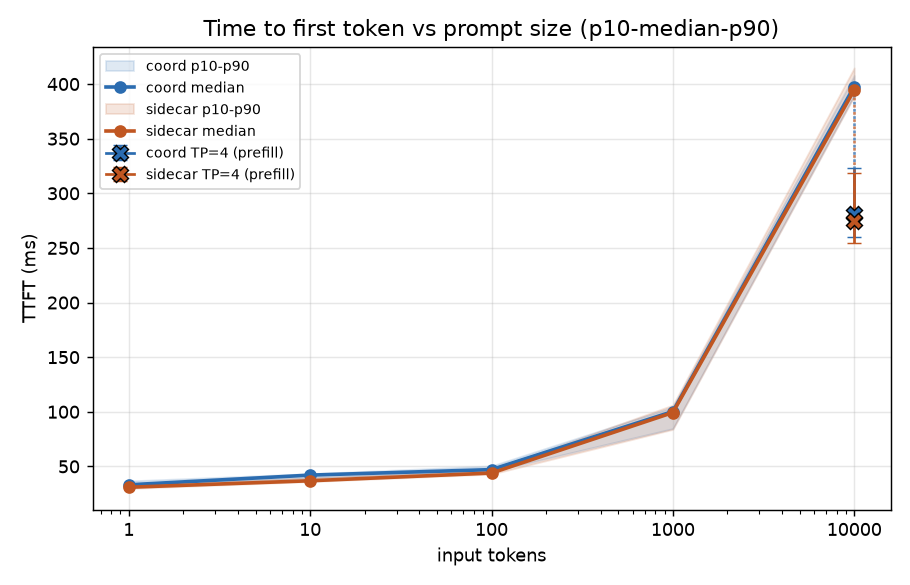
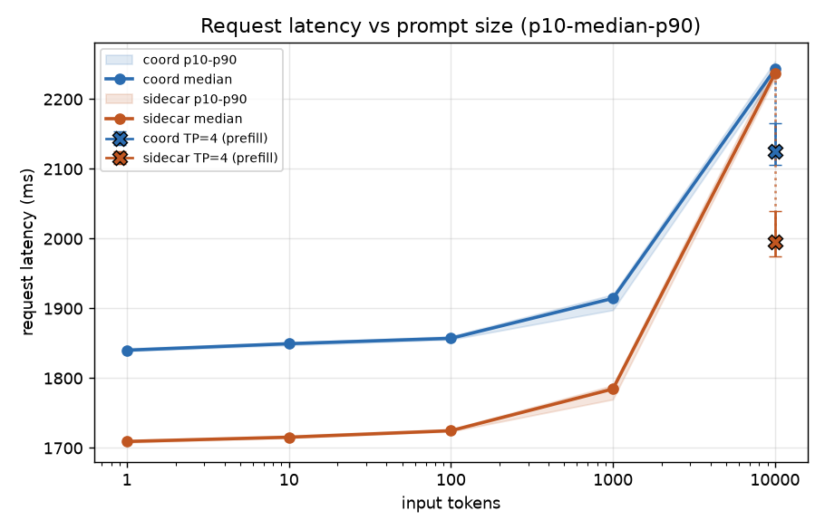
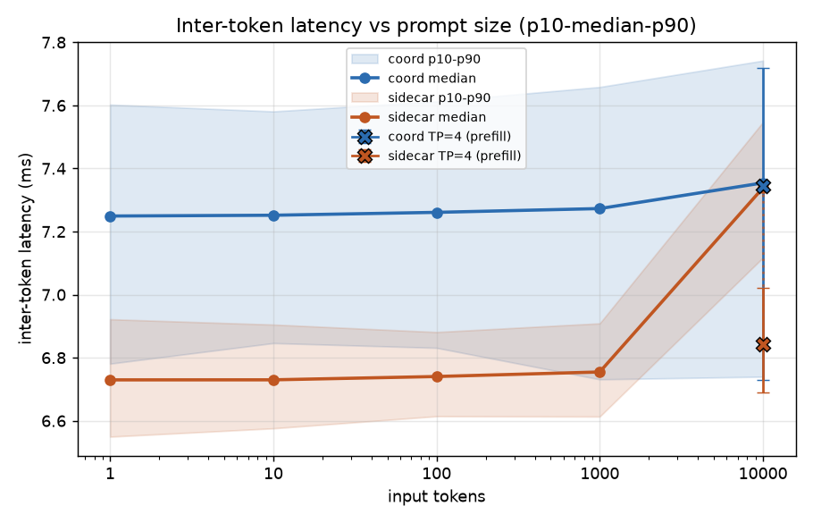
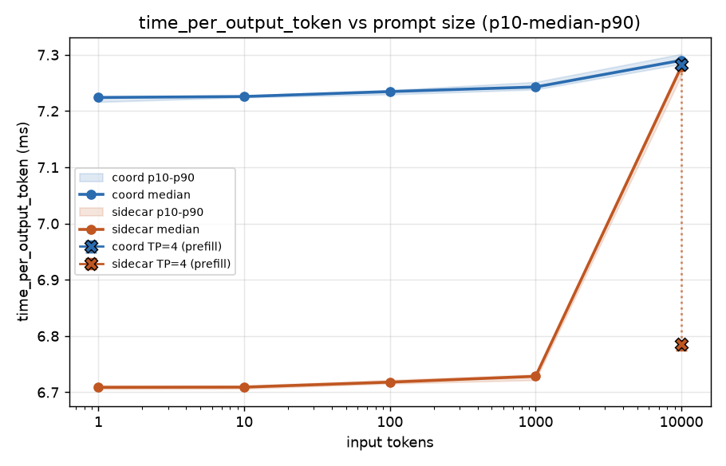
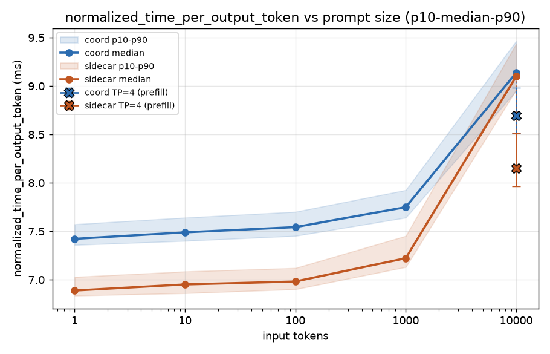
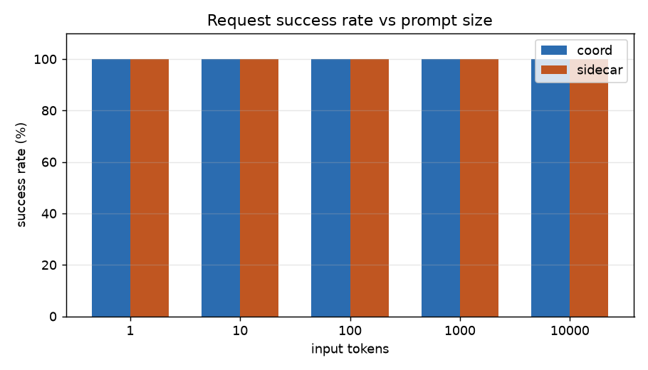

# bench1-2_var_prompt_always_disaggr — coord vs sidecar, variable prompt length

Same request stream shape run against both architectures — coordinator
(namespace `dpikus-epd`) and sidecar (namespace `dpikus-pd`), sidecar's EPP
configured to always disaggregate (`nonCachedTokens: 0`). Five steps, each
120 requests, constant rate, `openai/gpt-oss-120b`, streaming, output fixed
at 250 tokens:

| input tokens | rate | duration |
|---|---|---|
| 1 | 1 req/s | 120s |
| 10 | 1 req/s | 120s |
| 100 | 0.5 req/s | 240s |
| 1,000 | 0.25 req/s | 480s |
| 10,000 | 0.1 req/s | 1200s |

Data source: each step's own `summary_lifecycle_metrics.json` (official
inference-perf report). Sidecar was re-run after earlier infra issues
(see "Earlier data quality issues, now resolved" below); coord was then
re-run in full across all five sizes for a fresh, consistent baseline.
This summary uses only the latest run per size on each side (any
`-old`/`_old`-suffixed directory is excluded).

## Results (n=120 per step)

| input tokens | arch | success | lat median | lat p90 | TTFT median | TTFT p90 | ITL median | output tok/s |
|---|---|---|---|---|---|---|---|---|
| 1 | coord | 120/120 | 1840.1 ms | 1842.9 ms | 33.2 ms | 36.7 ms | 7.25 ms | 134.2 |
| 1 | sidecar | 120/120 | 1709.3 ms | 1711.3 ms | 30.9 ms | 33.3 ms | 6.73 ms | 144.7 |
| 10 | coord | 120/120 | 1849.5 ms | 1851.1 ms | 42.0 ms | 43.4 ms | 7.25 ms | 133.1 |
| 10 | sidecar | 120/120 | 1715.4 ms | 1717.8 ms | 36.9 ms | 39.6 ms | 6.73 ms | 143.4 |
| 100 | coord | 120/120 | 1857.2 ms | 1860.2 ms | 47.1 ms | 50.4 ms | 7.26 ms | 113.2 |
| 100 | sidecar | 120/120 | 1724.7 ms | 1726.9 ms | 43.9 ms | 46.7 ms | 6.74 ms | 120.8 |
| 1,000 | coord | 120/120 | 1914.4 ms | 1920.1 ms | 100.3 ms | 104.4 ms | 7.27 ms | 64.6 |
| 1,000 | sidecar | 120/120 | 1784.5 ms | 1789.7 ms | 99.3 ms | 106.2 ms | 6.75 ms | 64.3 |
| 10,000 | coord | 120/120 | 2242.9 ms | 2254.1 ms | 397.7 ms | 407.8 ms | 7.35 ms | 24.5 |
| 10,000 | sidecar | 120/120 | 2236.6 ms | 2250.1 ms | 394.6 ms | 414.8 ms | 7.34 ms | 33.4 |

Every step on both sides has 120/120 success. Coord's fresh numbers were
validated directly against `coordinator.log`'s own per-request pipeline
breakdown (parse/prefill-leg/decode-leg) for each of the five run
windows: the internal `parse+prefill+decode` sum matches the harness's
official `request_latency` median within 0.1-1.1% at every size,
confirming both instrumentation sources agree. Sidecar's pod logs show
all 7 expected pods up (including the prefill pod) with zero NIXL/UCX
errors. This is a clean, apples-to-apples comparison across all five
sizes.

## % difference (coord vs sidecar, median)

| input tokens | lat diff | lat % diff | TTFT diff | TTFT % diff | ITL diff | ITL % diff |
|---|---|---|---|---|---|---|
| 1 | +130.8 ms | +7.65% | +2.3 ms | +7.28% | +0.52 ms | +7.72% |
| 10 | +134.1 ms | +7.82% | +5.2 ms | +14.01% | +0.52 ms | +7.75% |
| 100 | +132.5 ms | +7.68% | +3.1 ms | +7.15% | +0.52 ms | +7.72% |
| 1,000 | +129.9 ms | +7.28% | +0.9 ms | +0.95% | +0.52 ms | +7.67% |
| 10,000 | +6.3 ms | +0.28% | +3.1 ms | +0.78% | +0.02 ms | +0.21% |

Diff = coord − sidecar; % diff is relative to sidecar. Positive means coord
is slower/higher. The ITL gap is now remarkably uniform (~7.7% at every
size except 10,000) — with fully clean data on both sides, this is the
tightest, most consistent version of this comparison so far. The 10-token
TTFT gap (+14.0%) stands out as larger in relative terms than the
neighboring sizes, though it's a small absolute difference (+5.2ms).

## Additional inference-perf metrics

| input tokens | arch | time_per_output_token median | normalized_time_per_output_token median |
|---|---|---|---|
| 1 | coord | 7.224 ms | 7.422 ms |
| 1 | sidecar | 6.709 ms | 6.888 ms |
| 10 | coord | 7.226 ms | 7.489 ms |
| 10 | sidecar | 6.709 ms | 6.951 ms |
| 100 | coord | 7.235 ms | 7.543 ms |
| 100 | sidecar | 6.718 ms | 6.981 ms |
| 1,000 | coord | 7.243 ms | 7.749 ms |
| 1,000 | sidecar | 6.728 ms | 7.222 ms |
| 10,000 | coord | 7.290 ms | 9.137 ms |
| 10,000 | sidecar | 7.279 ms | 9.099 ms |

`time_per_output_token` tells the same story as ITL above — coord sits at
a flat ~7.2ms floor while sidecar rises from ~6.7ms toward ~7.3ms at
10,000 tokens. `normalized_time_per_output_token` (which amortizes
prefill cost over output tokens too) diverges more at 10,000 tokens
specifically — both rise well above their own `time_per_output_token`
there (coord 9.14ms, sidecar 9.10ms), reflecting how much of total
latency at that size is prefill rather than decode; at 1-1,000 tokens the
two metrics stay close together since prefill cost is negligible there.

## Charts

Bands are p10-p90, line is the median, x-axis log-scaled by input tokens.
The `X` markers at the far right are the prefill-TP=4 follow-up runs (see
below), connected to the original TP=1 10,000-token point by a dotted
line so the shift is easy to see at a glance.

## Reading it

- **Coord is consistently ~7.3-7.8% higher on total request latency at 1,
  10, 100, and 1,000 input tokens** (+130-134ms), dropping sharply to
  +0.3% at 10,000 tokens. With the full coord re-run, this gap is now
  tighter and more uniform than in earlier versions of this analysis —
  four sizes spanning three orders of magnitude land within half a
  percentage point of each other (+7.25% to +7.82%).
- **The gap lives almost entirely in inter-token latency (ITL), not
  TTFT — and this is now the cleanest signal in the whole sweep.** ITL %
  diff is +7.67% to +7.75% at 1/10/100/1,000 tokens (essentially
  identical across four orders of magnitude in prompt size), dropping to
  +0.21% at 10,000 tokens. Coord's ITL sits at a flat ~7.25-7.27ms
  floor throughout 1-1,000 tokens; sidecar's rises from ~6.73ms toward
  7.34ms, catching up to coord's floor exactly at 10,000 tokens. TTFT
  differences are smaller and noisier (0.95-14.0% depending on size) and
  don't explain the latency gap on their own.
- **Validated against coord's own internal breakdown for every size, not
  just one**: `coordinator.log`'s per-request pipeline timings
  (parse/prefill-leg/decode-leg) show prefill leg cost rising from
  ~15.5ms (1 token) to ~325ms (10,000 tokens) — a real, expected
  disaggregation round trip that scales with prompt size — while the
  parse+prefill+decode sum matches the harness's own `request_latency`
  median within 0.1-1.1% at every size. The coord-vs-sidecar gap isn't
  hiding in an inflated prefill hop; it's inside the decode/streaming leg,
  consistent with the ITL finding above.
- **Read on this**: sidecar's per-token decode cost scales up with prompt
  size (larger KV cache → more expensive attention per token, the expected
  GPU-level behavior), while coord's per-token cost sits at a roughly
  constant ~7.25ms floor regardless of prompt size. That floor is
  consistent with coord adding a small, fixed per-token overhead (e.g.
  extra serialization/relay cost in how each token is streamed back)
  that's a real cost for small-to-medium prompts but gets swamped by
  genuine GPU attention cost once the KV cache is large enough (~10,000
  tokens) that both architectures converge. This is inferred from the
  pattern in the numbers, not confirmed via vLLM/coord-internal
  instrumentation of the decode streaming path. **Update**: the
  "convergence at 10,000 tokens" part of this was itself confounded by
  prefill running at TP=1 there — see the TP=4 follow-up below, which
  shows TTFT drops ~30% on both sides once prefill is properly
  parallelized, meaning the 10,000-token convergence point in this sweep
  isn't a stable architectural fact so much as an artifact of a specific
  (undersized) prefill configuration.
- **Output throughput is higher for sidecar at 1, 10, 100, and 10,000
  tokens** (+7.9%, +7.7%, +6.8%, +35.9% respectively), **but coord is
  marginally ahead at 1,000 tokens** (-0.4%, i.e. sidecar slightly
  behind) — a reversal from earlier versions of this analysis, driven by
  coord's 1,000-token throughput rising from 61.4 to 64.6 tok/s in the
  re-run. The 10,000-token gap remains the standout outlier by a wide
  margin.

**Bottom line**: with clean, re-run data on both sides for all five
prompt sizes, sidecar is consistently ~7.3-7.8% faster than coord on both
total request latency and ITL at 1, 10, 100, and 1,000 tokens — a tight,
uniform gap now that both sides are validated — converging to near-parity
(~0.3%) only at 10,000 tokens. Coord has a roughly constant per-token
decode cost that sidecar's per-token cost only catches up to once the KV
cache is large enough for real attention cost to dominate.

## Follow-up: prefill TP=1 → TP=4 at 10,000 tokens (confirms the prefill-bottleneck hypothesis)

Earlier in this investigation we asked whether prefill running at TP=1
(a single GPU, vs. decode's TP=4) was a genuine compute bottleneck
specifically at 10,000 input tokens, where prefill does substantial real
work (~325ms in coord's own internal breakdown). Both prefill deployments
were bumped to TP=4 (also fixing a `resources.limits.memory: 16Gi → 64Gi`
OOM issue that surfaced during the switch — 4 concurrent model-loading
workers needed more host RAM than 1 did) and the 10,000-token step was
re-run on both sides. Both new runs are clean: 120/120 success, correct
`--tensor-parallel-size=4` and `memory: 64Gi` confirmed in the pod specs,
zero errors in either prefill or decode logs.

| metric | coord TP=1 → TP=4 | sidecar TP=1 → TP=4 |
|---|---|---|
| lat median | 2242.9 → 2124.9 ms (−5.3%) | 2236.6 → 1994.9 ms (−10.8%) |
| TTFT median | 397.7 → 281.4 ms (**−29.2%**) | 394.6 → 274.9 ms (**−30.3%**) |
| ITL median | 7.354 → 7.346 ms (−0.1%) | 7.339 → 6.842 ms (−6.8%) |
| normalized TPOT median | 9.14 → 8.69 ms (−4.9%) | 9.10 → 8.15 ms (−10.4%) |
| output tok/s | 24.5 → 25.0 (+2.2%) | 33.4 → 41.7 (+24.8%) |

**This confirms the hypothesis directly**: TTFT drops by ~30% on *both*
architectures when prefill compute is parallelized across 4 GPUs instead
of 1 — a large, consistent effect that's architecture-independent,
exactly what you'd expect if prefill compute (not something
coord/sidecar-specific) was the thing capping TTFT at this prompt size.
ITL stays essentially flat for coord (as expected — ITL is a decode-only
metric, and coord's decode never touched prefill's TP) but improves
6.8% for sidecar — suggesting the earlier TP=1(prefill)/TP=4(decode)
*mismatch* was also adding a per-token transfer overhead on the sidecar's
NIXL path beyond just the initial handshake (4 decode workers fanning
into 1 prefill rank vs. now a matched 4-to-4 transfer), not just slowing
the one-time prefill hop. Sidecar benefits more overall (bigger drops on
every metric, +24.8% throughput vs. coord's +2.2%), consistent with
sidecar's NIXL-based transfer path being more sensitive to the TP
mismatch than coord's own prefill/decode handoff.

## Earlier data quality issues, now resolved

Earlier runs on both sides had infra issues that made their numbers
unusable; all have since been re-run cleanly:

1. **Sidecar, 10 and 100-token steps (first sweep)**: the prefill pod was
   down (missing from the namespace), so those requests were silently
   served decode-only with no real disaggregation.
2. **Sidecar, 10-token step (re-run)**: hit a persistent NIXL/UCX
   connector bug — after the prefill pod's `NixlConnector` was created,
   decode's first real KV transfer to it failed
   (`NIXL_ERR_REMOTE_DISCONNECT`), and every subsequent transfer to that
   same engine then failed with `NIXL_ERR_NOT_FOUND` — 972 failures over
   13+ minutes, never self-recovering. Traced into vLLM's NIXL connector
   source (`kv_connector/v1/nixl/base_worker.py`): a successful handshake
   caches the remote engine's registration with no health check, transfer
   failures don't evict that cache, and the TTL-based staleness eviction
   never fires because failed *attempts* still refresh the engine's "last
   active" timestamp. This is a vLLM/NIXL-connector bug, not an
   `llm-d-router` issue — the router passes fresh, correct
   `kv_transfer_params` from the live prefill response on every request.
3. **Coord, 1-token step (first sweep)**: 42/120 requests failed fast
   (65% success), which silently skewed the reported median down via
   survivorship bias — the earlier version of this summary read that as
   "coord ≈ sidecar at 1 token," which was an artifact of the failures,
   not a real result. The re-run (120/120 success) shows coord is actually
   ~7.7% slower than sidecar at 1 token, consistent with the other sizes.
   Cause of the original failures wasn't identified before the re-run
   resolved it.

All five coord steps were subsequently re-run in full for a fresh,
internally-consistent baseline (not just the previously-broken 1-token
step) — the 10/100/1,000/10,000-token numbers shifted slightly from
earlier versions of this summary (e.g. coord's 1,000-token throughput
rose from 61.4 to 64.6 tok/s) but the overall pattern — coord ~7-8%
slower on latency/ITL at 1-1,000 tokens, converging at 10,000 — held up
and became more uniform, not less. Every fresh coord number in this
version was cross-validated against `coordinator.log`'s own per-request
pipeline breakdown (see "Reading it" above), not just taken from the
harness report at face value.

The results in this summary are from the latest run per size on both
sides (all 5 steps, 120/120 success, 7/7 pods where applicable, zero NIXL
errors, coord validated against its own internal logs) and supersede
every earlier version of this analysis. Directories with an `-old`/`_old`
suffix are the superseded runs kept for reference — not used here.
