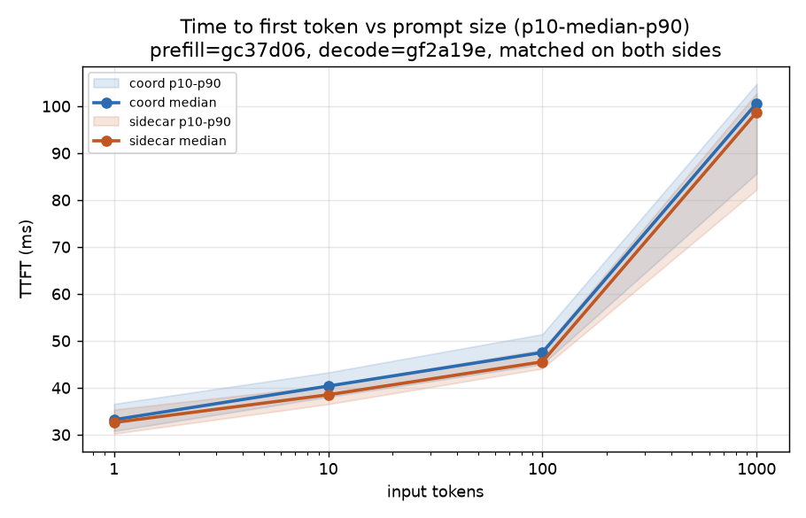
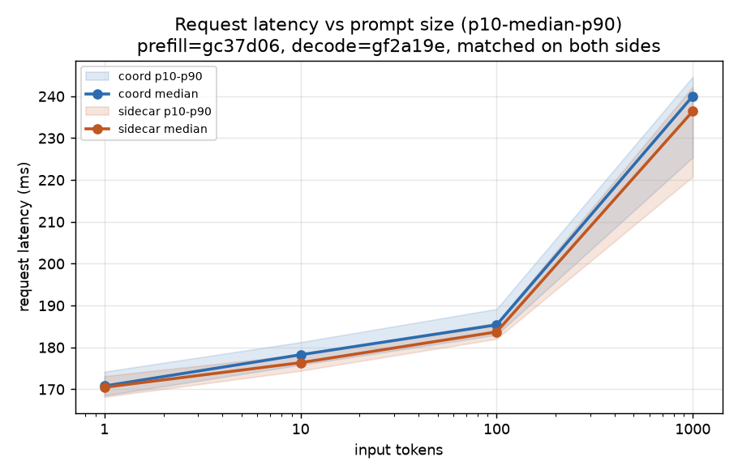
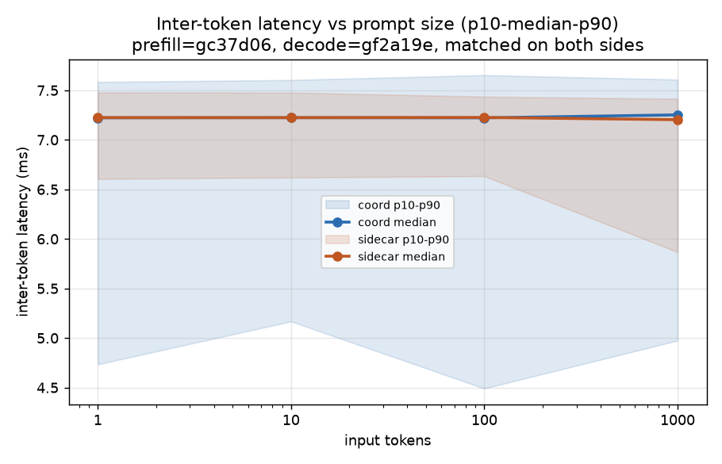
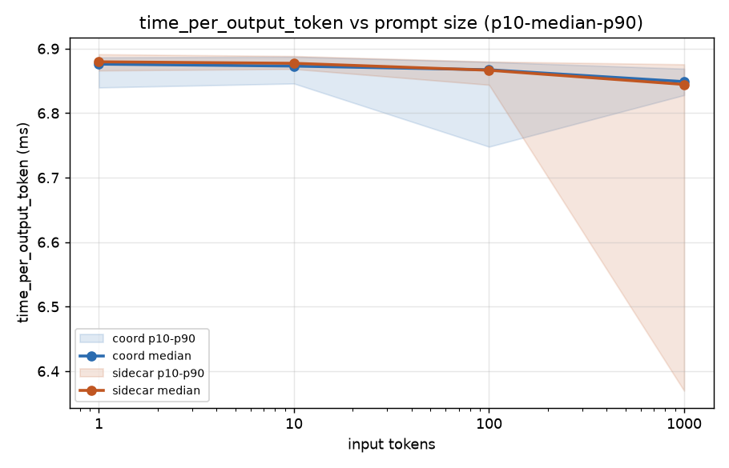
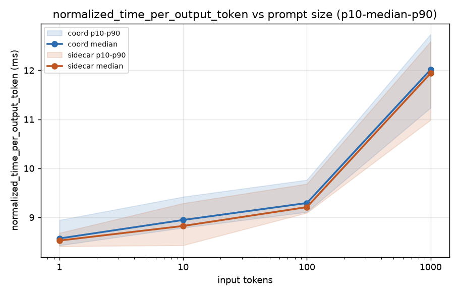
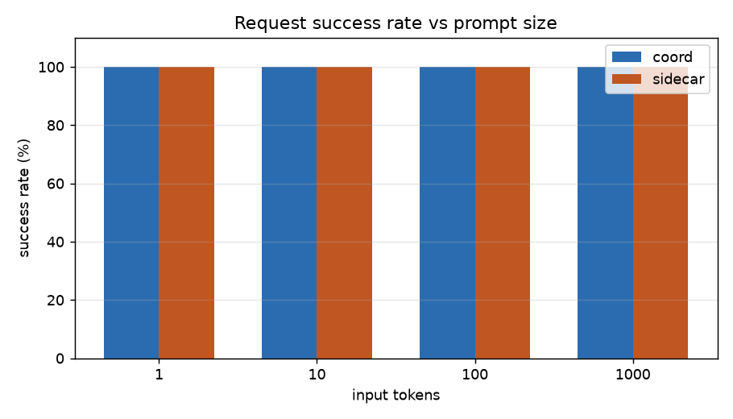

# bench1-3_var_prompt_always_disaggr — coord vs sidecar, node-controlled repeat of the input-length sweep

This bench repeats `bench1-2_var_prompt_always_disaggr`'s input-length
sweep (output fixed, input varies), but with two deliberate changes aimed
at removing confounds found in earlier benches:

1. **Output length cut from 250 to 20 tokens** — avoids the
   `worker_max_concurrency: 1` rate-cap issue found in `bench1-2` (at 250
   output tokens, per-request completion time exceeded the 1 req/s
   inter-arrival gap for the smallest sizes) and speeds up iteration,
   since ITL only needs a modest number of inter-token gaps to produce a
   stable estimate.
2. **Prefill and decode pinned to the same node pair on both
   architectures** — `nodeSelector` set so prefill runs on `gc37d06` and
   decode on `gf2a19e` for *both* coord and sidecar. This directly tests
   whether the ~7-8% ITL/latency gap found in `bench1-2` was a real
   architectural difference or a node-hardware-variance artifact (coord
   and sidecar had landed on different, differently-performing nodes in
   that earlier sweep — confirmed separately in
   `bench1-2_var_output_always_disaggr`, where the same class of node
   variance produced an ~8% swing purely from which physical GPU a pod
   landed on).

| input tokens | rate | duration |
|---|---|---|
| 1 | 1 req/s | 120s |
| 10 | 1 req/s | 120s |
| 100 | 0.5 req/s | 240s |
| 1,000 | 0.25 req/s | 480s |

## Data validation

- **Node placement confirmed matched**: `grep nodeName`/`Node:` on every
  prefill and decode pod spec across all 8 result directories shows
  prefill on `gc37d06` and decode on `gf2a19e`, consistently, for both
  coord and sidecar.
- **120/120 success on every run used in this summary**, zero
  crash-level errors in the relevant time window of any prefill/decode
  `modelserver.log`.
- **Coord's 10-token step needed two attempts.** The first attempt
  (`inference-perf_1784449874_...`) had its prefill pod go unavailable
  36 seconds into the run — the prefill EPP started returning
  `ServiceUnavailable: failed to find endpoint candidates`, and the
  coordinator logged `prefill: upstream returned HTTP 503` for the rest
  of the run (85/120 requests failed; the 35 that landed before the
  outage succeeded normally). Confirmed via the pod-log snapshot for that
  run, which is missing a prefill vLLM pod entry entirely — the very next
  step's snapshot has it back and healthy. This attempt is excluded
  (kept on disk as `pod_logs_dpikus-epd-10-20-old`, not used in any
  calculation). The second attempt
  (`inference-perf_1784451473_...`) is clean — 120/120 success, correct
  node placement, no errors in its own time window — and is the one used
  here.
- **Sidecar's 1,000-token result was originally miscollected** (nested
  one level deeper than normal, in a self-duplicated directory name) —
  that has since been re-collected cleanly at the normal top-level path
  and is used directly. A `-save` suffixed copy of the old, oddly-nested
  version still exists alongside it and is excluded, along with any
  `-old`-suffixed directory, from every calculation in this summary.

## Results (n=120 per step)

| input tokens | arch | success | lat median | lat p90 | TTFT median | ITL median | output tok/s |
|---|---|---|---|---|---|---|---|
| 1 | coord | 120/120 | 170.78 ms | 174.20 ms | 33.18 ms | 7.222 ms | 20.78 |
| 1 | sidecar | 120/120 | 170.47 ms | 173.12 ms | 32.59 ms | 7.224 ms | 20.20 |
| 10 | coord | 120/120 | 178.24 ms | 181.24 ms | 40.36 ms | 7.224 ms | 20.04 |
| 10 | sidecar | 120/120 | 176.35 ms | 178.24 ms | 38.51 ms | 7.224 ms | 20.02 |
| 100 | coord | 120/120 | 185.38 ms | 189.17 ms | 47.52 ms | 7.222 ms | 10.32 |
| 100 | sidecar | 120/120 | 183.71 ms | 185.87 ms | 45.53 ms | 7.226 ms | 10.39 |
| 1,000 | coord | 120/120 | 240.05 ms | 244.66 ms | 100.62 ms | 7.252 ms | 5.04 |
| 1,000 | sidecar | 120/120 | 236.43 ms | 242.27 ms | 98.72 ms | 7.203 ms | 5.04 |

`output tok/s` = (120 requests × 20 tokens) / `send_duration`, where
`send_duration` is the load generator's own measured wall-clock span for
the stage (from `stage_0_lifecycle_metrics.json`'s `load_summary`), not
derived from log timestamps. At 1,000 input tokens both architectures
land on essentially the same throughput (5.04 tok/s each,
`send_duration` ~476s for both against a 480s target) — there is no
architecture-driven pacing gap at this size. (An earlier draft of this
summary reported a large sidecar/coord throughput gap at 1,000 tokens
based on a flawed duration estimate; that has been corrected here using
the harness's own `send_duration` field.)

## % difference (coord vs sidecar, median)

| input tokens | lat % diff | TTFT % diff | ITL % diff |
|---|---|---|---|
| 1 | +0.18% | +1.82% | -0.03% |
| 10 | +1.07% | +4.81% | -0.01% |
| 100 | +0.91% | +4.38% | -0.05% |
| 1,000 | +1.53% | +1.93% | +0.68% |

% diff is `(coord − sidecar) / sidecar`. Positive means coord is
slower/higher. Every value here is within ±4.8%, an order of magnitude
tighter than the ~7-8% ITL/latency gap seen in the node-confounded
`bench1-2` sweep.

## ITL distribution spread (secondary finding)

| input tokens | arch | ITL p10 | ITL median | ITL p90 | p90−p10 |
|---|---|---|---|---|---|
| 1 | coord | 4.734 ms | 7.222 ms | 7.584 ms | 2.850 ms |
| 1 | sidecar | 6.606 ms | 7.224 ms | 7.478 ms | 0.873 ms |
| 10 | coord | 5.168 ms | 7.224 ms | 7.604 ms | 2.436 ms |
| 10 | sidecar | 6.620 ms | 7.224 ms | 7.477 ms | 0.857 ms |
| 100 | coord | 4.491 ms | 7.222 ms | 7.653 ms | 3.162 ms |
| 100 | sidecar | 6.634 ms | 7.226 ms | 7.436 ms | 0.802 ms |
| 1,000 | coord | 4.974 ms | 7.252 ms | 7.608 ms | 2.633 ms |
| 1,000 | sidecar | 5.867 ms | 7.203 ms | 7.414 ms | 1.547 ms |

Medians match (see % difference table above), but the shape of the ITL
distribution around that median doesn't: coord's p90−p10 spread is
**2.4-3.2ms at every input size**, while sidecar's is **0.8-1.5ms** —
roughly 2-3x tighter. The asymmetry is one-sided: coord's p90 is only
slightly above sidecar's (7.58-7.65ms vs 7.41-7.48ms), but coord's p10 is
much lower (4.5-5.2ms vs 5.9-6.6ms). So coord has a real, reproducible
excess of faster-than-typical inter-token gaps that sidecar doesn't
have, present at every size with prefill/decode pinned identically for
both — this is not the node-variance artifact seen elsewhere in this
series.

This is distinct from the near-zero min/p0.1/p1 values also visible in
this data (~0.005-0.01ms) — those are statistically identical between
coord and sidecar at every size, confirming that extreme low-outlier is
a universal streaming-chunk artifact (multiple tokens arriving in one
network flush) unrelated to architecture. The coord/sidecar spread
difference documented here sits in the p5-p10 band, not the extreme
tail.

**Mechanism not confirmed.** `inference-perf`'s output only records
aggregated percentiles per run (`per_request: false` in every run's
`config.yaml` in this bench) — there's no raw per-token timestamp data
to inspect directly. A plausible explanation is that coord's own HTTP
streaming path introduces more token-to-token flush/buffering jitter
when relaying the decode engine's SSE stream than the sidecar proxy
does, but confirming that would need a re-run with `per_request: true`
to capture raw per-token arrival times, or packet-level capture on the
client side. Treat this as a real, open finding, not a settled one.

## Charts

Bands are p10-p90, line is the median, x-axis log-scaled by input tokens.
The ITL chart's bands are wider than in other benches because output is
only 20 tokens here (19 inter-token gaps per request instead of 249),
giving each request's own ITL estimate more variance. That explains why
both bands are wider than in longer-output benches, but not why coord's
band is consistently wider than sidecar's at every size — see "ITL
distribution spread" below for that part. The medians themselves (what
the main comparison is based on) are unaffected either way and still
land on top of each other.

## Reading it

- **The ~7-8% ITL/latency gap from `bench1-2` is gone.** With prefill and
  decode pinned to the identical node pair on both architectures, ITL is
  now within **0.7%** of each other at every size (1/10/100/1,000
  tokens), and total latency is within 0.2-1.5%. This strongly supports
  the node-variance explanation over a real architectural difference —
  the `bench1-2` gap most likely came from coord's and sidecar's decode
  pods having landed on differently-performing physical GPUs, not from
  any genuine per-token overhead difference between the two
  architectures.
- **TTFT shows a small, consistent gap (coord 1.8-4.8% higher) that
  survives the node fix** — this is the one difference that looks like it
  might be real rather than node noise, and it's consistent with previous
  benches in this series, where coord's TTFT was also consistently a few
  percent higher than sidecar's. Given the small absolute size (0.6-2.0ms
  out of a 33-101ms TTFT), this is a minor effect either way, but if it
  holds up, `llm-d-router`'s own instrumentation
  (`coordinatorOverhead` in `connector_nixlv2.go`, measuring the gap
  between the prefill leg finishing and the decode leg starting) is the
  most likely place to look for a real, small, structural coordination
  cost.
- **TTFT still scales with input size as expected** (~33ms at 1 token to
  ~100ms at 1,000 tokens, for both architectures) — unaffected by the
  output-length change or the node pinning, exactly as it should be since
  TTFT is prefill/input-driven.
- **Throughput at 1,000 tokens is now a non-issue.** With `send_duration`
  used instead of a derived estimate, both architectures show ~5.04
  tok/s at this size — matching each other and matching the expected
  scaling from the smaller sizes. There's no pacing artifact to explain
  here once the correct field is used.
- **Coord's ITL is less consistent than sidecar's, even though the
  median matches** — see "ITL distribution spread" above. Coord's
  p90-p10 spread (2.4-3.2ms) is 2-3x sidecar's (0.8-1.5ms) at every
  size, node-pinning controlled for. This is a real secondary finding,
  not yet root-caused: the summary metrics don't include raw per-token
  timestamps, so it's not possible from this data alone to say whether
  it's a coordinator-side streaming/buffering effect or something else.

**Bottom line**: once node placement is controlled, coord and sidecar
perform essentially identically on decode-per-token cost (ITL, within
0.7%) and closely on total latency (within 1.5%) across the input-length
range tested. The only surviving gap is a small, consistent TTFT
difference (coord ~2-5% higher) that's too small and too consistent
across benches to dismiss as noise, but too small to matter much in
practice. This bench provides strong evidence that `bench1-2`'s
originally-reported ~7-8% coord-slower-on-decode finding was a
node-hardware artifact, not a real result — the same conclusion already
reached and directly confirmed for the output-length sweep
(`bench1-2_var_output_always_disaggr`).
