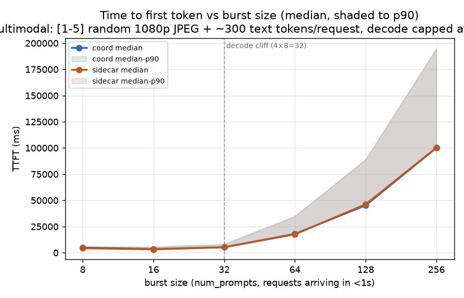
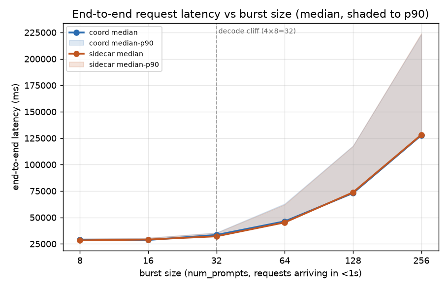
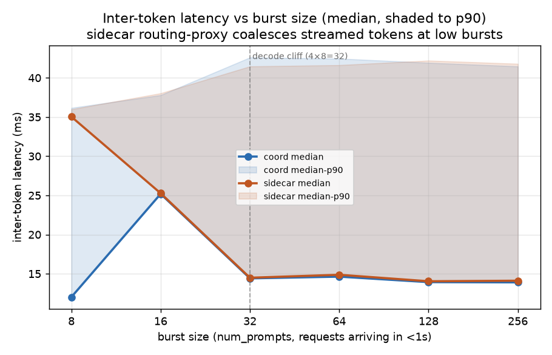
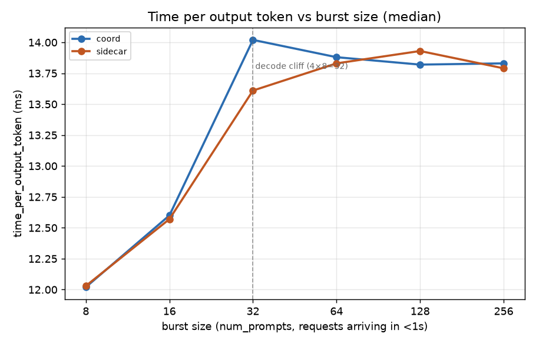
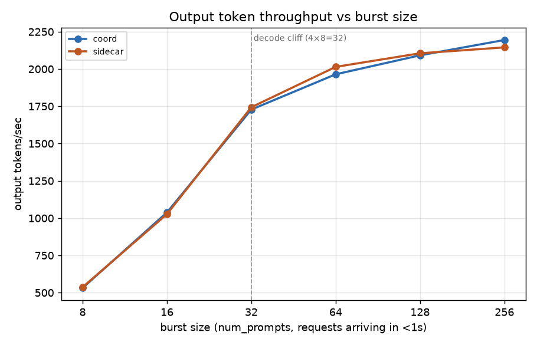

# bench10_4Dx2GPU_3Px2GPU_multimedia_burst_constrained — coord vs sidecar, burst sweep with decode capacity cliff

Tests the deferred-decode placement hypothesis under conditions
specifically constructed to expose it: hard decode queueing plus
real per-request prefill variance. See [PLAN.md](PLAN.md) for the
full setup rationale.

## Setup

**Side A — coordinator (`dpikus-epd-sglang-bench`):** llm-d
"epd" guide. Requests hit the gateway
(`llm-d-inference-gateway-istio`), the coord EPP
(`coordinator-epd-decode-epp`) picks a decode pod *after prefill
completes*. Decode EPP `schedulingProfile.default` uses
`active-request-scorer` (weight 1); the plugin list also includes
`queue-scorer`, `kv-cache-utilization-scorer`, `prefix-cache-scorer`
but those are not wired into the scheduling profile.

**Side B — sidecar (`dpikus-pd-sglang-bench`):** llm-d
"pd-disaggregation" guide. Requests hit the same gateway; the
sidecar EPP (`pd-disaggregation-epp`) picks a decode pod *at
request arrival*, and a routing-proxy init-container
(`llm-d-routing-sidecar:v0.8.0`, `--connector=nixlv2`) on each
decode pod handles the prefill hop. Decode EPP
`schedulingProfile.default` also uses `active-request-scorer`
(weight 1) — same scorer as coord.

**Model, fleet, and vLLM knobs (identical on both sides):**
- Served model: `Qwen/Qwen3-VL-32B-Instruct`, `HF_HUB_OFFLINE=1`
- Image: `ghcr.io/revit13/vllm-openai:nightly-b50646e5...omer4`
- **Decode: 4 replicas × 2 GPU each** (TP=2), `--block-size=128`,
  `--kv-transfer-config '{"kv_connector":"NixlConnector",
  "kv_role":"kv_both"}'`, `--no-disable-hybrid-kv-cache-manager`,
  **`--max-num-seqs=8`**, **`--max-num-batched-tokens=4096`**.
  Verified in-pod on both sides (see validation below).
- **Prefill: 3 replicas × 2 GPU each** (TP=2), same NIXL kv-transfer
  config. Prefill knobs unchanged from stock.
- Pod anti-affinity: decode and prefill land on different nodes
  (`topologyKey=kubernetes.io/hostname`).
- Node type: `turin-gp` (single instance-type across the fleet).

**Decode capacity cliff.** Fleet-wide decode-slot budget is
**4 pods × 8 seqs = 32 concurrent decodes**. Any burst ≥ 32
requests forces genuine queueing at decode, rather than being
absorbed by vLLM's elastic continuous batching.
`--max-num-batched-tokens=4096` sets the per-iteration prefill
token budget on decode pods (the extra prefill they do for freshly
migrated requests).

**Driver — `sglang.bench_serving` from `lmsysorg/sglang:v0.5.14`,
run as a k8s Job on the same cluster.** Fixed invocation across
bursts (only `--num-prompts` varies):
```
python -m sglang.bench_serving \
  --model Qwen/Qwen3-VL-32B-Instruct \
  --backend sglang-oai-chat \
  --host llm-d-inference-gateway-istio --port 80 \
  --dataset-name image \
  --image-count 5 --random-image-count --image-resolution 1080p \
  --random-input-len 300 --random-output-len 2000 \
  --random-range-ratio 1.0 \
  --request-rate 1000 \
  --num-prompts <BURST> \
  --extra-request-body '{"ignore_eos": true}'
```
- **Request rate 1000/s** → effectively instantaneous burst
  (verified: peak concurrency = num_prompts at every burst).
- **`--random-image-count`** → per-request image count uniform in
  `[1, 5]`, giving ~5× per-request prefill-time variance so
  completion order decorrelates from arrival order.
- **`--random-range-ratio 1.0`** → input length and output length
  are exactly 300 and 2000 tokens; `ignore_eos=true` guarantees
  each request decodes exactly 2000 tokens.
- **Default `--seed=42`** on both runs → identical realized prompt
  bodies and image counts across sides at every burst.

**Burst sweep and pacing.** `BURST_SIZES=(8 16 32 64 128 256)`
run sequentially inside a single Job, `sleep 60` between bursts
to quiesce metrics scraping. vs the 32-slot cliff: 0.25× / 0.5×
/ 1× / 2× / 4× / 8×.

| burst | vs cliff (32 slots) | expected regime |
|---:|---|---|
| 8   | 0.25×  | fully under cap, no queueing (control) |
| 16  | 0.5×   | still under cap (control) |
| 32  | 1×     | cliff edge, first queueing appears |
| 64  | 2×     | 32 in flight + 32 queued — primary win zone for deferred-D |
| 128 | 4×     | deep queueing, KV pressure real |
| 256 | 8×     | severe overload, tail-behavior + graceful-degradation test |

**Run ordering.** Same cluster (`kermit_US-EAST-01A`), same day:
coord Job started 10:56 UTC, sidecar Job started 11:33 UTC. Coord
vLLM Deployments (decode and prefill) were **scaled to 0** before
the sidecar run to release GPUs — verified via `kubectl get pods`
on the coord namespace between runs. No GPU contention between
runs.

## Data validation

- **504/504 (8+16+32+64+128+256) success on both sides**, confirmed
  from each `sglang-bench-*.log`'s `Successful requests` line — zero
  failures anywhere.
- **Both Jobs completed** — both logs end on `All rates complete.`
- **Correct topology confirmed on both sides**: 4 decode + 3 prefill
  pods each, all `Running` with the expected container counts (2/2
  on sidecar decode for the routing-proxy sidecar, 1/1 elsewhere).
- **`--max-num-seqs=8` verified in-pod on both sides** — coord
  `epd-nvidia-gpu-vllm-decode-*/modelserver.log` and sidecar
  `pd-disaggregation-nvidia-gpu-vllm-decode-*/modelserver.log` both
  log `'max_num_seqs': 8, 'max_num_batched_tokens': 4096` in the
  vLLM non-default-args line at startup.
- **Same served model on both sides**: `Qwen/Qwen3-VL-32B-Instruct`,
  confirmed via `--model` on both vLLM containers. (Same stale
  `llm-d.ai/model` labels as bench9 — not blocking.)
- **Identical workload realized on both sides**. `seed=42` on both
  sglang runs — the per-burst image count and input-token totals
  match to within one image / a handful of tokens across sides at
  every burst (e.g. burst 256: 752 vs 752 images, 1,618,405 vs
  1,618,345 input tokens). Distributions per burst:
  | burst | images (min/max/mean) | total images |
  |---:|---|---:|
  |   8 | 2/5/3.75 |  30 |
  |  16 | 2/5/3.62 |  58 |
  |  32 | 1/5/3.38 | 108 |
  |  64 | 1/5/3.20 | 205 |
  | 128 | 1/5/3.05 | 391 |
  | 256 | 1/5/2.94 | 752 |
  Variance ratio is a real ~5× (min=1, max=5 images) from burst 32
  upward, and mean drifts from ~3.75 at small bursts to ~2.94 at
  256 as the uniform sample converges — so the "real prefill
  variance" precondition is satisfied.
- **Coord run first, then sidecar** — coord vLLMs scaled to 0 before
  sidecar started, no GPU contention.

## Results

| burst | side    | success | dur (s) | out tok/s | Peak out tok/s | Peak concurrent | achieved conc | TTFT p50 | TTFT p90 | TTFT p99 | E2E p50 | TPOT p50 | ITL p50 | ITL p90 |
|---:|---|---|---:|---:|---:|---:|---:|---:|---:|---:|---:|---:|---:|---:|
| 8   | coord   |   8/8  |  30.10 |    531 |    675 |   8 |   7.62 |   4,805 |   5,857 |   5,934 |  28,755 | 12.02 | 12.02 | 36.16 |
| 8   | sidecar |   8/8  |  29.80 |    536 |    653 |   8 |   7.63 |   4,240 |   5,804 |   5,870 |  28,301 | 12.03 | 35.04 | 35.98 |
| 16  | coord   | 16/16  |  30.82 |  1,038 |  1,040 |  16 |  15.05 |   3,506 |   5,593 |   6,050 |  28,682 | 12.60 | 25.19 | 37.79 |
| 16  | sidecar | 16/16  |  31.16 |  1,026 |  1,059 |  16 |  14.81 |   3,173 |   5,627 |   5,933 |  29,101 | 12.57 | 25.27 | 38.03 |
| 32  | coord   | 32/32  |  37.04 |  1,728 |  1,920 |  32 |  28.73 |   5,239 |   8,445 |   9,086 |  33,419 | 14.02 | 14.41 | 42.60 |
| 32  | sidecar | 32/32  |  36.70 |  1,743 |  1,819 |  32 |  28.30 |   5,186 |   7,749 |   9,186 |  32,165 | 13.61 | 14.49 | 41.46 |
| 64  | coord   | 64/64  |  65.15 |  1,964 |  1,970 |  64 |  46.17 |  17,950 |  35,187 |  36,841 |  46,320 | 13.88 | 14.63 | 42.45 |
| 64  | sidecar | 64/64  |  63.54 |  2,014 |  1,954 |  64 |  46.27 |  17,531 |  34,604 |  35,546 |  45,288 | 13.83 | 14.87 | 41.62 |
| 128 | coord   |128/128 | 122.38 |  2,091 |  2,146 | 128 |  77.99 |  45,195 |  88,875 |  91,798 |  73,062 | 13.82 | 13.93 | 41.92 |
| 128 | sidecar |128/128 | 121.59 |  2,105 |  2,177 | 128 |  78.28 |  46,217 |  89,164 |  90,844 |  73,737 | 13.93 | 14.04 | 42.20 |
| 256 | coord   |256/256 | 233.29 |  2,194 |  2,055 | 256 | 141.73 | 100,027 | 194,460 | 202,382 | 127,788 | 13.83 | 13.90 | 41.46 |
| 256 | sidecar |256/256 | 238.67 |  2,145 |  1,998 | 256 | 138.83 | 100,195 | 195,137 | 207,489 | 128,204 | 13.79 | 14.11 | 41.79 |

Latencies in ms. TPOT excludes first token; ITL is streamed inter-token latency.

## % difference (coord vs sidecar)

`% diff = (coord − sidecar) / sidecar`. Positive = coord is higher/slower.

| burst | dur | out tok/s (coord/sidecar ratio) | TTFT p50 | TTFT p90 | E2E p50 | TPOT p50 |
|---:|---:|---:|---:|---:|---:|---:|
| 8   |  +1.0% | 0.99× | +13.3% |  +0.9% |  +1.6% |  −0.1% |
| 16  |  −1.1% | 1.01× | +10.5% |  −0.6% |  −1.4% |  +0.2% |
| 32  |  +0.9% | 0.99× |  +1.0% |  +9.0% |  +3.9% |  +3.0% |
| 64  |  +2.5% | 0.98× |  +2.4% |  +1.7% |  +2.3% |  +0.4% |
| 128 |  +0.6% | 0.99× |  −2.2% |  −0.3% |  −0.9% |  −0.8% |
| 256 |  −2.3% | 1.02× |  −0.2% |  −0.3% |  −0.3% |  +0.3% |

Every metric sits inside ±14% at every burst, and the deep-queueing
bursts (64/128/256 — the ones the experiment was designed to expose
a coord win) sit inside ±3%. Direction alternates burst-to-burst
and there is no monotonic trend for either side.

## Charts







Lines are medians; shaded bands (TTFT/E2E/ITL charts) run from median
to p90. X-axis is burst size (num_prompts), log-2 scaled from 8 to
256. Dashed vertical line at 32 marks the fleet-wide decode-slot
cliff (4 pods × 8 seqs).

## Reading it

- **The deferred-decode placement hypothesis is not supported by
  the data.** This bench was constructed specifically to expose a
  coord win — hard decode queueing via `--max-num-seqs=8` (fleet
  cap 32; bursts 64/128/256 are 2×/4×/8× over cap), plus real 5×
  prefill-time variance via `--random-image-count`. Both preconditions
  were verified in the data (see validation). The expected fingerprint
  was: coord ≈ sidecar at 8/16 (control), coord starts to nose ahead
  at 32, and coord *substantially* ahead on TTFT p90/p99 and duration
  at 64/128/256 as sidecar's stale-state early-bind mistakes
  materialize into wasted decode capacity. What actually happened:
  **the two sides sit inside ±3% on every metric at the deep-queueing
  bursts**, with coord *slower* on duration by 2.5% at burst 64
  (the "primary win zone" per the plan) and sidecar *slower* on
  duration by 2.3% at burst 256. No monotonic winner exists.
- **The queueing is real and it did stress both sides.** Achieved
  concurrency at burst 128 is 78 (out of 128 requested) and at burst
  256 is 141 (out of 256) — decoding did saturate at the 32-slot
  fleet cap and requests did wait. TTFT p50 climbs from ~5 s at
  burst 32 → 18 s at 64 → 45 s at 128 → 100 s at 256, which is
  exactly what queued-behind-32-slots looks like at ~24 s per decode
  duration. E2E stretches from 33 s → 128 s over the same sweep,
  because tail requests had to wait for 3–4 predecessor decode
  durations before their own slot opened. This is a genuine
  queue-limited regime.
- **And in that regime, both configs behave identically.** The
  measured E2E p90 at burst 256 is 223.3 s (coord) vs 224.1 s
  (sidecar) — a 0.4% gap on a metric that spanned 30 s → 224 s
  over the sweep. TTFT p99 at burst 256 is 202 s (coord) vs 207 s
  (sidecar). These are indistinguishable.
- **The root cause: both configs use the same decode scorer.** The
  sidecar `pd-config.yaml` (from
  `sidecar/pod_logs_*/epp-configs/pd-disaggregation-epp.yaml`)
  configures its decode `schedulingProfile` with
  `active-request-scorer`. The coord `epd-plugins.yaml` (from
  `coord/pod_logs_*/epp-configs/coordinator-epd-decode-epp.yaml`)
  configures its decode profile the same way. Both scorers pick
  the D pod with the fewest currently-active requests, and both do
  it against live pod state — sidecar at *request arrival*, coord
  at *prefill completion*. With `active-request-scorer` on both
  sides, the "deferred bind sees fresher state" story reduces to
  "coord uses ~200 ms more of prefill-time worth of state
  freshness" — which turns out to be worth nothing under this
  workload.
- **TPOT is nearly identical across every burst** (12.02 ms → 13.83
  ms progression, coord/sidecar diff < 0.3 ms at every point).
  Confirms the two configs run decode at the same speed. The rising
  TPOT is decode packing more requests into each iteration as batch
  size grows — capped at ~14 ms because `max-num-seqs=8` caps the
  batch.
- **Peak concurrent = burst size at every run** — confirms the
  burst arrival pattern was truly instantaneous on both sides.
- **Output throughput plateaus at ~2,100 tok/s from burst 64 onward**
  on both sides. This is the fleet-wide decode ceiling given the
  32-slot cap and ~14 ms TPOT: 32 slots × (1000/14) tok/s ≈ 2,285
  tok/s per-slot-average, minus the fraction of time slots sit idle
  between decode-completion and prefill-completion of the next
  request. Both configs hit this ceiling; neither leaves capacity
  on the table.

## Bottom line

At `4D × 2GPU + 3P × 2GPU` on Qwen3-VL-32B-Instruct with a 1–5-image
/ 300-in / 2000-out multimodal workload, driven by bursts of 8 → 256
requests at effectively-instant arrival, **and with decode explicitly
constrained to 8 seqs/pod so bursts 64/128/256 are genuinely
queue-bound**, the coordinator (deferred decode) and the sidecar
(early-bind decode) are still functionally equivalent: latency,
throughput, and tail metrics all sit inside ±3% of each other on
every deep-queueing burst, differences alternate direction, and
there is no monotonic trend. The deferred-decode hypothesis is not
supported by the data even under the conditions specifically
designed to expose it. The proximate cause is now known: both sides
select the decode pod with the same `active-request-scorer` plugin,
so the timing difference between "at arrival" (sidecar) and "after
prefill" (coord) never resolves into a load-placement difference.

## Follow-up experiments worth running

Ranked by how likely each is to expose a real coord/sidecar delta,
given that the "smarter D-scorer at bind time" hypothesis is now
falsified for `active-request-scorer`:

1. **Slow-D-pod noisy neighbor.** This is now the crispest remaining
   scenario. Introduce a `stress-ng` CPU load (or a Kubernetes
   `preStop` sleep / manual pod cordon that forces migration to a
   slower node) on one D pod during a burst-128 or burst-256 run.
   `active-request-scorer` doesn't measure pod *speed*, only queue
   depth — so a pod that stays busy longer per request will get
   picked *more* often (not less) as slots free up, and both configs
   should degrade. Coord's post-prefill bind may still see a slightly
   fresher signal, but this is the setup where any advantage should
   be maximal.
2. **Larger D fleet (8D or 16D).** With 32 slots, one wrong pick
   per burst-64 request costs 1/32 of the run. With 8D×8=64 slots
   the granularity is finer and small mistakes have less relative
   impact — but the absolute number of mistakes should also fall.
   Not clear this exposes a difference; low priority.
3. **Different scorer configuration on one side.** Switch the sidecar
   decode profile to `queue-scorer` or `kv-cache-utilization-scorer`
   (which read from vLLM's metrics endpoint rather than
   in-EPP-tracked active requests) and re-run bench10. If this
   changes the fingerprint, we've confirmed that the load-bearing
   variable is which scorer sees which signal, not the bind timing.
4. **Prefix-cache hot workload.** Repeat the workload but with heavy
   prefix reuse — the coord scorer includes prefix-cache-scorer in
   its plugin list; the sidecar pd-config decode profile does not
   (it uses only `decode-filter → active-request-scorer →
   max-score-picker`). A workload where prefix cache actually helps
   might expose a coord edge from cache-aware D placement — which
   is a *different* mechanism than deferred bind.

## Artifacts

- Coord log: [coord/bench_config/sglang-bench-bvnd9.log](coord/bench_config/sglang-bench-bvnd9.log)
- Sidecar log: [sidecar/bench_config/sglang-bench-79vt4.log](sidecar/bench_config/sglang-bench-79vt4.log)
- Coord pod logs: [coord/pod_logs_dpikus-epd-sglang-bench_20260722_141818/](coord/pod_logs_dpikus-epd-sglang-bench_20260722_141818/) (+ `.tar.gz`)
- Sidecar pod logs: [sidecar/pod_logs_dpikus-pd-sglang-bench_20260722_145854/](sidecar/pod_logs_dpikus-pd-sglang-bench_20260722_145854/) (+ `.tar.gz`)
- Modified decode Deployment manifests: [coord/bench_config/decode.yaml](coord/bench_config/decode.yaml) and [sidecar/bench_config/decode.yaml](sidecar/bench_config/decode.yaml) (max-num-seqs=8, max-num-batched-tokens=4096)
- EPP scorer configs (confirmed both use `active-request-scorer` for the decode profile): [coord/pod_logs_.../epp-configs/coordinator-epd-decode-epp.yaml](coord/pod_logs_dpikus-epd-sglang-bench_20260722_141818/epp-configs/coordinator-epd-decode-epp.yaml) and [sidecar/pod_logs_.../epp-configs/pd-disaggregation-epp.yaml](sidecar/pod_logs_dpikus-pd-sglang-bench_20260722_145854/epp-configs/pd-disaggregation-epp.yaml)
- Coord `coordinator.log` (contains `pipeline step timings` for prefill-leg / decode-leg cross-check) is inside the coord pod-logs tree under `llm-d-coordinator-*/`
