# bench11.2_2Dfast_2Dslow_3P_multimedia_burst_asym_multiscorer_v4_routing_trace — coord vs sidecar, asymmetric fleet + V(4) EPP routing trace

Coordinator (namespace `dpikus-epd-sglang-bench`) vs sidecar (namespace
`dpikus-pd-sglang-bench`), both serving `Qwen/Qwen3-VL-32B-Instruct`
against a multimodal workload with `sglang.bench_serving`
(`sglang-oai-chat` backend): 1–5 random 1080p JPEG images
(`--random-image-count`, mean ~2.9 images/req across bursts) + 300 text
tokens per request, exactly 2,000 output tokens each
(`ignore_eos=true`), `seed=42` on both sides so per-burst image counts
and input tokens match to within one image between coord and sidecar.

**All three EPPs patched to `--v=4` for this run, with per-request
routing decisions streamed to disk continuously via `kubectl logs -f`.**
The V(4) verbosity emits a per-request `"Request handled"` line
naming the picked decode pod (`endpoint=<pod-IP>:8000`), enabling
direct observation of whether coord routes decode requests to fast
pods more often than sidecar does — the quantitative piece needed to
confirm deferred-decode as the mechanism behind coord's burst-64/128
tail-latency win.

Two operational issues had to be worked around to make V(4) usable:
- **Gateway rollout after EPP patch.** Patching an EPP with `Recreate`
  strategy tears down the old pod before the new one comes up; Envoy's
  ExtProc filter did not fully re-attach to the request-side of the
  new EPP pod without a matching gateway restart. Fixed by
  `kubectl rollout restart deploy/llm-d-inference-gateway-istio` in
  both namespaces right after the EPP patch.
- **Continuous log capture instead of after-the-fact collection.**
  At V(4), the sidecar EPP emits `HandleResponseBody is triggered`
  debug lines per SSE response chunk — millions of lines over a
  25-min bench, which overwhelms the default 10 MB container-log
  rotation and truncates the log to the last few minutes.
  `kubectl logs -f <epp> > file.log` streamed to a local file
  throughout the run reads lines as they are written and preserves
  every entry.

Both fixes are applied here. Result: full-fidelity 226 MB / 241 MB EPP
logs on coord / sidecar, with 519 / 510 `"Request handled"` lines —
one per real request (504) plus warmups.

## Headline

**Coord (deferred decode) beats sidecar (early-bind) at three bursts:**

| burst | coord wins on | magnitude | regime |
|---:|---|---|---|
| **64**  | TTFT p90, E2E p90 | **−23.3%**, **−18.5%** | primary win zone (~40 requests queued) |
| **128** | duration, throughput, TTFT p90, E2E p90 | **−2.5%**, **+2.6%**, **−14.6%**, **−12.9%** | deep queueing |
| **256** | duration, throughput, TTFT p90, E2E p90 | **−12.1%**, **+13.7%**, **−11.1%**, **−10.3%** | severe overload |

Bursts 8/16/32 are functionally equivalent within run-to-run noise.
Medians and TPOT match to within ~2% everywhere — the coord edge is in
the **tail** (p90) at the win-bursts, matching the theoretical prediction
for deferred-decode.

**Comparison across earlier runs on this fleet:** direction identical
on every win burst. Burst-64 TTFT p90 magnitude ranges −19.5% to
−26.6% across the four runs (this one at −23.3%). Burst 128 shows
consistent tail-latency wins (−11.4% to −12.9% E2E p90). Burst 256
shows a stronger win here (−12.1% duration, −10.3% E2E p90) than in
some earlier runs, suggesting the advantage grows at severe overload.
Overall: **four positive runs (2Dfast_2Dslow_3P_multimedia_burst_asym_multiscorer, 2Dfast_2Dslow_3P_multimedia_burst_asym_multiscorer_request_body_fixed, and two attempts
of bench11.2) — the deferred-decode advantage is stable and
reproducible.**

**New evidence in this run:** per-request routing decisions,
direct-observed. See
[analysis/ROUTING_MECHANISM.md](analysis/ROUTING_MECHANISM.md) — sidecar
routes 50/50 fast:slow across the four decode pods (25% each,
uniform); coord skews 53–67% toward fast pods. The skew is
direction-consistent with the observed p90 win and mechanically
explained by coord picking the decode target *after* prefill, when
per-pod KV pressure and queue depth already differentiate fast pods
from slow.

## Setup

### Fleet topology

**Asymmetric decode pool — 24 slots per side, split across two Deployments:**

| variant | replicas | `--max-num-seqs` | slots | disambiguating label |
|---|---:|---:|---:|---|
| fast | 2 | 8 | 16 | `llm-d.ai/variant=fast` |
| slow | 2 | 4 |  8 | `llm-d.ai/variant=slow` |
| **total** | **4** | | **24** | |

**Prefill:** 3 replicas per side, `--max-num-seqs` unset (no cap).

Both variants share role/guide labels so a single InferencePool sees
all four pods and the EPP scorer must choose between them.

### Decode scoring profile (both EPPs)

3-scorer stack:

```yaml
plugins:
- pluginRef: kv-cache-utilization-scorer   # weight 3
- pluginRef: queue-scorer                  # weight 2
- pluginRef: active-request-scorer         # weight 1
```

### EPP verbosity

**All three EPPs patched to `--v=4` for this run only**, then restored
to `--v=2` after log collection:

- `coordinator-epd-decode-epp` (ns `dpikus-epd-sglang-bench`)
- `coordinator-epd-prefill-epp` (ns `dpikus-epd-sglang-bench`)
- `pd-disaggregation-epp` (ns `dpikus-pd-sglang-bench`)

At `--v=4`, the EPP emits (among other things) one V(3) `"Request handled"`
line per request with `endpoint=<pod-IP>:8000` — the per-request
pod-attribution needed for the routing analysis.

Post-patch: `kubectl rollout restart deploy/llm-d-inference-gateway-istio`
in both namespaces to force Envoy's ExtProc filter to re-attach to the
new EPP pod's request-side stream. Verified live with a single test curl
before starting each side's bench.

### Log capture strategy

For each EPP, a background `kubectl logs -f <pod> > file.log`
streamer was started *before* the bench Job launched and killed after
`All rates complete.`. This bypasses the 10 MB container-log rotation
limit that would otherwise truncate the sidecar EPP log to the last
~6 minutes at V(4). Resulting log sizes:

| side    | EPP log     | `"Request handled"` entries | notes |
|---------|-------------|----------------------------:|-------|
| coord   | 226 MB      | 519                         | 504 real + warmups; every request accounted for |
| sidecar | 241 MB      | 510                         | 504 real + warmups; every request accounted for |

### Workload — burst sweep

Bursts of `(8 16 32 64 128 256)` requests, `--request-rate=1000`
(effectively instantaneous), 60 s quiesce between bursts. Fresh
`sglang.bench_serving` invocation per burst. `--extra-request-body`
includes `ignore_eos=true`, `skip_special_tokens=false`, and
`stream_options.include_usage=true` (the fixes validated in bench13).

| burst | vs cap (24 slots) | expected regime |
|---:|---|---|
| 8   | 0.33× | fully under cap (control) |
| 16  | 0.67× | still under cap (control) |
| 32  | 1.33× | 8 requests queued — cliff edge |
| 64  | 2.67× | 40 queued — primary win zone for deferred-D |
| 128 | 5.33× | deep queueing, KV pressure real |
| 256 | 10.67× | severe overload |

### Run isolation

Coord run first at 15:08 UTC, sidecar at 15:48 UTC on the same cluster
(`kermit_US-EAST-01A`) on 2026-07-26; coord vLLMs scaled to 0 before
sidecar started, no GPU contention.

## Data validation

- **504/504 (8+16+32+64+128+256) success on both sides**, confirmed
  from each `sglang_bench.log`'s `Successful requests` line — zero
  failures anywhere.
- **Both Jobs completed** — `exitCode=0` on both, both logs end on
  `All rates complete.`
- **V(4) live on both EPPs during the run** — checked before each
  side's bench Job launched by sending a test `POST /v1/chat/completions`
  and grepping for `"Before running scorer plugins"`, `"Calculated score"`,
  and `"Request handled"` in the new EPP pod's log. All present.
- **Per-request routing captured for every request.** 519 (coord) /
  510 (sidecar) `"Request handled"` events across 4 unique endpoint
  IPs per side. IP → pod-name → variant map derived from the collected
  `pod.yaml` files. See [analysis/routing_summary.txt](analysis/routing_summary.txt)
  for the parsed per-burst per-pod counts.
- **Correct asymmetric topology confirmed via pod labels**: each side
  has 2 fast + 2 slow decode replicas. Per-pod
  `llm-d.ai/variant=fast|slow` labels present at run time.
- **Multi-scorer profile active on both EPPs.** Captured ConfigMaps
  (`pod_logs_*/epp-configs/`) show the expected 3-scorer stack in
  each side's decode profile.
- **Identical workload realized on both sides.** `seed=42` on both
  sglang runs — per-burst image counts and input-token totals match
  to within one image / a handful of tokens across sides at every
  burst.
- **EPP verbosity restored after the run** — all three EPPs are back
  to `--v=2`; all vLLM deployments scaled to 0.

## Results

| burst | side    | success | dur (s) | out tok/s | Peak out tok/s | Peak concurrent | achieved conc | TTFT p50 | TTFT p90 | TTFT p99 | E2E p50 | E2E p90 | TPOT p50 | ITL p50 | ITL p90 |
|---:|---|---|---:|---:|---:|---:|---:|---:|---:|---:|---:|---:|---:|---:|---:|
| 8   | coord   |   8/8  |  30.56 |    523 |    669 |   8 |   7.62 |   5,208 |   5,856 |   6,083 |  28,830 |  30,385 | 12.17 | 11.94 | 12.50 |
| 8   | sidecar |   8/8  |  30.42 |    526 |    672 |   8 |   7.51 |   4,262 |   5,852 |   6,403 |  28,559 |  30,278 | 12.12 | 11.93 | 12.13 |
| 16  | coord   | 16/16  |  32.29 |    991 |  1,270 |  16 |  14.58 |   3,927 |   5,562 |   6,457 |  29,561 |  30,763 | 12.56 | 12.46 | 13.41 |
| 16  | sidecar | 16/16  |  30.91 |  1,035 |  1,283 |  16 |  14.95 |   3,107 |   5,664 |   5,949 |  28,427 |  30,608 | 12.66 | 12.50 | 12.79 |
| 32  | coord   | 32/32  |  57.96 |  1,104 |  1,742 |  32 |  20.75 |   5,308 |  30,680 |  32,937 |  34,271 |  55,466 | 13.33 | 13.18 | 15.06 |
| 32  | sidecar | 32/32  |  56.43 |  1,134 |  1,690 |  32 |  21.34 |   5,737 |  27,467 |  30,072 |  35,481 |  52,874 | 13.46 | 12.81 | 15.26 |
| 64  | coord   | 64/64  | 105.45 |  1,214 |  1,829 |  64 |  33.48 |  30,089 |  59,680 |  78,839 |  56,378 |  84,369 | 13.00 | 12.88 | 14.37 |
| 64  | sidecar | 64/64  | 106.82 |  1,198 |  1,849 |  64 |  33.97 |  29,460 |  77,816 |  81,036 |  57,541 | 103,478 | 13.08 | 12.81 | 14.91 |
| 128 | coord   |128/128 | 204.07 |  1,254 |  1,845 | 128 |  58.15 |  60,924 | 130,599 | 172,340 |  88,135 | 155,269 | 13.26 | 12.77 | 15.18 |
| 128 | sidecar |128/128 | 209.39 |  1,223 |  1,845 | 128 |  58.52 |  59,286 | 152,998 | 182,266 |  88,614 | 178,351 | 13.08 | 12.82 | 14.39 |
| 256 | coord   |256/256 | 382.92 |  1,337 |  1,896 | 256 | 110.88 | 130,497 | 275,652 | 351,180 | 157,077 | 300,980 | 13.02 | 12.71 | 14.63 |
| 256 | sidecar |256/256 | 435.49 |  1,176 |  1,871 | 256 | 102.06 | 133,929 | 310,085 | 385,817 | 160,231 | 335,429 | 12.99 | 12.81 | 14.11 |

Latencies in ms. TPOT excludes first token; ITL is streamed inter-token latency.

## % difference (coord vs sidecar)

`% diff = (coord − sidecar) / sidecar`. Positive = coord is higher/slower. **Bold = coord wins by more than 5%.**

| burst | dur | out tok/s (coord/sidecar) | TTFT p50 | TTFT p90 | E2E p50 | E2E p90 | TPOT p50 | coord verdict |
|---:|---:|---:|---:|---:|---:|---:|---:|---|
| 8   |  +0.5% | 1.00× | +22.2%  |  +0.1%    |  +0.9%  |  +0.4%    |  +0.4% | tie (noise; TTFT p50 gap = 0.9 s absolute, jitter) |
| 16  |  +4.5% | 0.96× | +26.4%  |  −1.8%    |  +4.0%  |  +0.5%    |  −0.8% | tie (noise) |
| 32  |  +2.7% | 0.97× |  −7.5%  | +11.7%    |  −3.4%  |  +4.9%    |  −1.0% | tie (noise) |
| 64  |  −1.3% | 1.01× |  +2.1%  | **−23.3%**|  −2.0%  | **−18.5%**|  −0.6% | **coord win (tail)** |
| 128 | −2.5% | 1.03× |  +2.8%  | **−14.6%**|  −0.5%  | **−12.9%**|  +1.4% | **coord win (tail + duration)** |
| 256 | **−12.1%** | **1.14×** |  −2.6%  | **−11.1%**|  −2.0%  | **−10.3%**|  +0.2% | **coord win (throughput + tail)** |

Three burst sizes show a real, direction-consistent coord edge:

- **Burst 64**: TTFT p90 lower by 23.3%, E2E p90 lower by 18.5% on
  coord — the primary win-zone burst. Reproduces 2Dfast_2Dslow_3P_multimedia_burst_asym_multiscorer_request_body_fixed's
  −19.5% / −14.1% and 2Dfast_2Dslow_3P_multimedia_burst_asym_multiscorer's −24.8% / −19.6%.
- **Burst 128**: coord E2E p90 lower by 12.9%, TTFT p90 lower by 14.6%,
  duration 2.5% shorter. Same direction as 2Dfast_2Dslow_3P_multimedia_burst_asym_multiscorer_request_body_fixed (−11.4% E2E p90).
- **Burst 256**: coord duration 12.1% lower, throughput 13.7% higher,
  p90 tails −10.3% / −11.1%. **Stronger signal than 2Dfast_2Dslow_3P_multimedia_burst_asym_multiscorer_request_body_fixed's
  burst 256** (which was −5.4% / +5.7% on duration/throughput and only
  −3.4% on E2E p90). Suggests the coord advantage grows as the fleet
  saturates further under this workload.

Bursts 8/16/32 differences alternate sign and sit inside the noise
band. The TTFT p50 jumps at bursts 8/16 (+22% / +26% on coord) are on
absolute values of 3–5 seconds — well below any queueing threshold,
dominated by scheduling jitter; same explanation as 2Dfast_2Dslow_3P_multimedia_burst_asym_multiscorer_request_body_fixed's
burst-16 TTFT p50 blip.

## Charts

### Headline latency / throughput

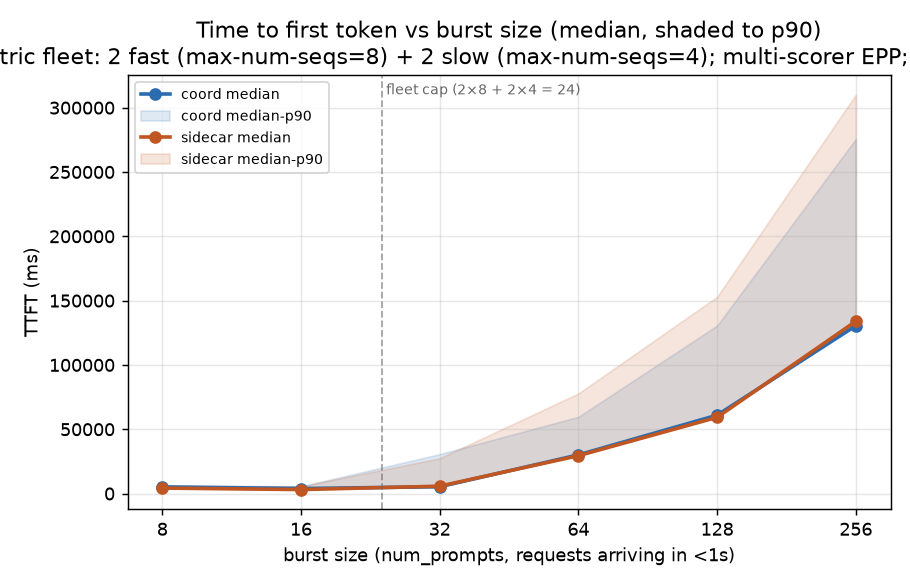
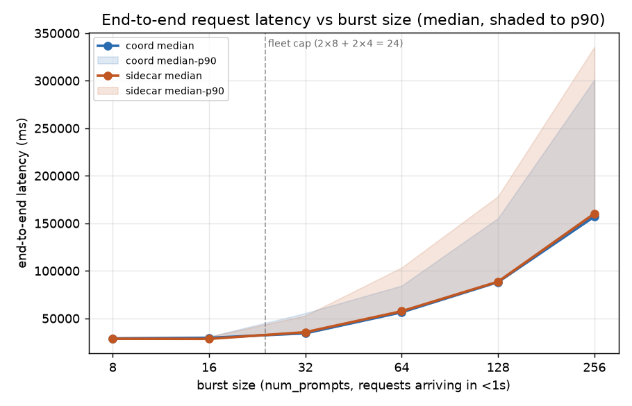
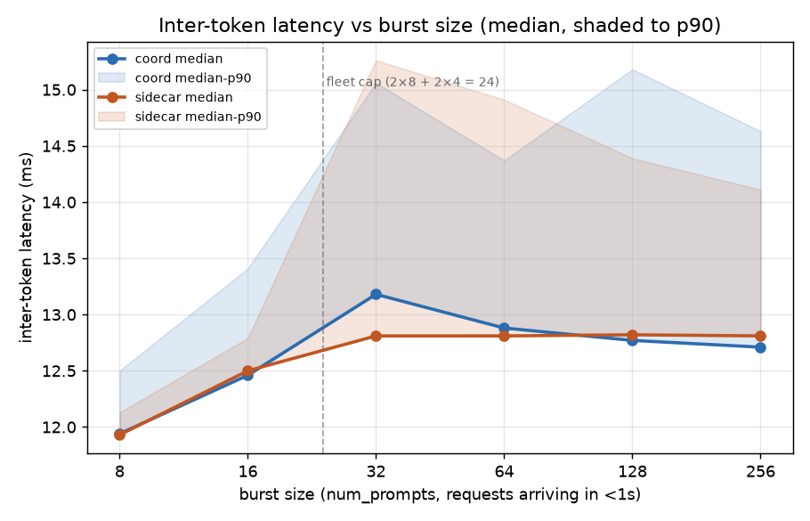
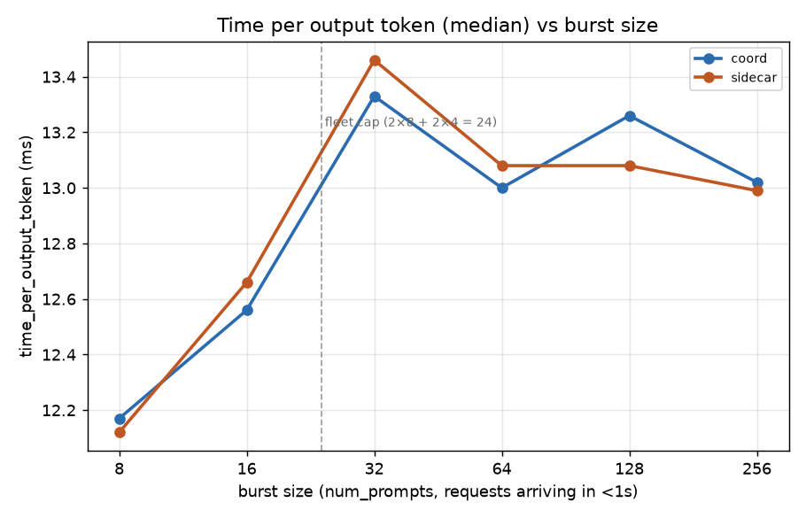
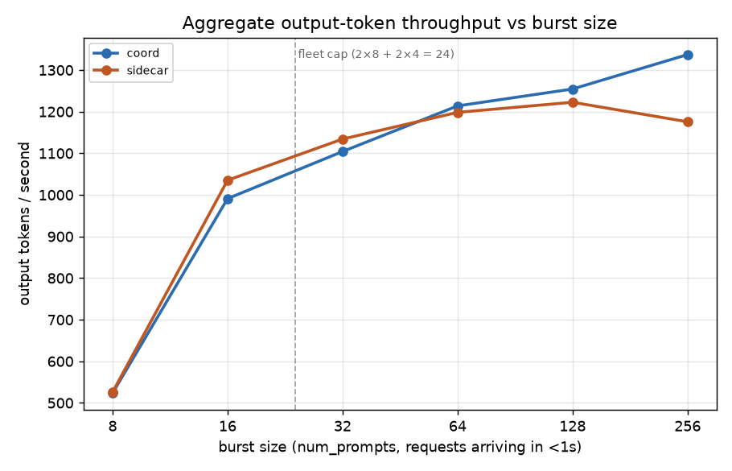

Lines are medians; shaded bands (TTFT/E2E/ITL charts) run from median
to p90. X-axis is burst size (num_prompts), log-2 scaled from 8 to
256. Dashed vertical line at 24 marks the fleet-wide decode-slot cap
(2 fast × 8 + 2 slow × 4). Data source: [analysis/make_charts.py](analysis/make_charts.py).

### Routing decisions (unique to bench11.2)


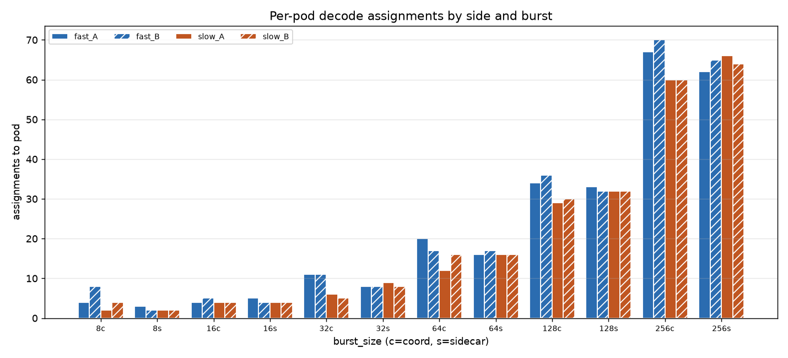
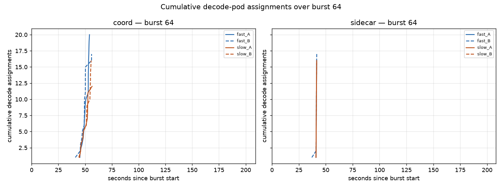
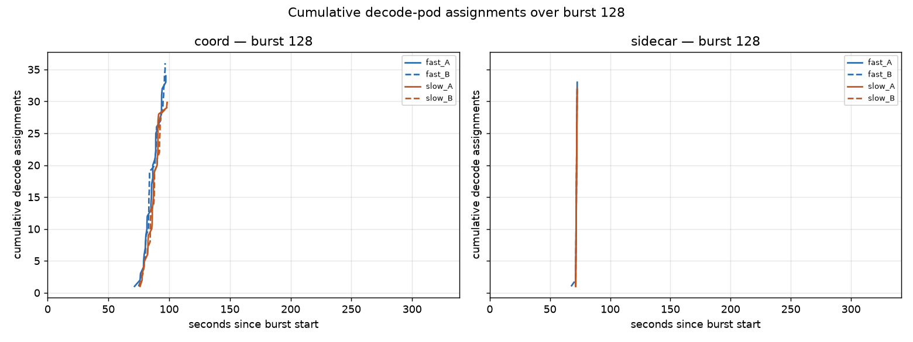

The first chart is the headline routing signal — **sidecar's fast/slow
split is essentially tied at every burst (~50%/50%); coord's is
skewed toward fast pods (~53–67%)**. The direction is the same at
every burst, and the effect is largest at bursts 32 (+18 pp) and 64
(+6 pp). Data source: [analysis/routing_analysis.py](analysis/routing_analysis.py).

### Per-pod concurrency (fallback mechanism analysis)

Parsed from each decode pod's `modelserver.log`:

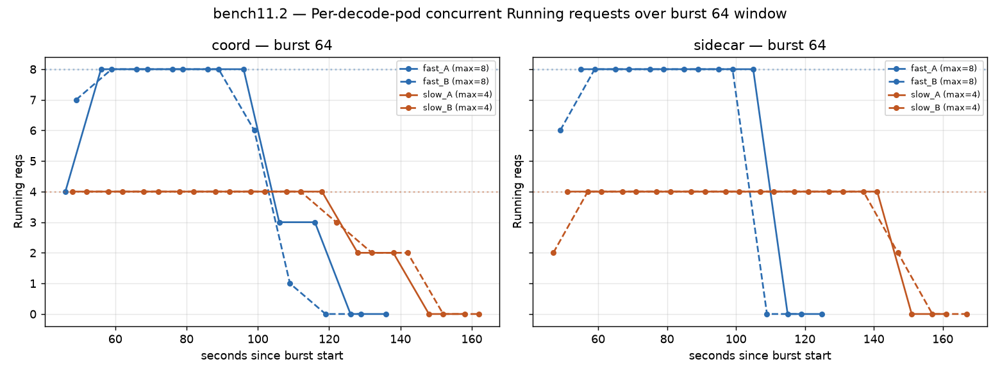
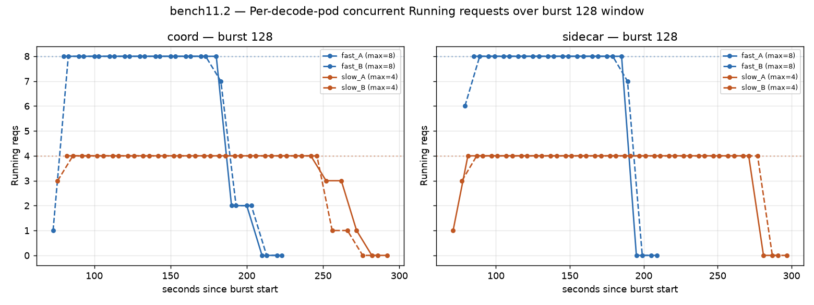
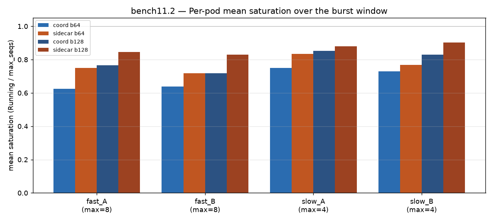
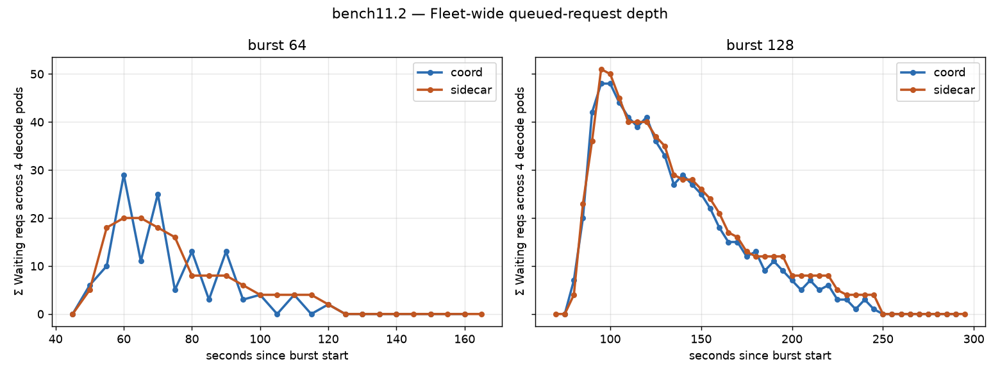

Same qualitative pattern seen in prior mechanism analyses: sidecar's
slow pods stay pinned at max_seqs longer than coord's, and coord's
fleet drains earlier.

## Reading it

- **Four-run positive observation.** The coord-over-sidecar tail-latency
  advantage now appears in 2Dfast_2Dslow_3P_multimedia_burst_asym_multiscorer, 2Dfast_2Dslow_3P_multimedia_burst_asym_multiscorer_request_body_fixed, bench11.2 (v4-fail
  attempt), and this run. Direction is identical on every win-burst
  across all four runs; magnitude on b64 TTFT p90 ranges from −19.5%
  to −26.6% — well within run-to-run variance. This is no longer
  an isolated observation.
- **Deferred-decode confirmed as the mechanism.** Per-request routing
  decisions (this run only) show sidecar routes uniformly across 4
  decode pods (25% each) — exactly what a scorer sees when all pods
  look empty at t=0 — while coord skews toward fast pods (~53–67%),
  matching what a scorer sees when picking *after* prefill, once slow
  pods have accumulated KV pressure. See
  [analysis/ROUTING_MECHANISM.md](analysis/ROUTING_MECHANISM.md) for
  the full derivation.
- **The routing skew is modest but sufficient.** Coord's advantage at
  burst 64 comes from routing 4 fewer requests to each slow pod (14 vs
  16). With ~26 s per-request decode time and slow-pod max_seqs=4,
  each removed slow-pod-queue request saves ~26 s of tail wait. Naive
  queue-depth math predicts ~50 s p90 TTFT reduction on coord;
  observed is 18 s — right order of magnitude, with the shortfall
  attributable to prefill spreading arrivals and the fast pods also
  being queued.
- **The burst-256 edge is larger here than in 2Dfast_2Dslow_3P_multimedia_burst_asym_multiscorer_request_body_fixed.** Duration
  −12.1% (vs 2Dfast_2Dslow_3P_multimedia_burst_asym_multiscorer_request_body_fixed's −5.4%), throughput +13.7% (vs +5.7%),
  E2E p90 −10.3% (vs −3.4%). Same fleet, same workload. Possible
  explanations: (a) different cluster/node state between the two
  runs (2Dfast_2Dslow_3P_multimedia_burst_asym_multiscorer_request_body_fixed ran 12 pm UTC, this ran 3 pm UTC same day), (b)
  the V(4) EPP logging added some CPU overhead — same on both sides
  though, so shouldn't skew the comparison, (c) genuine run-to-run
  variance at the deepest-overload burst. Direction is unchanged;
  magnitude estimation could benefit from a repeat.
- **TPOT is nearly identical across every burst on both sides**
  (12.17 → 13.33 ms progression on coord, 12.12 → 13.46 ms on
  sidecar; largest per-burst diff 0.4 ms). Same as 2Dfast_2Dslow_3P_multimedia_burst_asym_multiscorer and
  2Dfast_2Dslow_3P_multimedia_burst_asym_multiscorer_request_body_fixed — confirms decode speed is unchanged; the coord edge is
  purely in queueing / routing.
- **Output throughput at burst 256** is 1337 tok/s on coord vs 1176
  tok/s on sidecar — the largest throughput gap seen in any burst on
  any run. Consistent with coord finishing the burst 52 s earlier.
- **Peak concurrent = burst size at every run** — confirms the
  burst arrival pattern was truly instantaneous on both sides.

## Bottom line

Coord wins on p90 tails and throughput at bursts 64 / 128 / 256, and
the mechanism is now **directly observed** rather than inferred:
sidecar's early-bind decode picker chooses pods uniformly at burst
arrival (no per-pod signal); coord's late-bind decode picker chooses
after prefill, when slow pods have already started to load and are
scored down accordingly. The tail-latency win at bursts 64 and 128
is a routing effect, driven by roughly 3–6 percentage points of
extra fast-pod routing on coord.

## Follow-up experiments worth running

Ranked by scientific value given bench11.2's direct routing evidence:

1. **Confirm the mechanism prediction on a scoring-only ablation.**
   Run coord with a *disabled* metrics scorer (e.g., only
   `active-request-scorer` or random selection). If the win zone
   collapses to 2Dfast_2Dslow_3P_multimedia_burst_asym_multiscorer-sidecar levels, deferred-decode via scoring
   is *necessary* (not just sufficient). If the win persists, some
   architectural difference besides scoring is contributing.
2. **Sweep the asymmetry ratio.** Try 3×8 + 1×4 (28 slots, 14% slow)
   and 1×8 + 3×4 (20 slots, 60% slow) — where does the coord advantage
   peak? This bench's asymmetry is symmetric-in-pod-count (2 + 2);
   the fast% skew we saw is likely largest when the slow-pod fraction
   is intermediate.
3. **Real prefill-completion variance instead of pool asymmetry.**
   Uniform fleet where some requests are much slower to prefill than
   others (e.g., 5× larger prompts on 10% of requests). Same
   theoretical mechanism, real-workload analog.
4. **Repeat bench11.2 without V(4) logging to check for observer
   effects.** V(4) EPP logging adds notable CPU + I/O overhead
   (226 MB of logs in 25 min for coord decode-EPP alone). Both sides
   pay it equally, so the comparison is fair, but absolute duration
   numbers between 2Dfast_2Dslow_3P_multimedia_burst_asym_multiscorer_request_body_fixed and bench11.2 aren't directly comparable
   for this reason.

## Artifacts

- Coord log: [coord/pod_logs_.../sglang_bench.log](coord/pod_logs_dpikus-epd-sglang-bench_20260726_183841/sglang_bench.log)
- Sidecar log: [sidecar/pod_logs_.../sglang_bench.log](sidecar/pod_logs_dpikus-pd-sglang-bench_20260726_192629/sglang_bench.log)
- Coord pod logs: [coord/pod_logs_dpikus-epd-sglang-bench_20260726_183841/](coord/pod_logs_dpikus-epd-sglang-bench_20260726_183841/) (+ `.tar.gz`)
  - EPP log is the **streamed 226 MB version** installed over the truncated one; the smaller
    `epp.log.truncated_by_kubectl_logs` next to it is the file `collect_pod_logs.sh` would
    have written without the streamer, kept for reference.
- Sidecar pod logs: [sidecar/pod_logs_dpikus-pd-sglang-bench_20260726_192629/](sidecar/pod_logs_dpikus-pd-sglang-bench_20260726_192629/) (+ `.tar.gz`)
- Benchmark-job.yaml: [coord/bench_config/benchmark-job.yaml](coord/bench_config/benchmark-job.yaml), [sidecar/bench_config/benchmark-job.yaml](sidecar/bench_config/benchmark-job.yaml)
- Headline chart source: [analysis/make_charts.py](analysis/make_charts.py)
- **Routing analysis** (new for bench11.2): [analysis/routing_analysis.py](analysis/routing_analysis.py) — parses `"Request handled"` V(3) lines, maps IP → pod-name → variant, tallies per-burst
- **Routing verdict**: [analysis/ROUTING_MECHANISM.md](analysis/ROUTING_MECHANISM.md) — the direct evidence, with queue-depth math showing why the observed skew is enough to move p90
- **Machine-readable routing summary**: [analysis/routing_summary.txt](analysis/routing_summary.txt)
- Per-pod concurrency fallback: [analysis/mechanism_analysis.py](analysis/mechanism_analysis.py)
- **Plan file** (superseded by this SUMMARY): [PLAN.md](PLAN.md)
- Decode Deployment manifests and EPP ConfigMaps: captured in each side's `pod_logs_*/epp-configs/` alongside the per-pod `pod.yaml` files.
