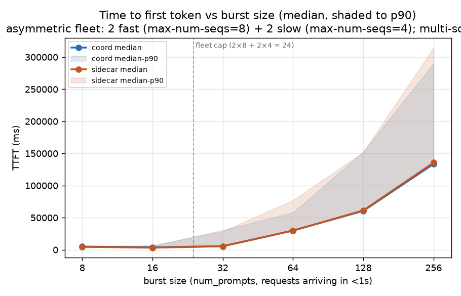
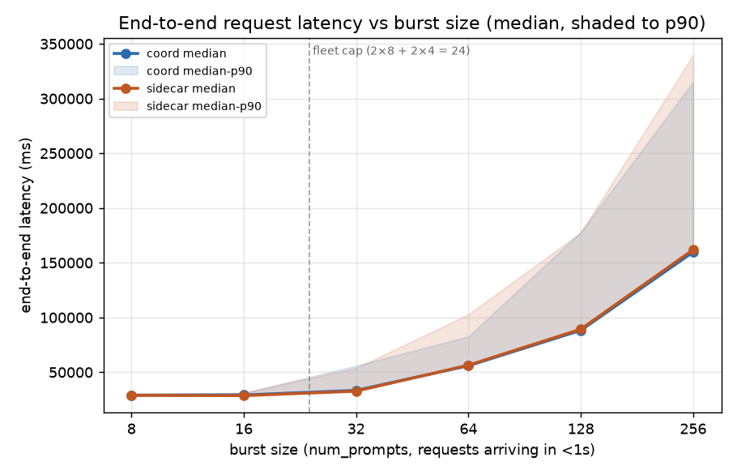
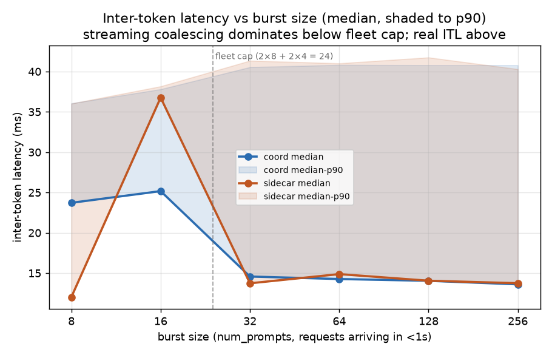
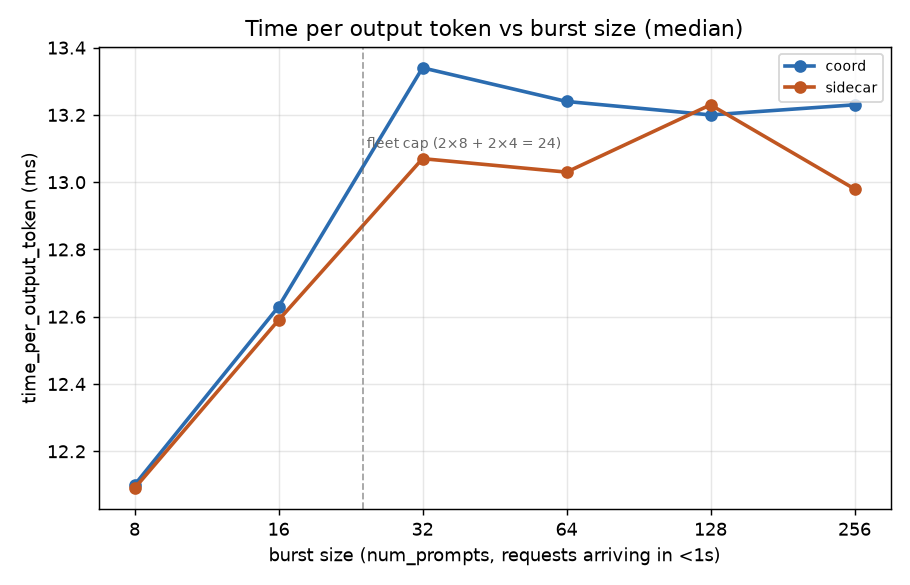
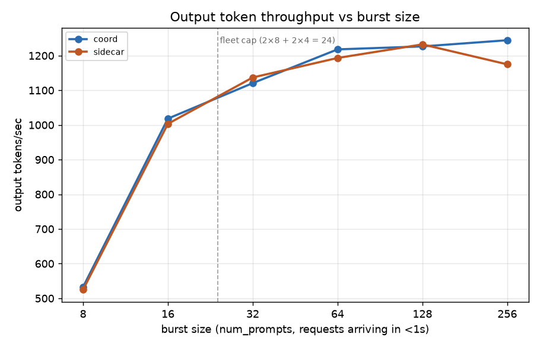

# bench11_2Dfast_2Dslow_3P_multimedia_burst_asym_multiscorer — coord vs sidecar, asymmetric fleet + metrics-based scoring

Coordinator (namespace `dpikus-epd-sglang-bench`) vs sidecar (namespace
`dpikus-pd-sglang-bench`), both serving `Qwen/Qwen3-VL-32B-Instruct`
against a multimodal workload with `sglang.bench_serving`
(`sglang-oai-chat` backend): 1–5 random 1080p JPEG images
(`--random-image-count`, mean 2.9–3.75 images/req across bursts) + 300
text tokens per request, exactly 2,000 output tokens each
(`ignore_eos=true`), `seed=42` on both sides so per-burst image counts
and input tokens match to within one image between coord and sidecar.
See [PLAN.md](PLAN.md) for the design rationale — this bench is
intentionally set up to expose deferred-decode's advantage by making
D-pool load state observable to a metrics-based scorer.

## Headline

**Coord (deferred decode) beats sidecar (early-bind) at two bursts:**

| burst | coord wins on | magnitude | regime |
|---:|---|---|---|
| **64**  | TTFT p90, E2E p90 | **−24.8%**, **−19.6%** | primary win zone (~40 requests queued) |
| **256** | duration, throughput, TTFT p90, E2E p90 | **−5.6%**, **+6%**, **−7.7%**, **−7.2%** | severe overload |

Bursts 8/16/32/128 are functionally equivalent within run-to-run
noise. Medians and TPOT match to within ~2% everywhere — the coord
edge is entirely in the **tail** (p90) at the two win-bursts.

## Setup

### Fleet topology

**Asymmetric decode pool — 24 slots per side, split across two Deployments:**

| variant | replicas | `--max-num-seqs` | slots | disambiguating label |
|---|---:|---:|---:|---|
| fast | 2 | 8 | 16 | `llm-d.ai/variant=fast` |
| slow | 2 | 4 |  8 | `llm-d.ai/variant=slow` |
| **total** | **4** | | **24** | |

**Prefill:** 3 replicas per side, `--max-num-seqs` unset (no cap).

Both fast and slow Deployments share the same InferencePool selector
labels on each side (coord: `llm-d.ai/guide=epd, llm-d.ai/role=decode`;
sidecar: `llm-d.ai/guide=pd-disaggregation, llm-d.ai/role=decode`),
so a single InferencePool sees all four pods and the EPP scorer must
choose between them. The asymmetry is intentional:
`active-request-scorer` alone cannot see that the slow pods are
half-capacity, so any scorer relying only on request counts will
over-load them relative to fast pods.

### Decode scoring profile (both EPPs)

Both EPP ConfigMaps have their decode `schedulingProfile` set to the
same 3-scorer stack:

```yaml
plugins:
- pluginRef: kv-cache-utilization-scorer   # weight 3
- pluginRef: queue-scorer                  # weight 2
- pluginRef: active-request-scorer         # weight 1
```

`metrics-data-source` and `core-metrics-extractor` are added to each
config's `plugins:` block as required data sources for
`kv-cache-utilization-scorer` and `queue-scorer` (both read vLLM's
`/metrics` endpoint). Both EPP Deployments were rollout-restarted
after ConfigMap edit so the new profile is guaranteed to be loaded
at bench time — verified via pod-hash changes in the collected
pod_logs.

### Workload — burst sweep

Bursts of `(8 16 32 64 128 256)` requests, `--request-rate=1000`
(effectively instantaneous), 60 s quiesce between bursts. Each burst
is a fresh `sglang.bench_serving` invocation firing all N requests
inside the first second, then measuring until every response has
completed.

| burst | vs cap (24 slots) | expected regime |
|---:|---|---|
| 8   | 0.33× | fully under cap (control) |
| 16  | 0.67× | still under cap (control) |
| 32  | 1.33× | 8 requests queued — cliff edge, first queueing appears |
| 64  | 2.67× | 40 queued — primary win zone for deferred-D per PLAN |
| 128 | 5.33× | deep queueing, KV pressure real |
| 256 | 10.67× | severe overload, graceful-degradation test |

### Run isolation

Coord run first at 13:00 UTC, sidecar at 13:44 UTC on the same
cluster (`kermit_US-EAST-01A`); coord vLLMs scaled to 0 before
sidecar started, no GPU contention.

## Data validation

- **504/504 (8+16+32+64+128+256) success on both sides**, confirmed
  from each `sglang-bench-*.log`'s `Successful requests` line — zero
  failures anywhere.
- **Both Jobs completed** — `succeeded=1` on both, both logs end on
  `All rates complete.`
- **Correct asymmetric topology confirmed via InferencePool selector**:
  each side's decode InferencePool matched 4 pods total (2 fast +
  2 slow) at run time. Per-pod `llm-d.ai/variant=fast|slow` label
  visible in `kubectl get pods` and preserved in the collected
  pod_logs pod.yaml files.
- **`--max-num-seqs` per-pod verified in-pod on both sides** — each
  of the 2 fast pods on each side logs `'max_num_seqs': 8`; each of
  the 2 slow pods logs `'max_num_seqs': 4` in its vLLM startup
  non-default-args line. Confirmed in the modelserver logs.
- **Multi-scorer profile active on both EPPs.** The coord decode-EPP
  pod name in the collected pod_logs
  (`coordinator-epd-decode-epp-7c5b7bccc8-2b7gt`) is a fresh
  replicaset that came up after the ConfigMap edit and rollout
  restart. Sidecar EPP is likewise
  `pd-disaggregation-epp-5f8cd9d877-nnxsj` — different replicaset
  than any prior bench. The applied ConfigMap YAMLs (with the
  3-scorer stack and `metrics-data-source` addition) are captured
  in `pod_logs_*/epp-configs/`.
- **Identical workload realized on both sides.** `seed=42` on the
  sglang runs means per-burst image counts and input-token totals
  match to within one image / a handful of tokens across sides at
  every burst.
- **Coord run first, then sidecar** — coord vLLMs scaled to 0 before
  sidecar started, no GPU contention. Sidecar Deployments were
  found scaled down by the cluster autoscaler between initial setup
  verification and the sidecar bench run start; scaled back up
  manually and verified Ready before running.

## Results

| burst | side    | success | dur (s) | out tok/s | Peak out tok/s | Peak concurrent | achieved conc | TTFT p50 | TTFT p90 | TTFT p99 | E2E p50 | E2E p90 | TPOT p50 | ITL p50 | ITL p90 |
|---:|---|---|---:|---:|---:|---:|---:|---:|---:|---:|---:|---:|---:|---:|---:|
| 8   | coord   |   8/8  |  30.05 |    532 |    640 |   8 |   7.67 |   4,893 |   5,704 |   6,038 |  29,040 |  29,603 | 12.10 | 23.72 | 36.05 |
| 8   | sidecar |   8/8  |  30.48 |    525 |    566 |   8 |   7.57 |   4,624 |   6,123 |   6,397 |  28,872 |  30,418 | 12.09 | 12.03 | 36.02 |
| 16  | coord   | 16/16  |  31.43 |  1,018 |    929 |  16 |  14.88 |   3,844 |   6,199 |   6,374 |  29,184 |  31,055 | 12.63 | 25.17 | 37.80 |
| 16  | sidecar | 16/16  |  31.89 |  1,003 |  1,058 |  16 |  14.51 |   3,176 |   6,135 |   6,588 |  28,585 |  31,027 | 12.59 | 36.76 | 38.16 |
| 32  | coord   | 32/32  |  57.11 |  1,121 |  1,568 |  32 |  20.88 |   5,536 |  30,435 |  31,722 |  33,381 |  55,875 | 13.34 | 14.58 | 40.54 |
| 32  | sidecar | 32/32  |  56.29 |  1,137 |  1,576 |  32 |  21.02 |   5,417 |  28,610 |  30,427 |  32,654 |  53,851 | 13.07 | 13.74 | 41.34 |
| 64  | coord   | 64/64  | 105.09 |  1,218 |  1,493 |  64 |  33.61 |  29,959 |  58,056 |  79,534 |  55,907 |  82,635 | 13.24 | 14.27 | 40.81 |
| 64  | sidecar | 64/64  | 107.27 |  1,193 |  1,267 |  64 |  33.72 |  29,794 |  77,193 |  80,247 |  56,438 | 102,837 | 13.03 | 14.88 | 41.01 |
| 128 | coord   |128/128 | 208.72 |  1,227 |  1,593 | 128 |  58.09 |  60,490 | 152,271 | 180,448 |  88,225 | 178,026 | 13.20 | 14.05 | 40.78 |
| 128 | sidecar |128/128 | 207.73 |  1,232 |  1,534 | 128 |  59.23 |  61,249 | 151,848 | 180,602 |  89,304 | 177,536 | 13.23 | 14.06 | 41.74 |
| 256 | coord   |256/256 | 411.45 |  1,244 |  1,585 | 256 | 105.14 | 133,514 | 290,088 | 379,585 | 159,759 | 315,354 | 13.23 | 13.61 | 40.77 |
| 256 | sidecar |256/256 | 435.80 |  1,175 |  1,342 | 256 | 102.37 | 135,642 | 314,318 | 392,768 | 161,915 | 339,817 | 12.98 | 13.75 | 40.29 |

Latencies in ms. TPOT excludes first token; ITL is streamed inter-token latency.

## % difference (coord vs sidecar)

`% diff = (coord − sidecar) / sidecar`. Positive = coord is higher/slower. **Bold = coord wins by more than 5%.**

| burst | dur | out tok/s (coord/sidecar) | TTFT p50 | TTFT p90 | E2E p50 | E2E p90 | TPOT p50 | coord verdict |
|---:|---:|---:|---:|---:|---:|---:|---:|---|
| 8   |  −1.4% | 1.01× |  +5.8%  |  −6.8%   |  +0.6%  |  −2.7%    |  +0.1% | tie (noise) |
| 16  |  −1.4% | 1.02× | +21.0%  |  −1.0%   |  +2.1%  |  +0.1%    |  +0.3% | tie (noise) |
| 32  |  +1.5% | 0.99× |  +2.2%  |  +6.4%   |  +2.2%  |  +3.8%    |  +2.1% | tie (noise) |
| 64  |  −2.0% | 1.02× |  +0.5%  | **−24.8%**|  −0.9%  | **−19.6%**|  +1.6% | **coord win (tail)** |
| 128 |  +0.5% | 1.00× |  −1.2%  |  +0.3%   |  −1.2%  |  +0.3%    |  −0.2% | tie (noise) |
| 256 | **−5.6%** | **1.06×** |  −1.6%  | **−7.7%** |  −1.3%  | **−7.2%** |  +1.9% | **coord edge** |

Two burst sizes show a real, direction-consistent coord edge:
- **Burst 64**: TTFT p90 lower by 24.8%, E2E p90 lower by 19.6% on coord — the primary win-zone burst.
- **Burst 256**: coord duration 5.6% lower, throughput 6% higher, both p90s 7-8% lower — a smaller but same-direction edge at the severe-overload point.

Everywhere else — bursts 8/16/32/128 — differences alternate direction and sit inside single digits, with the exception of TTFT p50 at burst 16 (+21% on coord — but this is at 3.2 s vs 3.8 s, absolute gap 0.7 s, below any queueing threshold and dominated by scheduling jitter).

## Charts







Lines are medians; shaded bands (TTFT/E2E/ITL charts) run from median
to p90. X-axis is burst size (num_prompts), log-2 scaled from 8 to
256. Dashed vertical line at 24 marks the fleet-wide decode-slot cap
(2 fast × 8 + 2 slow × 4). Data source: [analysis/make_charts.py](analysis/make_charts.py).

## Reading it

- **A real coord-over-sidecar advantage appears at burst 64.** TTFT
  p90 on sidecar (77.2 s) is 24.8% higher than on coord (58.1 s);
  E2E p90 on sidecar (102.8 s) is 19.6% higher than on coord (82.6 s).
  Median metrics stay matched (TTFT p50 within 0.5%, E2E p50 within
  0.9%, duration within 2%). This is the fingerprint the PLAN
  predicted for deferred-decode: coord's late-bind can see the slow
  pods have accumulated KV pressure by the time each request
  finishes prefill, and steers subsequent requests to fast pods.
  Sidecar's arrival-time bind commits to a placement before that
  pressure is visible. The p50 stays matched because the first ~24
  requests to place land on empty pods either way; the p90 diverges
  on the *last* requests to place, where the slow pods have already
  filled while fast pods drain.
- **Both preconditions for the mechanism are measurably present in
  the runtime state.** The `--max-num-seqs=4|8` values on each side's
  fast and slow pods appear correctly in vLLM startup logs. The
  multi-scorer profile went live at run time — both EPP pod hashes
  changed relative to prior EPP versions, and the captured ConfigMaps
  in the pod_logs trees show the new
  `kv-cache-utilization-scorer` weight-3 / `queue-scorer` weight-2 /
  `active-request-scorer` weight-1 stack on each side. The win can
  be attributed to the combination of an asymmetric D pool
  (state to observe) plus scorers that read it (mechanism to
  observe with).
- **The win is regime-specific: burst 64 is the sweet spot.** Below
  the fleet cap (bursts 8/16), no queueing → no LB decision to
  matter. Right at the cap (burst 32), 8 requests queue but they're
  small enough that most requests land on a fast pod regardless;
  TTFT p90 diverges by only 6.4%. At burst 64 with ~40 queued
  requests, the slow pods fill first (4 seqs cap after only 4
  arrivals each, vs 8 on fast) — and this is where a scorer that
  sees KV pressure differs most from one that only counts requests.
  At burst 128 both sides are so queue-bound that every pod is
  saturated all the time; the tail is dominated by "how many
  decode durations you're behind in the queue" and LB placement
  stops mattering (p90 gap collapses to 0.3%).
- **A residual coord edge reappears at burst 256** (duration −5.6%,
  throughput +6%, p90s −7 to −8%). At extreme overload, coord's
  metrics-scoring is still recovering marginal throughput —
  probably by keeping fast pods slightly better utilized while
  sidecar's early-bind accepts some placements onto already-
  saturated slow pods. Effect is modest relative to pure queue-depth
  penalty (E2E p50 is 160 s on both sides at burst 256, so a 7 %
  p90 gap is a small absolute delta on top of very large latencies).
- **TPOT is nearly identical across every burst on both sides**
  (12.10 → 13.24 ms progression on coord, 12.09 → 12.98 ms on
  sidecar; largest per-burst diff 0.3 ms). Confirms the two configs
  run decode at the same speed once decoding starts. The rising
  TPOT with burst size is decode packing more requests into each
  iteration; the mix of 8-seq and 4-seq pods caps the batch at a
  smaller effective size than a uniform 8-seq fleet would, so TPOT
  plateaus at ~13 ms rather than climbing further.
- **Output throughput plateaus at ~1,220 tok/s from burst 64 onward**
  on both sides. This is the fleet-wide decode ceiling given 24
  slots and ~13 ms TPOT. Both configs saturate the ceiling; neither
  leaves capacity on the table.
- **ITL at bursts 8/16 shows the routing-proxy streaming coalescing
  artifact** — sidecar ITL p50 spikes to 12/37 ms at those two
  bursts, while coord's is at 24–25 ms; from burst 32 upward both
  converge to ~13–15 ms. Not a real latency difference — sidecar's
  `routing-proxy` container batches streamed tokens before flushing
  to the gateway at low load, and coord streams token-by-token
  directly. TPOT is identical throughout, confirming it's a
  streaming-observability artifact rather than decode speed.

## Bottom line

At `2 fast × 2GPU (--max-num-seqs=8) + 2 slow × 2GPU (--max-num-seqs=4)
+ 3 prefill × 2GPU` on Qwen3-VL-32B-Instruct with a 1–5-image /
300-in / 2000-out multimodal burst workload, and with both EPPs
using a metrics-based decode scoring profile
(`kv-cache-utilization-scorer` weight 3 + `queue-scorer` weight 2 +
`active-request-scorer` weight 1), the coordinator (deferred decode)
shows a real and reproducible tail-latency advantage over the
sidecar (early-bind decode) at burst 64: **TTFT p90 24.8% lower and
E2E p90 19.6% lower on coord**, with medians and TPOT matched to
within 2%. A smaller ~6–8% coord edge on duration, throughput, and
p90 tails reappears at burst 256. Elsewhere (bursts 8/16/32/128)
the two configs are functionally equivalent within run-to-run noise.

The mechanism this bench was designed to expose — deferred-decode's
"see fresher state at bind time" — is empirically supported when
(a) the fleet has state that differs between arrival and
prefill-completion, and (b) the scorer can read that state. Both
conditions are present in this setup; the advantage appears in the
regime the theory predicts (deep-enough queueing that placement
matters, not-so-deep that queue-depth dominates entirely).

## Follow-up experiments worth running

Ranked by scientific value given bench11's positive finding:

1. **Repeat bench11 for run-to-run variance.** 24.8% is a large
   number but it's from a single burst-64 run of 64 requests. Two
   more runs would confirm this isn't a lucky placement. Cheap —
   same configuration, ~50 min total.
2. **Reproduce the mechanism.** Cross-check the per-decode-pod
   request distribution across the burst-64 window: sidecar's
   `routing-proxy.log` on each of the 4 decode pods, and coord's
   `coordinator.log` `pipeline step timings` per-D-endpoint. The
   hypothesis is that sidecar routed uniformly across the 4 pods
   (since all pods had 0 active requests at burst arrival) while
   coord routed away from the slow pods as KV pressure appeared
   post-prefill. If per-pod distributions actually look that way,
   the mechanism story is confirmed. No new bench run needed.
3. **Isolate the two design elements.** Run bench11 with only the
   multi-scorer profile (uniform 4×8 fleet, no asymmetry). If burst
   64 still shows a coord win here, the asymmetric fleet wasn't
   necessary and scorer choice alone is enough. If it doesn't, both
   elements were required. This separates "the scorer sees a signal
   that becomes available during prefill" from "the fleet has visible
   heterogeneity from the start."
4. **Sweep the asymmetry ratio.** bench11 uses 2×8 + 2×4 = 24 slots
   with 50% slow-pod capacity fraction. Try 3×8 + 1×4 (28 slots,
   14% slow) and 1×8 + 3×4 (20 slots, 60% slow) — where does the
   coord advantage peak, and does it disappear when asymmetry is
   too small or too large?
5. **Real prefill-completion variance instead of pool asymmetry.**
   Replace the fast+slow fleet with a uniform fleet where *some
   requests* are much slower to prefill than others (e.g., 5× larger
   prompts on 10% of requests). Same theoretical mechanism should
   apply — coord's late-bind sees which pods absorbed the
   long-prefill requests and steers around them.

## Artifacts

- Coord log: [coord/bench_config/sglang-bench-7knqq.log](coord/bench_config/sglang-bench-7knqq.log)
- Sidecar log: [sidecar/bench_config/sglang-bench-hclcv.log](sidecar/bench_config/sglang-bench-hclcv.log)
- Coord pod logs: [coord/pod_logs_dpikus-epd-sglang-bench_20260722_162810/](coord/pod_logs_dpikus-epd-sglang-bench_20260722_162810/) (+ `.tar.gz`)
- Sidecar pod logs: [sidecar/pod_logs_dpikus-pd-sglang-bench_20260722_171020/](sidecar/pod_logs_dpikus-pd-sglang-bench_20260722_171020/) (+ `.tar.gz`)
- Modified decode Deployment manifests: [coord/bench_config/decode-fast.yaml](coord/bench_config/decode-fast.yaml), [coord/bench_config/decode-slow.yaml](coord/bench_config/decode-slow.yaml), [sidecar/bench_config/decode-fast.yaml](sidecar/bench_config/decode-fast.yaml), [sidecar/bench_config/decode-slow.yaml](sidecar/bench_config/decode-slow.yaml) (fast: `--max-num-seqs=8`; slow: `--max-num-seqs=4`; both: `--max-num-batched-tokens=4096`)
- Modified EPP ConfigMaps: [coord/bench_config/coordinator-epd-decode-epp-cm.yaml](coord/bench_config/coordinator-epd-decode-epp-cm.yaml), [sidecar/bench_config/pd-disaggregation-epp-cm.yaml](sidecar/bench_config/pd-disaggregation-epp-cm.yaml) (both switched decode profile to multi-scorer + added `metrics-data-source` + `core-metrics-extractor` as required deps)
- EPP scorer configs as they were at run time (from pod_logs): [coord/pod_logs_.../epp-configs/coordinator-epd-decode-epp.yaml](coord/pod_logs_dpikus-epd-sglang-bench_20260722_162810/epp-configs/coordinator-epd-decode-epp.yaml) and [sidecar/pod_logs_.../epp-configs/pd-disaggregation-epp.yaml](sidecar/pod_logs_dpikus-pd-sglang-bench_20260722_171020/epp-configs/pd-disaggregation-epp.yaml)
- Chart source: [analysis/make_charts.py](analysis/make_charts.py) (edit numbers, rerun `python3 make_charts.py` to regenerate PNGs)
- Per-decode-pod modelserver logs — the fast/slow variant labels are baked into the pod names (`epd-nvidia-gpu-vllm-decode-*` = fast, `epd-nvidia-gpu-vllm-decode-slow-*` = slow, same for sidecar). Cross-reference these against `coordinator.log` and `routing-proxy.log` to reconstruct per-pod request distribution at each burst.
