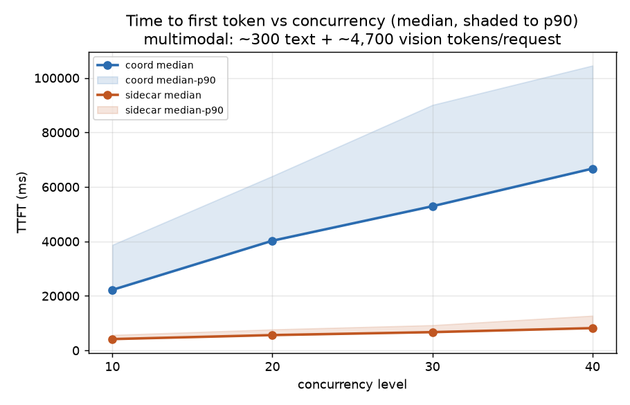
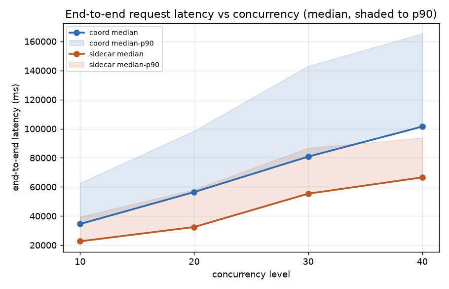
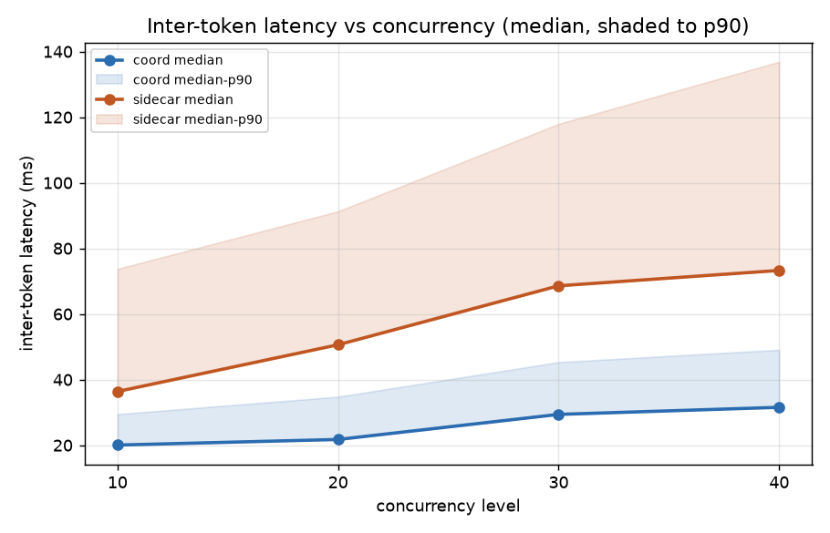
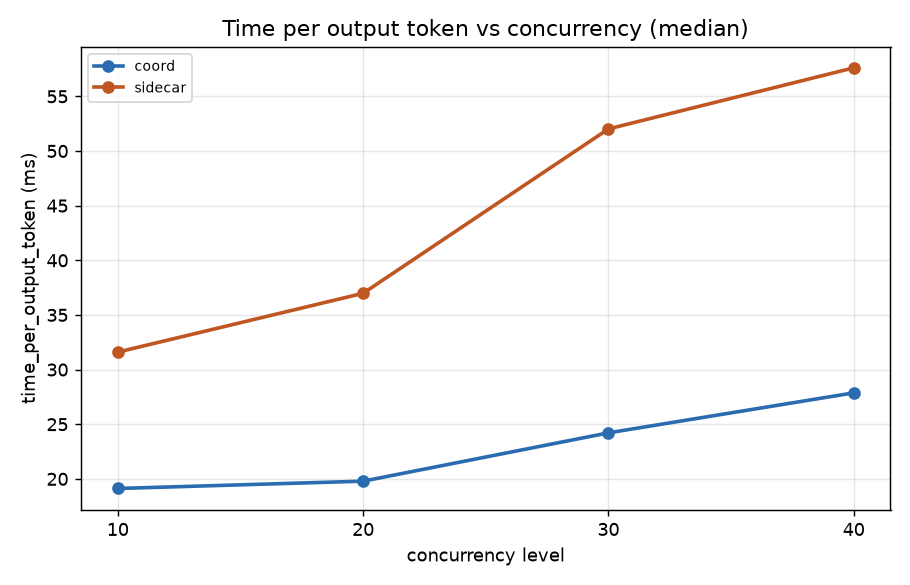
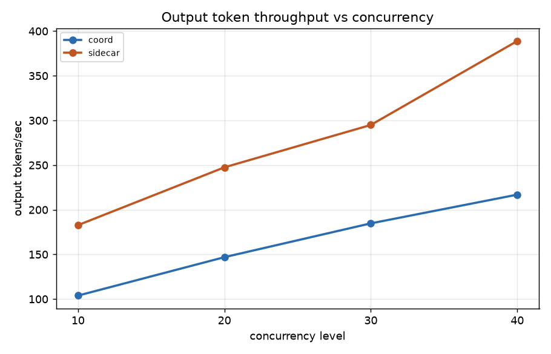

# bench7.1_3Dx8GPU_3Px8GPU_multimedia — coord vs sidecar, multimodal serving

Coordinator (namespace `dpikus-epd-sglang-bench`) vs sidecar (namespace
`dpikus-pd-sglang-bench`), both running 3 decode replicas and 3 prefill
replicas (8 GPUs each), serving `Qwen/Qwen3-VL-235B-A22B-Instruct` with
`sglang`'s `bench_serving` tool (`sglang-oai-chat` backend) against
multimodal requests: ~300 text tokens + 1-3 random 1080p JPEG images per
request (avg ~4,700 vision tokens, ~2.1-2.3 images/request), up to 2,000
output tokens, `ignore_eos` off (real generation, not padded). Each side
was run at 4 concurrency levels, back-to-back in a single job:

| concurrency | num requests | request rate |
|---|---|---|
| 10 | 10 | 10 req/s (offered) |
| 20 | 20 | 20 req/s (offered) |
| 30 | 30 | 30 req/s (offered) |
| 40 | 40 | 40 req/s (offered) |

The offered request rate is far above what either side can sustain at
this workload size — that's intentional, this bench is a load/capacity
test, not a fixed-rate latency test like the `bench1-*` series. Actual
achieved concurrency (from `sglang`'s own accounting) is 5.5/10.3/15.8/21.5
for coord and 6.2/10.4/16.2/24.1 for sidecar.

## Data validation

- **40/40 (10+10+10+10) success on both sides at every concurrency
  level**, confirmed directly from each `sglang-bench-*.log`'s
  `Successful requests` line — zero failures anywhere.
- **Zero real errors in any pod log on either side.** Coord: 0 error-level
  lines in any prefill/decode/coordinator/EPP log. Sidecar: 411 matches
  for "error", all accounted for and benign — 410 are
  `routing-proxy.log` OpenTelemetry trace-exporter timeouts
  (`connection refused` to a local trace collector on port 4317, an
  observability sidecar that isn't running, unrelated to request
  serving), and the 1 remaining is the EPP's known-benign
  `"Request latency values are invalid for TPOT calculation"` warning
  (seen before in `bench1-2_var_output_always_disaggr` — a non-streamed
  health-check probe tripping a diagnostic, not real traffic).
- **Correct topology confirmed on both sides**: 3 decode + 3 prefill pods
  each, all `Running`, 0 restarts. Coord's prefill pods landed on
  `gf2a19e`/`g13d42a`/`g11bab6`, decode on `gc37cba`/`gf27fec`/`g124daa`.
  Sidecar's prefill landed on `g124002`/`gf2ac9a`/`g1251ac`, decode on
  `g13bc90`/`gc37cba`/`gf2a19e`. Six distinct prefill nodes and five
  distinct decode nodes across both sides (only `gc37cba` and `gf2a19e`
  are shared) — given the finding below is a queueing effect that scales
  smoothly with concurrency (not a fixed offset), node-hardware variance
  is an unlikely explanation on its own; see "Reading it".
- **Coord's TTFT numbers were cross-checked against its own internal
  instrumentation**, not just taken from the client-side benchmark
  report — see "Reading it" below. This is the same validation approach
  used throughout the `bench1-*` series.

## Results

| concurrency | arch | success | E2E lat median | E2E lat p90 | TTFT median | TTFT p90 | TPOT median | ITL median | output tok/s | req/s |
|---|---|---|---|---|---|---|---|---|---|---|
| 10 | coord | 10/10 | 34,528 ms | 62,683 ms | 22,221 ms | 38,738 ms | 19.12 ms | 20.05 ms | 103.9 | 0.14 |
| 10 | sidecar | 10/10 | 22,629 ms | 39,464 ms | 4,177 ms | 5,696 ms | 31.60 ms | 36.38 ms | 182.8 | 0.25 |
| 20 | coord | 20/20 | 56,481 ms | 98,505 ms | 40,263 ms | 63,998 ms | 19.79 ms | 21.76 ms | 146.9 | 0.18 |
| 20 | sidecar | 20/20 | 32,455 ms | 58,160 ms | 5,643 ms | 7,712 ms | 36.98 ms | 50.62 ms | 247.5 | 0.30 |
| 30 | coord | 30/30 | 80,844 ms | 143,004 ms | 52,929 ms | 90,078 ms | 24.21 ms | 29.40 ms | 184.8 | 0.19 |
| 30 | sidecar | 30/30 | 55,383 ms | 86,730 ms | 6,727 ms | 9,274 ms | 52.02 ms | 68.59 ms | 294.9 | 0.30 |
| 40 | coord | 40/40 | 101,495 ms | 165,428 ms | 66,732 ms | 104,536 ms | 27.87 ms | 31.56 ms | 216.9 | 0.23 |
| 40 | sidecar | 40/40 | 66,567 ms | 93,753 ms | 8,203 ms | 12,750 ms | 57.61 ms | 73.28 ms | 388.9 | 0.41 |

## % difference (coord vs sidecar, median)

| concurrency | E2E lat % diff | TTFT % diff | TPOT % diff | ITL % diff | output tok/s ratio (sidecar/coord) |
|---|---|---|---|---|---|
| 10 | +52.6% | +431.9% | -39.5% | -44.9% | 1.76x |
| 20 | +74.0% | +613.6% | -46.5% | -57.0% | 1.68x |
| 30 | +46.0% | +686.8% | -53.4% | -57.1% | 1.60x |
| 40 | +52.5% | +713.5% | -51.6% | -56.9% | 1.79x |

% diff is `(coord − sidecar) / sidecar`. Positive means coord is
higher/slower. Note the crossover: coord is dramatically worse on TTFT
and E2E latency, but consistently *better* on per-token decode cost
(TPOT/ITL) at every concurrency level.

## Charts

Lines are medians; shaded bands (TTFT/E2E/ITL charts) run from median to
p90. X-axis is concurrency level, linear (not log — only 4 points,
10-40).

## Reading it

- **This is a crossover, not a uniform architectural gap.** Coord loses
  badly on TTFT (4-8x higher) and therefore on E2E latency (46-74%
  higher) at every concurrency level tested. But coord's own decode is
  faster once it starts — TPOT and ITL are both 40-57% *lower* for coord
  than sidecar throughout. This is the opposite pattern from the
  `bench1-*` text-only sweeps, where coord's ITL was the thing running
  ~7-8% *higher* than sidecar's before node-pinning resolved it. Here,
  coord's decode is genuinely faster; its problem is entirely upstream
  of decode.
- **Coord's TTFT blowup is confirmed real via its own internal
  instrumentation, not a benchmark-client artifact.** `coordinator.log`
  logs a `pipeline step timings` line per request with `parse`/`prefill`/
  `decode` sub-durations. Pooling all 115 logged requests across all 4
  concurrency levels: prefill-leg duration ranges from ~120ms (the first
  few requests, before the queue builds up) up to a **median of 40.0s,
  p90 87.5s, max 104.7s**. This closely tracks the client-observed TTFT
  growth (22.2s → 66.7s median as concurrency rises from 10 to 40) — the
  bottleneck is real, internal, and grows with load, not a fixed
  per-request tax.
- **Root cause found: coord's "prefill" pods are not deferring decode
  work — they're generating close to the full response themselves,
  separately from the actual decode leg.** vLLM's own periodic engine
  logger (`Avg generation throughput`, `Running: N reqs`) reports real
  token generation activity per engine. Integrating that throughput over
  each pod's full log window and dividing by the number of requests each
  pod handled (`POST /v1/chat/completions` count) gives an estimated
  tokens-generated-per-request, per pod:

  | | prefill pods (3) | decode pods (3) | client-reported avg output/request |
  |---|---|---|---|
  | **coord** | ~808-951 tok/req | ~858-1084 tok/req | 912.3 tok/req |
  | **sidecar** | ~2.1-2.2 tok/req | ~1145-1221 tok/req | 912.3 tok/req |

  Sidecar matches the textbook disaggregation pattern exactly: prefill
  generates essentially nothing (~2 tokens/request — the single fused
  first token that comes for free with vLLM's prefill step), decode does
  all the real generation, and decode's average (~1,175 tok/req) is in
  the right ballpark of the client-reported output length. **Coord does
  not match this pattern at all** — its prefill pods are independently
  generating close to a *full response's worth* of tokens per request
  (~878 avg), and its decode pods are *also* generating close to a full
  response's worth (~967 avg) — both numbers land near the client's
  912.3 tok/req average, not "prefill does ~0, decode does ~912" the way
  sidecar's do. This is consistent with the model generating the
  response independently on both legs — near-duplicate work, not a
  minor handoff delay — which would roughly double the GPU compute spent
  per request and directly explains why a 3-pod prefill pool becomes a
  severe bottleneck under concurrency for coord but not for sidecar.
  Request counts across coord's 3 prefill pods (34/34/36) are reasonably
  balanced, so this isn't one stuck pod — it's systemic across the pool.
- **What isn't confirmed from these logs alone**: whether this is
  literal 100% duplicate generation (full response computed twice, only
  decode's copy is streamed to the client) or a large partial overlap
  (e.g. a delayed/late KV handoff that lets prefill keep generating for
  most of the response before decode takes over the tail). Confirming
  which would need per-request generation-length tracing (not available
  at vLLM's current INFO log level — `config.yaml`'s harness-level
  `per_request` output is also off for this bench) or a request-level
  trace through the coordinator's NIXL handoff path. Either way, the
  aggregate evidence is unambiguous: coord's prefill pool is doing
  decode-equivalent work it should not be doing for this workload, and
  sidecar's isn't.
- **Sidecar's decode cost is more sensitive to rising concurrency than
  coord's, even though it's lower in absolute terms throughout this
  range.** From concurrency 10 to 40, sidecar's median ITL grows 36.4ms
  → 73.3ms (+101%), while coord's grows 20.1ms → 31.6ms (+57%). This is
  consistent with sidecar's decode pool doing more real work per unit
  time — its output token throughput is 1.6-1.8x coord's at every
  level, so its decode engines are serving more concurrent generation,
  which plausibly explains part of why its own per-token cost degrades
  faster under load.

**Bottom line**: at this multimodal, vision-heavy workload, coord's
prefill pods are not deferring decode to the dedicated decode pool the
way disaggregated P/D serving is supposed to work — they're
independently generating close to a full response's worth of tokens per
request (~878 tok/req, vs sidecar's ~2 tok/req for the same role). This
is a functional defect in coord's disaggregation, not a capacity or
node-placement issue, and it directly explains the TTFT/E2E latency gap:
a 3-pod prefill pool doing decode-length work per request behaves like a
severely undersized decode pool, and queues up hard under concurrency
(confirmed separately via coordinator.log's own internal prefill-leg
timing: median 40.0s, up to 104.7s). Coord's decode stage, in isolation,
is still faster than sidecar's per-token (TPOT/ITL) at every concurrency
level — the problem is entirely that the prefill leg is doing far more
work than it should, not that decode itself is slow. This is a
different, more specific finding than the `bench1-*` series' node-
variance explanation, and looks like a bug worth reporting against
coord's NIXL handoff path or request routing for multimodal requests,
rather than an inherent architectural cost of the coordinator design.
