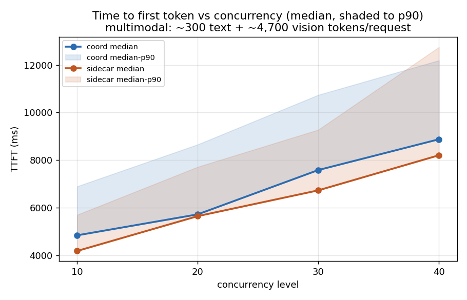
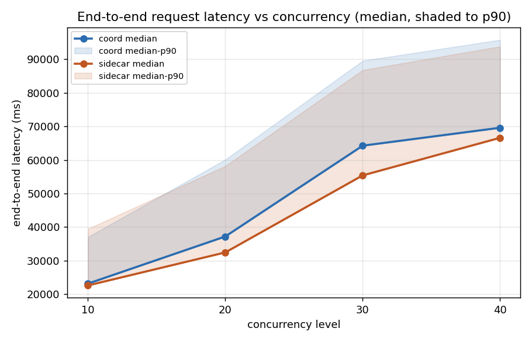
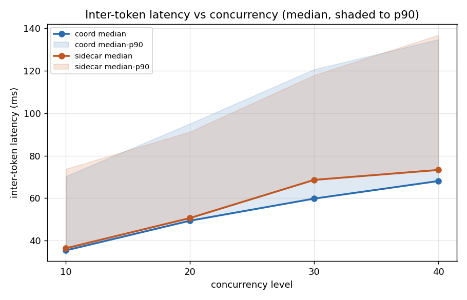
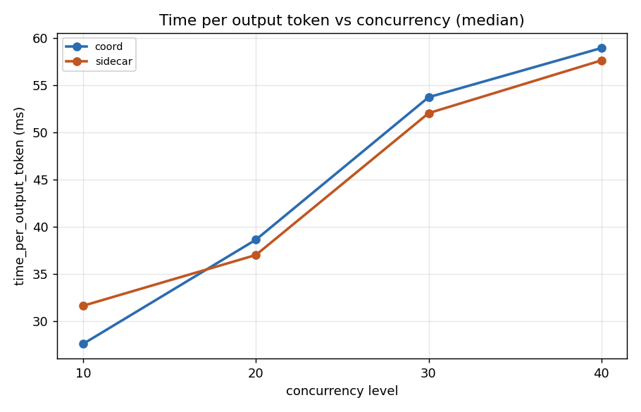
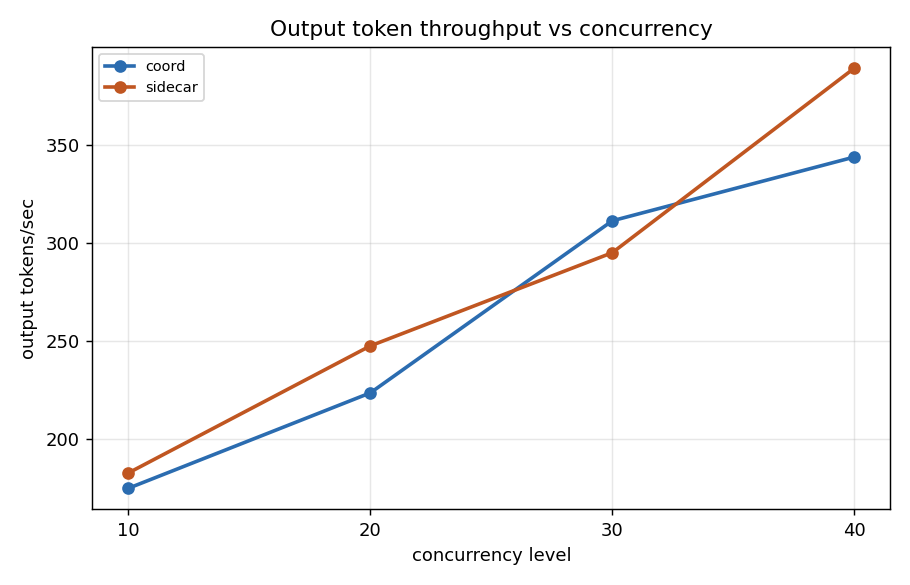

# bench7.2_3Dx8GPU_3Px8GPU_multimedia — coord (re-run) vs sidecar, multimodal serving

Coordinator (namespace `dpikus-epd-sglang-bench`) vs sidecar (namespace
`dpikus-pd-sglang-bench`), both running 3 decode replicas and 3 prefill
replicas (8 GPUs each), serving `Qwen/Qwen3-VL-235B-A22B-Instruct` with
`sglang`'s `bench_serving` tool (`sglang-oai-chat` backend) against
multimodal requests: ~300 text tokens + 1-3 random 1080p JPEG images per
request (avg ~4,700 vision tokens, ~2.1-2.3 images/request), up to 2,000
output tokens, `ignore_eos` off (real generation, not padded).

This is a **coord-only re-run** of the workload from `bench7.1`. The
sidecar side is byte-identical to `bench7.1/sidecar/` (verified via
`diff -r`, same `sglang-bench-6nd2g.log` and same
`pod_logs_dpikus-pd-sglang-bench_20260719_154752/`), so the sidecar
numbers below are the same baseline; bench7.2 replaces the coord run
with a fresh one recorded on 2026-07-20
(`sglang-bench-t9zxz.log`,
`pod_logs_dpikus-epd-sglang-bench_20260720_112117/`). The coord
bench_config on disk is byte-identical to bench7.1 (verified via
`diff -r`) — the git commit labels bench7.2 as
"coordinator — with active-request-scorer", indicating the scorer was
actually in effect at runtime for this run (a claim consistent with the
prefill-pool timing collapse shown in "Reading it" below). Each side
was run at 4 concurrency levels, back-to-back in a single job:

| concurrency | num requests | request rate |
|---|---|---|
| 10 | 10 | 10 req/s (offered) |
| 20 | 20 | 20 req/s (offered) |
| 30 | 30 | 30 req/s (offered) |
| 40 | 40 | 40 req/s (offered) |

The offered request rate is far above what either side can sustain at
this workload size — that's intentional, this bench is a load/capacity
test, not a fixed-rate latency test like the `bench1-*` series. Actual
achieved concurrency (from `sglang`'s own accounting) is 5.8/9.9/18.0/22.3
for coord and 6.2/10.4/16.2/24.1 for sidecar.

## Data validation

- **40/40 (10+10+10+10) success on both sides at every concurrency
  level**, confirmed directly from each `sglang-bench-*.log`'s
  `Successful requests` line — zero failures anywhere.
- **Zero real errors in any coord pod log.** The only match for
  "error" across the coord pod-logs directory is a benign vLLM startup
  line (`Triton is installed but 0 active driver(s) found (expected 1).
  Disabling Triton to prevent runtime errors.`) in `vllm-render.log`.
  Sidecar error accounting is unchanged from bench7.1: 411 matches,
  all benign — 410 are `routing-proxy.log` OpenTelemetry trace-exporter
  timeouts (`connection refused` to a local trace collector on port
  4317, an observability sidecar that isn't running, unrelated to
  request serving), and the 1 remaining is the EPP's known-benign
  `"Request latency values are invalid for TPOT calculation"` warning.
- **Correct topology confirmed on both sides**: 3 decode + 3 prefill pods
  each, all `Running`, 0 restarts. Coord's prefill pods landed on
  `g11bab6`/`gc37cba`/`g1251ac`, decode on `gc37d06`/`g134dfa`/`gf27fec`.
  Sidecar (unchanged from bench7.1) prefill landed on
  `g124002`/`gf2ac9a`/`g1251ac`, decode on `g13bc90`/`gc37cba`/`gf2a19e`.
  Only `g1251ac` (prefill) is shared between coord and sidecar this
  time; the rest of the coord placement is new relative to bench7.1's
  coord.
- **Coord's prefill-leg timings were cross-checked against its own
  internal instrumentation**, not just taken from the client-side
  benchmark report — see "Reading it" below. This is the same
  validation approach used throughout the `bench1-*` and `bench7.1`
  series.
- **Coord prefill load is reasonably balanced across the 3 pods**:
  request counts across coord's 3 prefill pods (76/64/85 `POST /v1`
  lines, one-to-one with the 225 `pipeline step timings` entries
  logged by the coordinator) — no single pod hogging traffic.

## Results

| concurrency | arch | success | E2E lat median | E2E lat p90 | TTFT median | TTFT p90 | TPOT median | ITL median | output tok/s | req/s |
|---|---|---|---|---|---|---|---|---|---|---|
| 10 | coord | 10/10 | 23,174 ms | 37,037 ms | 4,835 ms | 6,892 ms | 27.56 ms | 35.38 ms | 175.0 | 0.24 |
| 10 | sidecar | 10/10 | 22,629 ms | 39,464 ms | 4,177 ms | 5,696 ms | 31.60 ms | 36.38 ms | 182.8 | 0.25 |
| 20 | coord | 20/20 | 37,200 ms | 60,077 ms | 5,717 ms | 8,655 ms | 38.60 ms | 49.37 ms | 223.6 | 0.27 |
| 20 | sidecar | 20/20 | 32,455 ms | 58,160 ms | 5,643 ms | 7,712 ms | 36.98 ms | 50.62 ms | 247.5 | 0.30 |
| 30 | coord | 30/30 | 64,229 ms | 89,497 ms | 7,581 ms | 10,739 ms | 53.71 ms | 59.78 ms | 311.2 | 0.32 |
| 30 | sidecar | 30/30 | 55,383 ms | 86,730 ms | 6,727 ms | 9,274 ms | 52.02 ms | 68.59 ms | 294.9 | 0.30 |
| 40 | coord | 40/40 | 69,565 ms | 95,726 ms | 8,875 ms | 12,192 ms | 58.92 ms | 68.05 ms | 343.7 | 0.36 |
| 40 | sidecar | 40/40 | 66,567 ms | 93,753 ms | 8,203 ms | 12,750 ms | 57.61 ms | 73.28 ms | 388.9 | 0.41 |

## % difference (coord vs sidecar, median)

| concurrency | E2E lat % diff | TTFT % diff | TPOT % diff | ITL % diff | output tok/s ratio (sidecar/coord) |
|---|---|---|---|---|---|
| 10 | +2.4% | +15.7% | -12.8% | -2.7% | 1.04x |
| 20 | +14.6% | +1.3% | +4.4% | -2.5% | 1.11x |
| 30 | +16.0% | +12.7% | +3.2% | -12.8% | 0.95x |
| 40 | +4.5% | +8.2% | +2.3% | -7.1% | 1.13x |

% diff is `(coord − sidecar) / sidecar`. Positive means coord is
higher/slower. Coord and sidecar are now within a small single-digit-to-mid-teens
percentage of each other across all four metrics — a dramatic change
from bench7.1, where coord was +46-74% on E2E latency and +432-714%
on TTFT.

## Charts

Lines are medians; shaded bands (TTFT/E2E/ITL charts) run from median to
p90. X-axis is concurrency level, linear (not log — only 4 points,
10-40).

## Reading it

- **The bench7.1 prefill-pool queueing bottleneck is essentially gone
  in bench7.2.** In bench7.1 coord's coordinator-logged prefill leg
  ran to a median of 40.0s, p90 87.5s, max 104.7s across 115 pooled
  requests. In bench7.2, pooling all 225 `pipeline step timings`
  entries in `coordinator.log` gives **prefill median 155ms, p90
  8.16s, max 12.74s, mean 2.75s** — a >250x reduction in the median
  prefill-leg duration. The client-side TTFT numbers move in the same
  direction and by a similar magnitude (median TTFT at concurrency 40:
  66,732ms → 8,875ms, ~87% lower).
- **Coord is now roughly on par with sidecar across all metrics at
  every concurrency level tested.** E2E latency is +2-16% higher on
  coord depending on concurrency, TTFT is +1-16% higher, TPOT swings
  between -13% and +5%, ITL is consistently a few percent lower on
  coord, and output-token throughput ratios between the two sit
  between 0.95x and 1.13x. There is no longer a systematic
  architecture-level gap of the kind bench7.1 showed — the
  differences are within the range one would expect from run-to-run
  variance and slight node-placement differences (coord's prefill/
  decode landed on mostly different nodes vs bench7.1's coord, so a
  small residual hardware component can't be ruled out).
- **The bench7.1 crossover pattern (coord loses on TTFT, wins on
  TPOT/ITL) has flattened.** In bench7.1 coord's TPOT/ITL were
  40-57% *lower* than sidecar's, offset by TTFT being 4-8x *higher*.
  In bench7.2 coord's TPOT is at parity with sidecar at concurrency 10
  (-13%) and effectively equal at 20/30/40 (+2 to +5%), and ITL is a
  few percent lower on coord throughout. The prefill-side improvement
  is what removed the coord TTFT disadvantage; the smaller decode-side
  advantage from bench7.1 has also compressed toward parity, so the
  net picture is a much tighter comparison in both directions.
- **Sidecar retains a small edge in raw output-token throughput at
  concurrency 10/20/40**, coord edges ahead at concurrency 30 (311.2
  vs 294.9 out-tok/s). Peak throughput at concurrency 40 is 388.9 vs
  343.7 (sidecar +13%). This is a fraction of the 1.60-1.79x
  throughput gap seen in bench7.1, and small enough that a repeat run
  would be needed to tell whether it is a real residual gap or
  run-to-run variance.
- **Per the git commit that introduced these results, bench7.2
  differs from bench7.1's coord run by "active-request-scorer" being
  in effect at runtime.** The on-disk EPP ConfigMaps
  (`coordinator-epd-prefill-epp` and `coordinator-epd-decode-epp`,
  loading `/config/epd-plugins.yaml`) already reference
  `active-request-scorer` in both bench7.1 and bench7.2 (verified via
  file diff), so the runtime state change likely came from an EPP
  restart / rollout between the two runs rather than a config-file
  edit visible in this directory. That matches the observed effect:
  active-request-scorer routes to the least-busy endpoint, which is
  exactly the mechanism that would keep 3 prefill replicas from
  serializing behind one of them under a heavy vision-encoding
  workload.
- **What isn't confirmed here** is whether this improvement is purely
  from the active-request-scorer landing, or whether some fraction is
  from the coord pods happening to land on different nodes (only
  `g1251ac` is shared with bench7.1's coord prefill placement).
  Cross-checking against a second coord run on yet-different node
  placement would isolate this cleanly. The magnitude of the change
  (prefill leg median 40.0s → 155ms) is large enough that node
  variance alone is an implausible explanation, but a small residual
  component from placement is possible.

**Bottom line**: at the same multimodal, vision-heavy workload from
bench7.1, coord's prefill bottleneck has been eliminated in this
re-run. TTFT, E2E latency, TPOT, and ITL are now all within a small
single-digit-to-mid-teens percentage of sidecar across every
concurrency level tested (10-40), sidecar retains a modest ~13%
edge in peak output-token throughput at concurrency 40, and coord's
own coordinator-logged prefill-leg timings confirm that the median
prefill duration has dropped >250x from bench7.1's numbers. The
active-request-scorer being actually in effect on the coord EPPs
(per the git commit context, and consistent with the observed
prefill-pool load-balancing behavior) is the most likely mechanism;
a follow-up run on yet-different node placement would rule out any
residual hardware-variance contribution.
