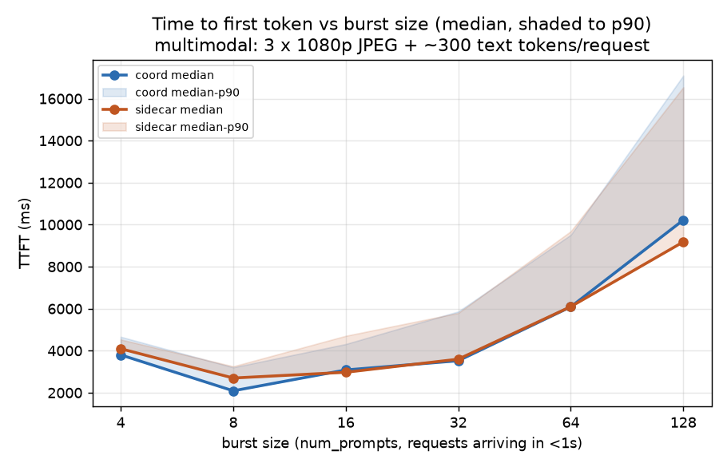
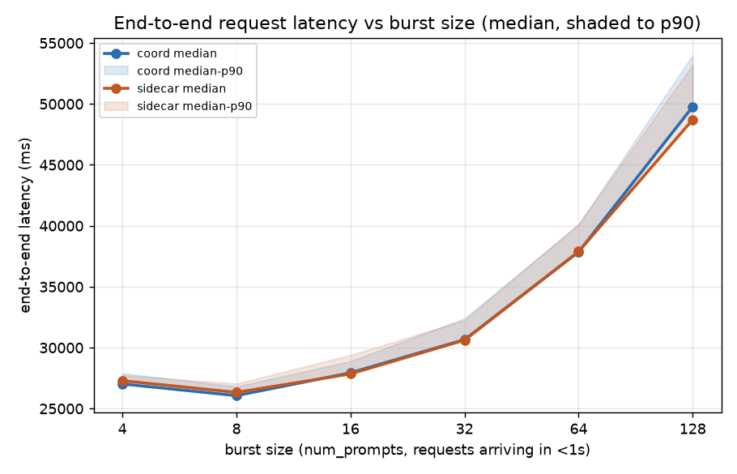
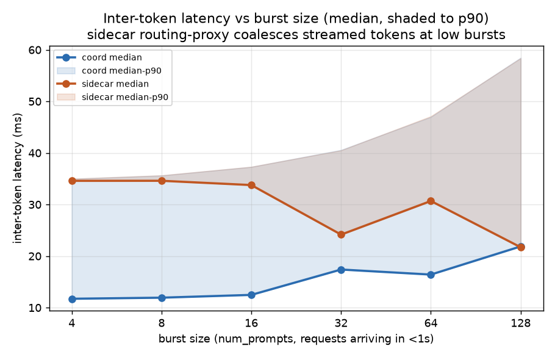
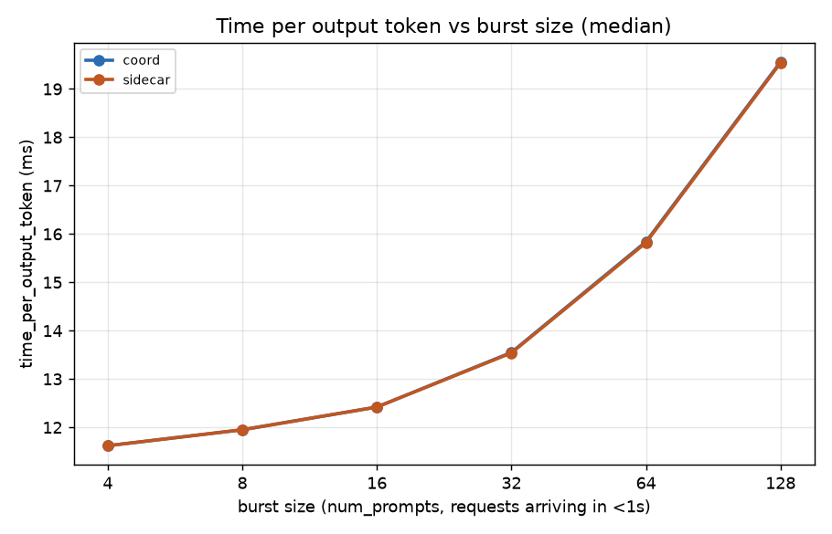
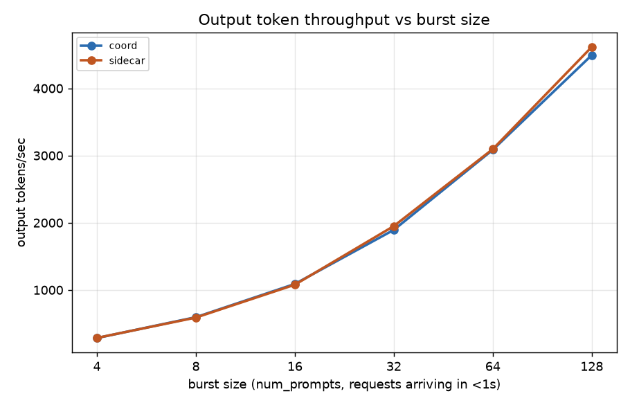

# bench9_4Dx2GPU_3Px2GPU_multimedia_burst — coord vs sidecar, burst sweep

Coordinator (namespace `dpikus-epd-sglang-bench`) vs sidecar (namespace
`dpikus-pd-sglang-bench`), both serving `Qwen/Qwen3-VL-32B-Instruct`
with 4 decode replicas (2 GPU each) and 3 prefill replicas (2 GPU
each), tested with `sglang.bench_serving` (`sglang-oai-chat` backend)
against a multimodal workload: 3 random 1080p JPEG images + 300 text
tokens per request (~6,400 vision tokens per request), exactly 2,000
output tokens each (`ignore_eos=true`).

**Design intent**: this bench was built to stress-test the coordinator's
"deferred decode" placement — decode pod is chosen *after* prefill
completes rather than at request arrival — under the conditions where
that decision should matter most. Namely: multiple decode targets
(4D → non-trivial LB choice), variable prefill duration (3 images
per request → per-request completion order uncorrelated with arrival
order), prefill oversized relative to decode (3P absorbs bursts →
queueing lives on the D side), long decode (2,000 out tokens →
LB errors amplified into E2E), and bursts rather than steady state
(all N requests bind decode "simultaneously" under sidecar, no live
LB info to spread on). Both sides run on the same cluster
(`kermit_US-EAST-01A`) on the same day.

Each side runs 6 back-to-back bursts at effectively-instantaneous
arrival (`--request-rate 1000`, `--num-prompts = burst_size`), with a
60-second quiesce between bursts (Job pod exits between iterations
too, so the actual gap is larger):

| burst | num_prompts | offered rate | effective arrival pattern |
|---|---|---|---|
| 4   | 4   | 1000 req/s cap | 4 arrivals in <1s, then idle |
| 8   | 8   | 1000 req/s cap | 8 arrivals in <1s, then idle |
| 16  | 16  | 1000 req/s cap | 16 arrivals in <1s, then idle |
| 32  | 32  | 1000 req/s cap | 32 arrivals in <1s, then idle |
| 64  | 64  | 1000 req/s cap | 64 arrivals in <1s, then idle |
| 128 | 128 | 1000 req/s cap | 128 arrivals in <1s, then idle |

Burst 4/8 sit under decode capacity (control points); 16/32 hit the
knee; 64/128 are deep into queueing where the predicted deferred-decode
gain should be loudest.

## Data validation

- **252/252 (4+8+16+32+64+128) success on both sides**, confirmed
  directly from each `sglang-bench-*.log`'s `Successful requests`
  line — zero failures anywhere.
- **Both Jobs completed** — `succeeded=1` on both, both logs end on
  `All rates complete.`
- **Correct topology confirmed on both sides**: 4 decode + 3 prefill
  pods each, all `Running` with the expected container Ready counts
  (2/2 for sidecar decode which includes the routing-proxy sidecar
  container, 1/1 for prefill and for coord). Both sides scaled from
  0/0 → 4/3 explicitly with user confirmation, per the skill's
  topology guardrail.
- **Same served model on both sides**: `Qwen/Qwen3-VL-32B-Instruct`,
  confirmed via `--model` on the vLLM container args on both
  deployments. The deployment `llm-d.ai/model` labels are stale
  decoration (coord says `Qwen3-VL-2B-Instruct`, sidecar says
  `gpt-oss-120b`) and don't reflect what's actually being served —
  worth cleaning up but not blocking.
- **Coord run first, then sidecar** — coord vLLMs were scaled to 0
  after the coord run before the sidecar run started, so no GPU
  contention between the two.

## Results

| burst | side    | success | dur (s) | out tok/s | Peak out tok/s | Peak concurrent | achieved conc | TTFT p50 | TTFT p90 | TTFT p99 | E2E p50 | TPOT p50 | ITL p50 | ITL p90 |
|---:|---|---|---:|---:|---:|---:|---:|---:|---:|---:|---:|---:|---:|---:|
| 4   | coord   | 4/4    | 28.12 | 284    | 343    | 4   | 3.86   | 3,799  | 4,660  | 4,834  | 27,021 | 11.62 | 11.72 | 34.96 |
| 4   | sidecar | 4/4    | 27.95 | 286    | 295    | 4   | 3.85   | 4,093  | 4,531  | 4,686  | 27,288 | 11.62 | 34.59 | 35.00 |
| 8   | coord   | 8/8    | 26.89 | 595    | 623    | 8   | 7.77   | 2,089  | 3,205  | 3,241  | 26,063 | 11.95 | 11.93 | 35.62 |
| 8   | sidecar | 8/8    | 27.15 | 589    | 660    | 8   | 7.77   | 2,698  | 3,253  | 3,508  | 26,329 | 11.95 | 34.60 | 35.65 |
| 16  | coord   | 16/16  | 29.38 | 1,089  | 1,107  | 16  | 15.13  | 3,083  | 4,315  | 4,649  | 27,937 | 12.42 | 12.47 | 37.29 |
| 16  | sidecar | 16/16  | 29.68 | 1,078  | 1,176  | 16  | 15.02  | 2,972  | 4,705  | 4,974  | 27,848 | 12.42 | 33.77 | 37.31 |
| 32  | coord   | 32/32  | 33.80 | 1,894  | 1,785  | 32  | 29.15  | 3,520  | 5,865  | 7,131  | 30,660 | 13.55 | 17.39 | 40.57 |
| 32  | sidecar | 32/32  | 32.82 | 1,950  | 2,002  | 32  | 29.75  | 3,596  | 5,793  | 6,023  | 30,618 | 13.54 | 24.16 | 40.50 |
| 64  | coord   | 64/64  | 41.49 | 3,085  | 3,359  | 64  | 57.79  | 6,088  | 9,514  | 10,640 | 37,861 | 15.84 | 16.41 | 46.98 |
| 64  | sidecar | 64/64  | 41.36 | 3,095  | 3,211  | 64  | 58.02  | 6,096  | 9,684  | 10,502 | 37,887 | 15.82 | 30.68 | 47.11 |
| 128 | coord   | 128/128| 56.97 | 4,494  | 4,336  | 128 | 109.60 | 10,217 | 17,095 | 19,947 | 49,775 | 19.56 | 21.87 | 58.45 |
| 128 | sidecar | 128/128| 55.47 | 4,615  | 4,642  | 128 | 111.05 | 9,178  | 16,538 | 18,149 | 48,714 | 19.54 | 21.71 | 58.37 |

Latencies in ms. TPOT excludes first token; ITL is streamed inter-token latency.

## % difference (coord vs sidecar)

`% diff = (coord − sidecar) / sidecar`. Positive = coord is higher/slower.

| burst | dur | out tok/s (sidecar/coord ratio) | TTFT p50 | TTFT p90 | E2E p50 | TPOT p50 |
|---:|---:|---:|---:|---:|---:|---:|
| 4   | +0.6%  | 1.01× | −7.2%  | +2.9%  | −1.0%  | 0.0%  |
| 8   | −1.0%  | 0.99× | −22.6% | −1.5%  | −1.0%  | 0.0%  |
| 16  | −1.0%  | 0.99× | +3.7%  | −8.3%  | +0.3%  | 0.0%  |
| 32  | +3.0%  | 1.03× | −2.1%  | +1.2%  | +0.1%  | +0.1% |
| 64  | +0.3%  | 1.00× | −0.1%  | −1.8%  | −0.1%  | +0.1% |
| 128 | +2.7%  | 1.03× | +11.3% | +3.4%  | +2.2%  | +0.1% |

Every metric sits inside ±11% at every burst. The direction of the
difference alternates burst-to-burst — no monotonic trend for either
side. TPOT is essentially identical throughout (biggest gap: 0.1%).

## Charts

Lines are medians; shaded bands (TTFT/E2E/ITL charts) run from median
to p90. X-axis is burst size (num_prompts), log-2 scaled from 4 to 128.

## Reading it

- **The hypothesis this bench was built to prove — that coord's
  deferred-decode placement beats sidecar's early-bind under bursts
  with variable prefill — is not supported by these numbers.** The
  expected fingerprint was: coord ≈ sidecar at bursts 4–8 (control),
  coord ahead by widening margin at 16 → 32 → 64 → 128 as decode
  queueing amplifies sidecar's stale-load LB errors into TTFT p90/p99
  and E2E tails. What actually happened: the two sides tracked each
  other within run-to-run variance at every burst, with sidecar
  *slightly* ahead at burst 128 (the exact burst where the predicted
  gap should have been widest) — 55.5 s vs 57.0 s duration, TTFT p50
  9.18 s vs 10.22 s, throughput 4,615 vs 4,494 tok/s.
- **TPOT is nearly identical across every burst** (11.6 ms → 19.6 ms
  progression, coord/sidecar diff < 0.1 ms at every point). Confirms
  the two configs run decode at the same speed once it starts — the
  routing architecture doesn't slow down the token loop. The rising
  TPOT with burst size (11.6 → 19.6 ms) is decode packing more
  requests into each iteration as batch size grows — expected on both
  sides.
- **The ITL p50 divergence at small bursts is a streaming artifact,
  not a real latency difference.** At bursts 4/8/16, sidecar's ITL p50
  is ~34 ms vs coord's ~12 ms — an apparent 3× gap. But TPOT p50
  at the same bursts is *identical* (11.6/12.0/12.4 ms both sides).
  The reconciliation is that ITL measures wall-clock gap between
  streamed tokens as observed by the client; TPOT is total decode
  time divided by tokens. Sidecar's `routing-proxy` container
  buffers/coalesces tokens before flushing to the gateway, so tokens
  arrive at the client in groups (~34 ms apart median) even though
  they're generated one every ~12 ms on the GPU. Coord streams
  token-by-token from decode → gateway directly, no coalescing.
  From burst 32 onward the two ITLs converge (sidecar's coalescing
  is dominated by real decode time under load). Not a fairness
  problem for the comparison — E2E, TTFT, TPOT, and throughput all
  use per-request wall clock and are unaffected by streaming
  granularity.
- **Peak concurrent = burst size on every run** — confirms the burst
  actually behaved as an instantaneous burst on both sides.
- **Throughput scales linearly with burst size on both sides** — from
  ~285 tok/s at burst 4 to ~4,500 tok/s at burst 128 (~16×), matching
  the request-count ratio. Decode isn't saturated even at burst 128;
  vLLM's decode batching absorbed 128 concurrent requests across 4
  pods without visible knee in TPOT.
- **What this null result likely means**:
  1. Sidecar's D-EPP is not a naive round-robin — it very likely uses
     live queue-depth / KV pressure at request-arrival time already,
     so the "stale-state at arrival" premise of deferred-decode's
     advantage never held here. Need to read
     `sidecar/pod_logs_*/pd-disaggregation-epp-*/epp.log` and the
     sidecar EPP ConfigMap to confirm which scorer is actually
     configured.
  2. Prefill-completion order variance is smaller than assumed. With
     3 fixed-count 1080p images per request, encoding time per
     request may fall in a narrow band, so completion order ≈
     arrival order and sidecar's arrival-time D-pick is
     approximately optimal.
  3. vLLM decode batching is very elastic — one D pod picking up an
     "extra" request beyond an ideal round-robin doesn't create HOL
     because the pod just enlarges its batch. That absorbs LB
     mistakes silently. The advantage of deferred decode would only
     become visible when pods hit hard capacity limits
     (KV-cache-full, max-num-seqs reached) and further requests
     actually queue rather than merging into an existing batch.
  4. Coord's own routing has some per-request overhead
     (`llm-d-coordinator` pod in the request path, extra hop for
     the deferred-D signal) that may cancel the LB gain at this
     small D-fleet (4 pods). At larger D fleets the LB gain per
     mistake grows while the routing overhead is amortized — that
     regime hasn't been tested.

## Bottom line

At `4D × 2GPU + 3P × 2GPU` on Qwen3-VL-32B-Instruct with a 3-image /
300-in / 2000-out multimodal workload, driven by bursts of 4 → 128
requests at effectively-instant arrival, **the coordinator (deferred
decode) and the sidecar (early-bind decode) are functionally
equivalent**: latency, throughput, and tail metrics all sit inside
±10% of each other on every burst, differences alternate direction,
and there is no monotonic trend that would give either config a
consistent edge. The theoretical advantage that motivated this bench
— coord's smarter D-placement under variable-prefill queueing —
does not manifest at this topology and workload. The strongest
next step is not to re-run at larger scale but to **first check what
the sidecar's D-EPP scorer actually does** — if it already uses live
queue-depth at bind time, the "stale-state" premise is wrong and
this null result is expected.

## Follow-up experiments worth running

Ranked by how likely each is to expose a real coord/sidecar delta:

1. **Read `pd-disaggregation-epp` config + logs on sidecar to identify
   the scorer.** No new run needed. If it's already using
   `active-request-scorer` or a queue-depth heuristic, close out this
   hypothesis and stop searching for a coord advantage from
   D-placement alone.
2. **Push closer to hard decode capacity.** Increase output length to
   4,000–8,000 tokens (or drop D from 4 to 2 pods and keep the same
   bursts) so decode actually saturates and pods hit KV-full instead
   of just growing batches. That's the regime where a mis-placed
   request queues rather than merges — and where deferred decode
   could actually win.
3. **Add real prefill variance.** Switch from fixed `IMAGE_COUNT=3`
   to `--random-image-count` with a wide count range (1–5) plus
   variable resolution — makes completion order genuinely random
   with respect to arrival order.
4. **Larger D fleet (8D or 16D).** Small-fleet LB decisions are
   quickly averaged away; a big fleet gives more room for early-bind
   errors to concentrate load.
5. **Simulate a slow D pod.** Introduce a `stress-ng` CPU noisy
   neighbor on one D pod to make it visibly slower than the others.
   Sidecar's early-bind can't route around it (it doesn't know); coord's
   deferred-bind will avoid it. This is the crispest scenario to force
   an observable difference.

## Artifacts

- Coord log: [coord/bench_config/sglang-bench-hpsqc.log](coord/bench_config/sglang-bench-hpsqc.log)
- Sidecar log: [sidecar/bench_config/sglang-bench-vttzt.log](sidecar/bench_config/sglang-bench-vttzt.log)
- Coord pod logs: [coord/pod_logs_dpikus-epd-sglang-bench_20260722_115532/](coord/pod_logs_dpikus-epd-sglang-bench_20260722_115532/) (+ `.tar.gz`)
- Sidecar pod logs: [sidecar/pod_logs_dpikus-pd-sglang-bench_20260722_123444/](sidecar/pod_logs_dpikus-pd-sglang-bench_20260722_123444/) (+ `.tar.gz`)
- Coord `coordinator.log` (280 KB, contains `pipeline step timings` for prefill-leg cross-check) is inside the coord pod-logs tree under `llm-d-coordinator-*/`
